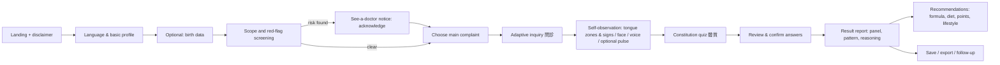

# Product Requirements Document — TCM Self-Assessment App

| | |
|---|---|
| **Working title** | TCM Self-Assessment App (name TBD) |
| **Version** | 0.5 (draft) |
| **Status** | Draft — documentation set complete (M0); open questions resolved with MVP defaults (§14.2), supporting-document proposals confirmed (§14.3); all to be revisited after the MVP |
| **Last updated** | 2026-10-04 |
| **Related docs** | [Documentation index](README.md) · [Diagnosis SOP v0.2 (繁體中文)](diagnosis-sop.zh-TW.md) · [Algorithm spec](wuxing-algorithm.md) ([繁中](wuxing-algorithm.zh-TW.md)) · [Tech spec](tech-spec.md) · [UI/UX spec](ux-spec.md) · [KB schema](kb-schema.md) · [i18n guide](i18n-guide.md) · [Content review](content-review.md) · [Safety policy](safety-policy.md) · [Privacy](privacy.md) · [Test plan](test-plan.md) · [Release process](release-process.md) · [Tasks](../TASKS.md) · [Checklist](../CHECKLIST.md) · [Knowledge base (`data/`)](../data/README.md) · [Reference sources](../reference/README.md) |

> **Source-of-truth rule.** The diagnosis logic (what is asked, how answers become a pattern and a body panel, how that becomes a
> recommendation) is owned by the [Diagnosis SOP](diagnosis-sop.zh-TW.md); the yin-yang / five-phase mathematics by the
> [algorithm spec](wuxing-algorithm.md). This PRD summarises them (§9) and derives product requirements. If documents disagree, the SOP
> (then the algorithm spec) wins and this PRD is updated. Numbers in `data/` win over numbers in prose.

---

## 1. Overview

### 1.1 Vision

Make the reasoning of Traditional Chinese Medicine (TCM) approachable and transparent. A user describes their body and symptoms
(optionally also their birth data); the app walks through the classical method (四診 → 辨證 → 論治), shows a **body panel** — the
deviation of their five-phase organ balance, pathogenic qi and eight principles from a healthy norm — says which **pattern (證)** and
**constitution (體質)** fit best, **why** (symptom by symptom, with quotations from 《黃帝內經》《傷寒論》《金匱要略》 …), and which classical
formulas and lifestyle measures traditionally address it, including how the formula's **sovereign–minister–assistant–envoy (君臣佐使)**
structure works and how it could be adjusted.

### 1.2 Problem

- Laypeople curious about TCM cannot tell which advice applies to them; generic "TCM tips" ignore individual pattern differences, the core of TCM.
- Existing apps give conclusions without reasoning or sources, so users cannot judge reliability and learners cannot learn.
- Good TCM content is mostly classical Chinese: hard to access for English speakers and for modern readers.

### 1.3 Positioning

An **educational self-assessment and decision-support tool**, not a diagnostic or prescribing service. Output is "what classical TCM reasoning
suggests for the information you gave", always paired with safety guidance. How much it outputs, for whom, is **configurable** (§6 FR-17):
the development profile opens everything, the release profile restricts.

---

## 2. Goals and non-goals

### 2.1 Goals

| # | Goal |
|---|---|
| G1 | Guide a non-expert through a structured TCM assessment on any device (phone, tablet, desktop). |
| G2 | Produce a pattern / constitution result with a **transparent, citable reasoning trace**. |
| G3 | Recommend classical formulas plus diet, acupressure and lifestyle advice, each with reasons, cautions and contraindications. |
| G4 | Be fully bilingual: Traditional Chinese (default) and English, with consistent TCM terminology. |
| G5 | Ground every medical statement in a real, traceable source; build the knowledge base from downloaded, licence-checked resources. |
| G6 | Be safe by design: every risky population or condition gets a "see a doctor" notice, then the flow continues under a restricted or annotated output. |
| G7 | Be privacy-first: no account needed; health and birth data stay on the device. |
| G8 | Be **configurable**: output levels per population / condition / state; `dev` opens everything, `release` restricts by default. |
| G9 | Express the person's state as a **five-phase organ panel** relative to a normal body, calibrated by three blocks — innate (birth), annual and seasonal, and the person's observed deviation — to support regulation toward balance (調理和中). |
| G10 | Make formulas computable: herb-level yin-yang / five-phase / organ benefit–burden weights and 君臣佐使 roles, so formulas can be matched to a panel, proportioned and modified (加減). |

### 2.2 Non-goals (MVP)

- Not a medical device; no claim to diagnose, treat, cure or prevent disease.
- No e-commerce, herb sales, telemedicine, or practitioner marketplace.
- No image-based tongue/face diagnosis in MVP (guided selection of zones and signs only).
- No Simplified Chinese UI in MVP (data is converted from Simplified sources but only zh-Hant and en are offered).
- No LLM-generated diagnosis. The diagnostic core is deterministic and explainable (§9, Q3).
- No fate/fortune prediction. Birth data is used **only** as a bounded, optional tendency prior for the five-phase panel.
- Dosing: the release profile never shows amounts; amounts and ratios are a development / practitioner feature (FR-10, FR-17).

---

## 3. Target users

| Persona | Description | Needs |
|---|---|---|
| **Curious Health-Seeker** (primary) | Adult, 25–60, chronic "sub-health" complaints (sleep, fatigue, bloating, cold hands/feet …), curious about TCM | Simple questions, plain language, clear next steps, safety |
| **TCM Learner** | Student or hobbyist studying 四診/辨證 | See *why* a pattern was chosen; the panel; citations; formula structure; compare differentials |
| **English-speaking User** | Interested in TCM, cannot read classical Chinese | Accurate English terms (with Chinese + pinyin), translated citations |
| **Practitioner (secondary)** | Licensed TCM practitioner | Structured intake summary and panel; formula modification suggestions (dev / L2–L3 profile) |

---

## 4. Scope

### 4.1 MVP (v1.0, release profile default)

- Adults: output level **L1** (education, diet, safe acupressure points, tier-A formulas without dose). Other populations and conditions per the release profile in `data/config/scope-profiles.json` (e.g. minors, pregnancy, breastfeeding, red flags, serious chronic disease: a blocking "see a doctor" notice, then **L0**).
- Eight complaint modules (SOP §4.8): sleep, fatigue, digestion, cold-heat & sweating, head/body pain, mood/stress, women's cycle (non-pregnant), mild early external contraction.
- Constitution (9 types, with seasonal susceptibility) + pattern differentiation over the 23-pattern draft library (SOP §9.4), decomposed into 24 pattern elements.
- **Body panel** (五行臟腑・六邪・八綱) with observed deviation, personal reference and transmission (SOP §10).
- **Season and 五運六氣** reference; **birth-based innate / annual blocks as a user opt-in** (FR-18).
- Result report with reasoning trace, recommendations and citations; zh-Hant and en; responsive; local history; print-friendly export.

### 4.2 Development profile

Everything open for every population, condition and state (L3): tier-C formulas as learning display, relative proportions and reference amounts, formula modification, herb weights; the safety filter annotates instead of removing; the "see a doctor" notices are still shown.

### 4.3 Later (post-MVP)

- Additional complaint modules, 衛氣營血 / 三焦 patterns; on-device tongue photo assistance; knowledge-base browser; practitioner summary export.
- Optional accounts / cloud sync; Simplified Chinese UI; PWA / offline.

---

## 5. User journey

Target completion time: **≤ 10 minutes** for the first assessment; progress is saved so the user can resume. Birth data, tongue and pulse are optional and never block the flow.

---

## 6. Functional requirements

Priority: **P0** = MVP must-have · **P1** = MVP should-have · **P2** = post-MVP.

### FR-1 Onboarding and disclaimer — P0
- First screen explains purpose, limits (education, not diagnosis) and privacy (data stays on the device).
- Acknowledgement is stored with a version so changed wording re-prompts. A permanent, unobtrusive disclaimer stays on result and recommendation views.

### FR-2 Language and localisation — P0
- Default **Traditional Chinese (zh-Hant)**; English selectable at any time without losing progress; language is part of the URL and remembered; zh-Hant is the fallback.
- No hard-coded UI strings; all content (questions, patterns, formulas, citations) is keyed and translatable.
- TCM terms follow `data/glossary.json`: Chinese + pinyin + English (WHO terminology where known); a term tooltip is available wherever a term appears.
- Classical citations are shown in the original Traditional-script text with an English rendering labelled as a translation.

### FR-3 Body and birth information intake — P0
- ★ Age, sex at birth, pregnancy/lactation, ★ medications, allergies, chronic disease (safety and scope inputs); height, weight, sleep, activity, diet, smoking/alcohol, stress; region/climate; current season (auto).
- **Optional birth data (FR-18):** date, time (or "unknown hour"), place (longitude, time zone). Never required; processed on the device only.
- Main complaint(s) from a list; free-text note (stored locally, not interpreted in MVP).

### FR-4 Red-flag screening and "see a doctor" notice — P0 (rewritten)
- Before any assessment, ask the red-flag list (`data/diagnosis/red-flags.json`: level A emergency, B within 24 h, C out of intended scope).
- A positive answer or an out-of-scope population triggers the **configured notice** (SOP §0.2): `blocking_ack` = a full-screen "seek medical care" notice that the user acknowledges, **after which the flow continues**; `inline` = a banner. The notice is always shown in every profile for the risky populations and conditions.
- The **output level** (L0–L3) is decided by the active profile and the most restrictive matched dimension; there is no dead end.
- Emergency resources are shown for the user's region (Q1). Notice wording, the filter semantics and the incident process are owned by the [safety policy](safety-policy.md).

### FR-5 Structured inquiry (問診) — P0
- 12-dimension questionnaire derived from the 十問歌 (SOP §4.2); about 25 core questions then module-specific follow-ups; the next question is chosen by discriminating power (SOP §4.8).
- Plain-language wording with the TCM term as secondary info; every question maps to symptom codes (`data/diagnosis/symptoms.json`); back/forward, edit, "not sure / skip" allowed; skipped data lowers confidence rather than blocking results.

### FR-6 Self-observation: tongue, face, voice, optional pulse — P0 (updated)
- **Tongue (zones and special signs):** guided selection with illustrated examples of body colour/shape, coating, **zone-specific findings (tip, centre, root, edge/side)** and **special signs (tooth marks, cracks, red dots/prickles, ecchymosis, sublingual veins)**; `data/diagnosis/tongue.json`. Quality coefficient 0.7.
- **Complexion & spirit; voice/breath/odour:** selection-based; quality coefficient 0.7 / 1.0.
- **Pulse is optional input and enters the calculation:** resting pulse rate and regularity (measured), plus optional self-assessed pulse qualities (**float, sink, wiry, rapid, slippery, thin …**, 28 pulses, mutually exclusive groups enforced) and optional **position** (left/right 寸關尺). Quality coefficient 0.5. A fixed educational note explains why self-assessed pulse is low-confidence; missing pulse never lowers a score. `data/diagnosis/pulse.json`.
- Every observation shows its data-quality class, which feeds result confidence. P2: on-device tongue-photo assistance (no upload).

### FR-7 Constitution and susceptibility — P0
- 9-type questionnaire following the 王琦 standard (item wording: own-written pending licence decision, D6); primary + secondary tendency with scores.
- **Seasonal susceptibility**: constitution × pathogenic-qi risk combined with the current season and the year's climate (SOP §7.3).
- Constitution is a tie-breaker and advice-style input; it never adds to pattern scores.

### FR-8 Diagnosis engine — P0
- Deterministic and explainable: pattern scoring over weighted symptoms (SOP §9.2), pattern decomposition into 證素 (SOP §9.3), compound patterns for 寒熱錯雜 / 虛實夾雜, an explicit "insufficient information" state, a differential with "what would change this". Weights, thresholds and quality coefficients are placeholders until calibrated by a practitioner.
- **Golden test set** (≥ 100 vignettes with practitioner-agreed expectations) and the **reference pipeline** `scripts/kb/example_pipeline.py` as an executable specification; the pattern self-test must pass in CI.

### FR-9 Result report — P0
Sections in order: safety/scope banner and acknowledged notices · summary (constitution, patterns, confidence) · **body panel** (FR-19) · **why** (reasoning trace with citations, including evidence against) · transmission and susceptibility hints · recommendations (FR-10) · when to see a practitioner · data summary (editable → re-run) · what would change the conclusion.

### FR-10 Recommendations: formula matching, 君臣佐使, modification, proportions — P0 (updated)
- **Formula selection:** candidates from the pattern→formula links, then symptom-level fit (≥ 60 % of the formula's core indications), then **panel-level fit**: relative strength `k*` and the fraction of the deviation explained (SOP §12.4), then the safety filter and the active profile.
- **Explanation:** composition table with each herb's role (君/臣/佐/使), formula rationale, which of the user's symptoms match, what does not match, cautions, contraindications, sources (verification status shown).
- **Modification (加減) — L2 feature:** classical modifications first (e.g. 四君子湯 → 六君子湯), then residual-based add/remove suggestions (SOP §12.5), each with its reason.
- **Proportions and amounts:** the engine works with relative proportions and a relative strength; the release profile shows composition and roles but **no amounts**; the development profile may show relative proportions and reference amounts; classical amounts parsed from the original text are labelled as such, never as advice.
- **Tiers A / B / C** are computed from the formula's herbs (SOP §12.3): C = learning-only display, never a recommendation; B = conditional on the safety filter.
- Diet, safe self-acupressure points and lifestyle/seasonal advice per pattern, each with rationale and contraindications.

### FR-11 Citation and knowledge viewer — P0
- Every claim has a citation chip opening the original passage (book, chapter / clause, original text, edition note) and the English rendering, with its provenance record (`data/citations.json`: 127 machine-verified quotations).
- Citation ids are stable; saved reports record the knowledge-base version.

### FR-12 History and follow-up — P1
- Local save, reopen, compare two assessments (including panel changes), delete all data; optional "re-assess in N weeks".

### FR-13 Export — P1
- Print-optimised stylesheet and PDF export; "practitioner summary" view (complaints, 四診 findings, panel, pattern hypotheses).

### FR-14 Knowledge browser — P2
- Browse patterns, formulas, herbs (with benefit/burden weights), acupoints and classical passages, each with provenance.

### FR-15 Content pipeline (internal) — P0 (implemented)
- `scripts/kb/build_kb.py` builds `data/` deterministically from `reference/` plus curated tables, then validates references and runs the pattern self-test. Validation fails on a missing citation, unknown symptom or herb, bad panel target, inconsistent profile, unverified quotation. `data/README.md` records provenance, verification status and known gaps.

### FR-16 Feedback — P1
- "Did this match?" per result and per reasoning item, stored locally, exportable by the user; used by maintainers to calibrate weights.

### FR-17 Scope and safety configuration — P0 (new)
- Application configuration (`data/config/scope-profiles.json`) defines **output levels L0–L3** and **profiles** (`release`, `dev`) mapping each **population** (adult, 65+, minor, pregnant, lactating), **condition** (red flag A/B, serious chronic disease, anticoagulant use, other interacting medication, allergy match, acute external symptoms) and **state** (low confidence, insufficient information, conflicting data) to an output level and a notice kind.
- **Defaults:** `dev` opens everything (L3) with `annotate_only` safety; `release` restricts (adult L1, risky populations L0) with `suppress_hard` safety.
- **Resolution:** effective level = most restrictive matched dimension, further limited by feature flags; effective notice = most severe; **flow always continues**; suppressed items are always listed with their reason.
- Feature flags: dosage reference, formula modification, herb weights, tier C, acupoints, diet, and the five-phase module blocks (FR-18).
- The active profile is chosen at build time and overridable by environment configuration; the active profile name is shown in dev builds and recorded with every saved report.

### FR-18 Birth-based five-phase module — P1 (new)
- Optional. With birth data the app computes the **innate** five-phase profile and the **annual** (流年) shift from the four pillars, solar terms (astronomical), true solar time, hidden stems, month command and generation/restraint propagation; without it the module still gives **season** and **五運六氣** references.
- Output: a **personal reference panel** (innate + annual + yunqi + season, each block capped and switchable, reported separately with a trace) and a forecast for the next seasons (docs/wuxing-algorithm.md §9).
- **Rules:** priors never add to pattern scores and never reduce the primary deviation (the population offset equals the observation); the personal offset and the alignment (aligned / opposed / neutral) are context only; they may break ties and set the advice direction (SOP §6.3).
- **Privacy and wording:** birth data is optional, local-only and erasable; release default is **opt-in** with a "traditional-culture tendency reference, not clinically validated" notice; wording stays at the level of tendencies — no fate, disease or time-window claims.
- Implemented and verified in `packages/wuxing` (zero-dependency TypeScript; parity with the source engine, HKO solar-term check, calendar anchors, invariants).

### FR-19 Body panel (盤面) and offsets — P0 (new)
- The report shows the panel as deviations from a healthy norm: ten organ nodes × qi/blood/yin/yang and stagnation, the five-phase function radar, the six pathogenic qi, pathological products, and the eight-principle axes (SOP §10).
- Two offsets: **population offset** (observed − 0; primary) and **personal offset** (observed − reference; context), with per-element alignment and the three-block explanation (innate, annual/seasonal, observed).
- Transmission hints from 生克乘侮 and 母子 (e.g. weak earth → lung at risk → "培土生金"), and constitution × season susceptibility.
- Visual design: single-hue scales for ordered quantities; no red/green good-bad colouring; the reference outline is shown dashed, the main plot is relative to the healthy norm.

### FR-20 Herb and formula knowledge — P0 (new)
- Herb records carry 四氣 (signed warmth), 五味 → 五行, 歸經 → organs, functions, **panel effects** (benefit) and **burden weights** (harm), tags, pregnancy / interaction / toxicity flags, and sources. 703 herbs: 94 hand-curated for the MVP formulas, 609 machine-derived (labelled `derived`).
- Formula records carry herb roles and proportions (`effective weight = proportion × role weight`), the aggregate panel effect/burden, the flavour profile, the computed tier, and a verification record: **9** formulas verified against the classical text (amounts parsed), **18** against the source book, **6** partially (lost characters in the compilation, or herbs added later).
- Data model and conventions in `data/README.md`.

---

## 7. Non-functional requirements

| Area | Requirement |
|---|---|
| **Responsive** | Mobile-first; 320 px – 1920 px; phone single column with bottom-anchored primary action; tablet/desktop two-pane report with sticky reasoning/citation and panel; touch targets ≥ 44 px; no horizontal scroll. |
| **Performance** | LCP ≤ 2.5 s, INP ≤ 200 ms on mid-range mobile over 4G; initial JS ≤ 200 KB gzip; knowledge data lazy-loaded per module; engine fully client-side; the wuxing engine already runs a chart in ≈ 1 ms. The 975 KB herb file is never shipped whole: knowledge data is chunked and pruned per profile ([tech spec §5](tech-spec.md); a release session fetches ≈ 55–65 KB gzip). |
| **Accessibility** | WCAG 2.1 AA; keyboard operable; screen-reader labels in both languages; colour never the only signal (tongue and panel views carry text labels); CJK-friendly typography. |
| **i18n** | zh-Hant default; strict key coverage check in CI; Traditional-script fonts with fallbacks; ICU messages. |
| **Privacy** | No PII to any server in MVP; assessments and birth data stored only locally with an "erase everything" control; birth data never in URLs or logs; analytics (if any) opt-in, aggregate, no answers. |
| **Security** | Static hosting with strict CSP; no third-party scripts seeing user input; dependency audit in CI. |
| **Configuration** | The scope profile is part of the build; a release build must fail CI if it ships the `dev` profile; a test asserts that the dev profile opens everything and keeps the blocking notices. |
| **Content integrity** | 100 % of recommendations and reasoning items carry citations; the knowledge-base bundle is versioned; each saved report records the KB version, the engine parameter fingerprint and the profile. |
| **Testability** | Engine and KB covered by tests: golden cases, reference pipeline parity, pattern self-test, i18n and a11y checks; the wuxing package keeps its 74 tests (oracle parity, HKO, invariants). |
| **Browser support** | Last 2 versions of Chrome, Safari (iOS), Firefox, Edge. |
| **Maintainability** | Clear separation: content (data) · engine (pure functions) · UI; content changes never require engine/UI changes. |

---

## 8. Knowledge base

### 8.1 Principle
The KB is **derived from real sources**, never authored from memory or generated freely; every record keeps provenance and a review status; every quotation is machine-checked against the source text.

### 8.2 Contents (see [`data/README.md`](../data/README.md))

| Area | Files | Records |
|---|---|---|
| Citations | `citations.json` | 127 verified quotations |
| Herbs | `herbs/herbs.json`, `herb-index.json` | 703 (94 curated, 609 derived) |
| Formulas | `formulas/formulas.json` | 33 with roles, proportions, tiers, modifications, verification |
| Diagnosis | `symptoms`, `patterns`, `pattern-elements`, `tongue`, `pulse`, `constitutions`, `red-flags`, `panel-schema` | 171 symptoms (incl. 32 tongue, 28 pulse), 23 patterns, 24 pattern elements, 9 constitutions, 28 red flags |
| Five phases | `wuxing/correspondences`, `ganzhi`, `yunqi`, `susceptibility`, `engine-params` | parsed from 《素問》; exported from `packages/wuxing` |
| Policy | `config/scope-profiles.json`, `safety/rules.json`, `treatment/guidance.json`, `glossary.json` | 2 profiles, 26 safety rules, 31 acupoints, 139 terms |

### 8.3 Sources and licences
`TCM-Library` (MIT), `TCM-Ancient-Books` (no licence: reference only, short quotations only), `tcm-mkg` (MIT, not yet used), Pharmacopoeia facts as structured data, and the project's own `packages/wuxing`. Non-commercial-only sources (ctext.org) are excluded from the shipped bundle (Q10). The author's earlier BaZi engine is a private repository and is **not** a dependency; the needed algorithm was re-implemented and verified against it numerically.

### 8.4 Review
Every record is `draft`, `curated-draft` or `derived` until a qualified practitioner reviews it: pattern weights and thresholds, formula–pattern mapping and roles, herb effect/burden weights, pregnancy/interaction/toxicity flags, red-flag lists, dose references and conflict thresholds (Q8, blocks M3). Known gaps: English prose, constitution questionnaire items, acupoint locations and illustrations, a second-source check of later formulas.

---

## 9. Diagnostic approach (summary of the SOP)

| Step | Name (SOP §) | What happens |
|---|---|---|
| 0 | Safety and scope policy (§2) | Red flags + population/condition/state → output level and notice; the flow always continues |
| 1 | Profile, optional birth data, 三因 (§3) | Safety inputs, region, season, optional birth data |
| 2 | 四診 (§4) | 問診 (12 dimensions), tongue zones and special signs, voice/face, **optional pulse** |
| 3 | Normalisation (§5) | Standard symptom codes, data-quality class, conflict checks |
| 4 | Innate · annual · seasonal reference (§6) | Birth chart → five-phase profile; 流年; 五運六氣; season → personal reference panel (three capped blocks) |
| 5 | Constitution and susceptibility (§7) | 9 types; constitution × season risk |
| 6 | 八綱 and six-qi orientation (§8) | Routing and consistency |
| 7 | 辨證 (§9) | Pattern scoring; decomposition into 證素 |
| 8 | Panel synthesis (§10) | Observed panel (noisy-OR projection), two offsets, 八綱 derived, transmission |
| 9 | Reconcile and confidence (§11) | Ranking, differential, confidence; priors only break ties |
| 10 | 論治 (§12) | Formula matching (symptom + panel level), 君臣佐使, modification, proportions |
| 11 | Safety filter (§13) | Rules per population/condition/medication; enforcement per profile |
| 12 | Explanation (§14) | Panel, reasoning with citations, what would change the result |

Design consequences: the questionnaire is adaptive; the engine exposes per-evidence contributions and the panel; recommendations are generated from KB records, never free text; the priors are bounded and never create or hide evidence.

---

## 10. Safety, ethics and compliance

- **Positioning:** educational; every result screen says it does not replace a licensed practitioner or emergency care.
- **Notice, then continue:** risky populations and conditions always get a "see a doctor" notice (blocking acknowledgement for A/B red flags, minors, pregnancy, breastfeeding, serious chronic disease), in **every** profile; the flow then continues with the output level of the active profile. No dead ends; suppressed items are always shown with their reason.
- **Safety filter (configuration-driven):** pregnancy/breastfeeding/minor/elderly rules, medication-class interactions (anticoagulants, antidiabetics, antihypertensives, diuretics and cardiac glycosides, immunosuppressants, sedatives, MAOIs), strong herbs, aristolochic-acid risk, allergy match, 十八反/十九畏, pattern-direction conflicts, flavour excess, low confidence. `release` removes hard-rule items; `dev` annotates all.
- **No treatment claims:** wording avoids "cure" and disease-specific claims; reviewed by a practitioner and by legal counsel for the target region (Q1).
- **Birth and five-phase content:** presented as a traditional-culture tendency reference; no fate, disease, prognosis or time-window statements; off by default in `release`.
- **Transparency:** show confidence, data used, quality classes and sources; never present speculative content as classical fact.
- **Privacy:** local-first; a separate privacy and consent design is required if sync/accounts are added (GDPR / PDPA-type regimes).
- **Content licensing:** respect upstream licences; attribute where required; exclude non-commercial-only data from commercial builds.

---

## 11. Success metrics

| Metric | Target (MVP, to calibrate) |
|---|---|
| Assessment completion rate (start → result) | ≥ 60 % |
| Median time to result | ≤ 10 min |
| "I understand why" rating | ≥ 4.0 / 5 |
| Expert concordance: top-3 patterns contain the practitioner's pattern on the golden set (≥ 100 vignettes) | ≥ 80 % |
| Formula concordance: practitioner's choice is in the top-3 matched formulas | ≥ 70 % |
| Citation coverage of recommendations and reasoning items | 100 % |
| Safety: red-flag and scope vignettes show the notice and respect the profile | 100 % |
| Release build never ships the dev profile (CI assertion) | 100 % |
| Lighthouse (mobile) performance / accessibility | ≥ 90 / ≥ 95 |
| i18n completeness | 100 % |

---

## 12. Risks and mitigations

| Risk | Impact | Mitigation |
|---|---|---|
| User treats output as medical advice / delays care | Harm, liability | Notices, scope profiles, disclaimers, no amounts in release, legal review |
| Incorrect or inconsistent pattern logic | Bad advice | SOP as source of truth, practitioner-reviewed weights, golden cases, self-test, confidence, "insufficient info" |
| **Birth / yunqi priors treated as evidence** | Pseudo-scientific claims; masking symptoms | Capped and switchable blocks; priors never change scores or the primary offset; opt-in in release; wording rules; tested invariant |
| **Dev profile shipped to production** | Unrestricted output for risky users | Build-time profile, CI assertion, visible profile badge |
| Source text errors (lost characters, editions, conversion) | Wrong citations/compositions | Machine verification, partial-verification flags, second-source check, review status |
| Machine-derived herb properties wrong | Wrong formula matching | `derived` label, hand-curated MVP herbs, review before use in release |
| Licence issues (unlicensed or NC data) | Legal exposure | Licence ledger; short quotations only from reference-only sources |
| Terminology mistranslation | Confusion | Glossary-first, WHO terminology, reviewer sign-off |
| Schools disagree (經方 vs 時方 vs 溫病; 長夏 extent; orifice schools) | Inconsistent output | Declared choices recorded with every result; alternatives shown |
| Self-reported tongue/pulse unreliable | Low accuracy | Guided inputs, quality coefficients, optional pulse, no penalty when absent |
| Herb safety (toxicity, interactions) | Physical harm | Safety filter, tiers, practitioner review of flags |
| Long questionnaire | Drop-off | Adaptive, 10-minute budget, optional extras never block |

---

## 13. Release plan and document roadmap

| Milestone | Content | Status |
|---|---|---|
| **M0 — Docs** | PRD ✔ · Diagnosis SOP ✔ (v0.2) · algorithm spec ✔ · **tech spec ✔ · UI/UX spec ✔ · KB schema ✔ · i18n guide ✔ · content review ✔ · safety policy ✔ · privacy ✔ · test plan ✔ · release process ✔ · contributing ✔ · task list ✔ · checklist ✔** | done — decisions recorded in §14.2–§14.3 |
| **M1 — Knowledge base** | Reference ingestion, Traditional conversion, **built and validated first data set ✔** (127 quotes, 703 herbs, 33 formulas, 23 patterns, policy) | first pass done; review pending |
| **M2 — MVP app** | Responsive UI, bilingual, intake → engine → panel/report (dev builds; no public release) | not started (`packages/wuxing` ✔); see [`TASKS.md`](../TASKS.md) |
| **M3 — Review & hardening** | Practitioner review ([process](content-review.md)), golden-case calibration, a11y/perf passes | blocked on Q8 |
| **M4 — Beta** | Limited release, feedback loop, weight calibration | — |

Implementation proceeds from [`TASKS.md`](../TASKS.md) with acceptance in [`CHECKLIST.md`](../CHECKLIST.md). One commit per finished task.

---

## 14. Decisions and open questions

### 14.1 Decided (2026-10-03)

| # | Decision |
|---|---|
| Scope | Application configuration with output levels and `dev` / `release` profiles (FR-17). Dev opens everything; release restricts. |
| Notices | Every risky population/condition gets a "see a doctor" notice in every profile; the flow then continues; the safety filter is part of the configuration (FR-4, §10). |
| Five phases | Birth data → innate five-phase profile; annual and seasonal blocks; observed deviation; **panel** relative to a normal body (FR-18/19). Reference algorithm: the author's BaZi engine, re-implemented in `packages/wuxing`. |
| Tongue / pulse | Tongue zones and special signs; **pulse optional and entering the calculation** with an educational note (FR-6). |
| 五運六氣 | **Included** as a bounded prior (previous default was "not included"). |
| Formulas | 君臣佐使 and herb yin-yang / five-phase / organ benefit–burden weights in the KB; matching, proportions and modification supported by the engine; display gated by configuration (FR-10, FR-20). |
| Framework | 內傷: 臟腑 + 氣血津液; 外感: 六經 / 衛氣營血; unified in the five-phase panel (previous Q7 confirmed and extended). |

### 14.2 Open questions — MVP defaults confirmed (2026-10-04)

**Decision:** the project owner accepted the recommended default for every item below for the MVP, and will revisit them **after the MVP is finished**. Only Q8 changes how work is sequenced (see its row).

| # | Question | Default |
|---|---|---|
| Q1 | Target region and regulatory framing (Taiwan / HK / mainland / global); which pharmacopoeia | **Taiwan-first** wording and emergency numbers; international English; the Pharmacopoeia in the source data (PRC 2025) is used as structured facts |
| Q2 | Which complaint modules and patterns are in the MVP | 23 patterns, 8 modules (SOP §9.4) |
| Q3 | LLM involvement | None in the diagnostic core; optional rewording post-MVP |
| Q4 | Tongue-photo analysis or pulse devices | Not in MVP |
| Q5 | Accounts / cloud sync | Purely local |
| Q6 | Simplified Chinese UI | Post-MVP |
| Q7 | Commercial or non-commercial release (affects CC BY-NC-SA material) | Treat as potentially commercial → exclude NC data |
| Q8 | Who reviews the content (TCM practitioner, pharmacist, physician); cadence | **Not appointed for the MVP.** The MVP is built and run as **dev builds only** (no public clinical output, per §14.3 P4); reviewers per [content review §2](content-review.md) are appointed before M3 |
| Q9 | Minimum age, pregnancy and elderly handling beyond the profiles | Per release profile |
| Q10 | Release default of the birth-based blocks | **Opt-in** (SOP D13) |
| Q11 | 長夏 model, tier thresholds, automatic modification scope | SOP D14–D16 defaults |

Detailed SOP-level open items (D2, D3, D6, D9–D18) live in SOP Appendix D; technical, UX, safety, privacy and release open questions live in the respective documents (tech spec §13, UX spec §15, safety policy §10, privacy §9, release process §13).

### 14.3 Proposed by the supporting documents — **confirmed 2026-10-04**

The project owner confirmed P1–P10 on 2026-10-04 (to be revisited after the MVP). They are now decisions, not proposals.

| # | Proposal | Where |
|---|---|---|
| P1 | Client-only static SPA; React 19 + Vite + TypeScript; pure, deterministic TS packages (`@tcm/kb`, `@tcm/engine`, `@tcm/i18n`, existing `@tcm/wuxing`); no UI/chart library; own tiny i18n | Tech spec §3 |
| P2 | The Python reference pipeline is the **oracle** for engine parity; practitioner **golden cases** become the authority once they exist | Tech spec §7.4, test plan §3.5 |
| P3 | **Profile pruning:** the release bundle physically lacks doses, tier-C formulas, herb weights and the dev profile; CI asserts it; no runtime profile switch in release | Tech spec §5.3, §6 |
| P4 | **Review-gated release:** a release level is enabled only when the owning content areas have valid review records; **until then only dev builds run**. A closed beta may ship draft content with a visible draft label and a recorded exception (physician review of red flags/scope/notices is never waived) | Content review §7 |
| P5 | "Not sure" on A/B red flags counts as **yes**; a positive A/B flag is cleared only by an explicit, recorded correction | Safety policy §2.2, §3 |
| P6 | Birth data: opt-in in release; "remember on this device" **off by default**; no analytics, cookies or third-party calls in MVP | Privacy §2–§3 |
| P7 | Default language `zh-Hant` for everyone (English offered once for English browsers); terms rendered as Chinese · pinyin · English (WHO ISTM for English); UI in **您** register | i18n guide §1–§2 |
| P8 | Panel presented as words/bands, never as a "health score"; Pct only in details; no red/green good-bad colouring; emergency notices alone use red | UX spec §4.10, §6.2, §9 |
| P9 | Own-written constitution questionnaire items and question bank, reviewed by the clinical reviewer (SOP D6) | KB schema §9, tasks K-05, K-08 |
| P10 | A question-bank, scoring-parameter file, exclusions file, JSON Schemas, emergency numbers and a city list are added to `data/` | KB schema §9 |

---

## 15. Glossary

| Term | Meaning |
|---|---|
| 四診 | Four examinations: 望 inspection, 聞 listening/smelling, 問 inquiry, 切 palpation/pulse |
| 辨證 / 論治 | Pattern differentiation / treatment determination |
| 證 / 證型 / 證素 | Pattern / pattern type / pattern element (location × nature) |
| 八綱 | Eight principles: 陰陽、表裡、寒熱、虛實 |
| 六邪 | Six pathogenic qi: 風寒暑濕燥火 |
| 盤面 (panel) | The person's deviation from a healthy norm across five-phase organs, six qi, products and the eight principles |
| 常模 (reference panel) | The personalised "normal for me, now" from innate, annual and seasonal blocks |
| 先天 / 流年 / 時令 | Innate (birth) / annual cycle / season |
| 五運六氣 | Five periods and six qi: the classical model of the year's climate |
| 君臣佐使 | Sovereign, minister, assistant, envoy — the roles of herbs in a formula |
| 加減 | Modification of a formula by adding/removing herbs |
| 治則 / 治法 | Treatment principle / method |
| 經方 / 時方 | Classical formulas (傷寒論, 金匱要略) / later-era formulas |
| Output level L0–L3 | Education only / standard / extended / full |
| Profile | Application configuration (`dev`, `release`) mapping populations, conditions and states to output levels and notices |

---

## 16. Changelog

| Version | Date | Change |
|---|---|---|
| 0.1 | 2026-10-03 | Initial draft from project brief |
| 0.2 | 2026-10-03 | Aligned with diagnosis SOP v0.1 |
| 0.3 | 2026-10-03 | Scope configuration with dev/release profiles and "notice then continue" (FR-4, FR-17); birth-based five-phase module and personal reference panel (FR-18); body panel and offsets (FR-19); tongue zones and special signs, optional pulse (FR-6); herb and formula knowledge with 君臣佐使 and benefit–burden weights, matching, modification and proportions (FR-10, FR-20); implemented KB pipeline and `packages/wuxing`; decisions log; aligned with SOP v0.2 |
| 0.4 | 2026-10-04 | Documentation set completed (tech spec, UX spec, KB schema, i18n guide, content review, safety policy, privacy, test plan, release process, contributing, task list, checklist); related-docs header, M0–M3 status, performance NFR and FR-4 cross-references updated; new §14.3 lists the decisions proposed by those documents for confirmation |
| 0.5 | 2026-10-04 | Owner decisions recorded: P1–P10 of §14.3 confirmed; §14.2 questions resolved with the recommended MVP defaults (Q1 Taiwan-first; Q8 reviewers appointed before M3, MVP runs as dev builds); all to be revisited after the MVP |
