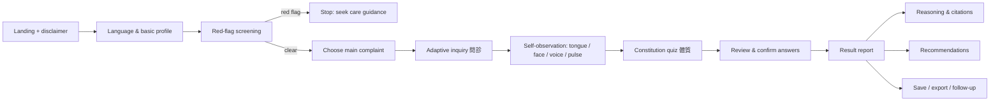

# Product Requirements Document — TCM Self-Assessment App

| | |
|---|---|
| **Working title** | TCM Self-Assessment App (name TBD) |
| **Version** | 0.2 (draft) |
| **Status** | Draft — under review; diagnosis SOP still being refined |
| **Last updated** | 2026-10-03 |
| **Related docs** | [Diagnosis SOP (繁體中文)](diagnosis-sop.zh-TW.md) · [Reference sources](../reference/README.md) |

> **Source-of-truth rule.** The diagnosis logic (what is asked, how answers become a
> pattern, how a pattern becomes a recommendation) is owned by the
> [Diagnosis SOP](diagnosis-sop.zh-TW.md). This PRD summarises it (§9) and derives product
> requirements from it. If the two disagree, the SOP wins and this PRD is updated.

---

## 1. Overview

### 1.1 Vision

Make the reasoning of Traditional Chinese Medicine (TCM) approachable and transparent. A user
describes their body and symptoms; the app walks through the classical diagnostic method
(四診 → 辨證 → 論治), tells the user which **pattern (證)** and **constitution (體質)** fit best,
**why** (symptom-by-symptom, with quotations from classics such as 《黃帝內經》《傷寒論》《金匱要略》),
and which classical formulas and lifestyle measures traditionally address that pattern.

### 1.2 Problem

- Laypeople who are curious about TCM cannot tell which advice applies to them; generic
  "TCM tips" ignore individual pattern differences, which is the core of TCM.
- Existing apps give conclusions without reasoning, or cite no sources, so users cannot judge
  reliability and learners cannot learn.
- Good TCM content is mostly in Chinese classical text, hard to access for English speakers and
  hard for modern readers even in Chinese.

### 1.3 Positioning

An **educational self-assessment and decision-support tool**, not a diagnostic or prescribing
service. Output is "what classical TCM reasoning suggests for the information you gave", always
paired with safety guidance and a pointer to a licensed practitioner (see §10).

---

## 2. Goals and non-goals

### 2.1 Goals

| # | Goal |
|---|---|
| G1 | Guide a non-expert through a structured TCM assessment on any device (phone, tablet, desktop). |
| G2 | Produce a pattern/constitution result with a **transparent, citable reasoning trace**. |
| G3 | Recommend classical formulas plus diet, acupressure and lifestyle advice, each with reasons, cautions and contraindications. |
| G4 | Be fully bilingual: Traditional Chinese (default) and English, with consistent TCM terminology. |
| G5 | Ground every medical statement in a real, traceable source; build the knowledge base from downloaded, licence-checked resources. |
| G6 | Be safe by design: red-flag triage, contraindication filtering, clear disclaimers. |
| G7 | Be privacy-first: no account needed, health data stays on the user's device by default. |

### 2.2 Non-goals (MVP)

- Not a medical device; no claim to diagnose, treat, cure or prevent disease.
- No acute / emergency, paediatric (< 18) or pregnancy-specific prescribing.
- No e-commerce, herb sales, telemedicine, or practitioner marketplace.
- No image-based tongue/face diagnosis in MVP (guided self-selection only; see FR-6).
- No Simplified Chinese UI in MVP (data is converted from Simplified sources, but not offered as a UI language).
- No LLM-generated diagnosis. The diagnostic core is deterministic and explainable (§9, Q3).

---

## 3. Target users

| Persona | Description | Needs |
|---|---|---|
| **Curious Health-Seeker** (primary) | Adult, 25–60, has chronic "sub-health" complaints (poor sleep, fatigue, bloating, cold hands/feet …), curious about TCM, not a practitioner | Simple questions, plain language, clear next steps, safety |
| **TCM Learner** | Student or hobbyist studying 四診/辨證 | See *why* a pattern was chosen; classical citations; compare differential patterns |
| **English-speaking User** | Interested in TCM, cannot read classical Chinese | Accurate English terms (with Chinese + pinyin), translated citations |
| **Practitioner (secondary)** | Licensed TCM practitioner | Quick structured intake summary of a patient; (not a replacement for clinical judgement) |

---

## 4. Scope

### 4.1 MVP (v1.0)

- Adults (≥ 18), non-pregnant, non-acute, self-limited functional / chronic complaints.
- Eight complaint modules (SOP §4.7): sleep, fatigue, digestion (bloating / appetite / stool),
  cold-heat sensitivity & sweating, head/body pain, mood/stress, women's cycle (non-pregnant),
  and mild early-stage external contraction (cold/flu onset).
- Constitution assessment (9 types) + pattern differentiation across the 23-pattern draft set in SOP §8.5.
- Result report with reasoning trace, recommendations and citations.
- zh-Hant and English; responsive; local history; print-friendly export.

### 4.2 Later (post-MVP)

- Seasonal / solar-term (節氣) guidance; follow-up re-assessment reminders; PWA/offline.
- On-device tongue photo assistance; knowledge-base browser; practitioner summary export.
- Additional complaint modules and schools (溫病 衛氣營血 / 三焦 for more external-contraction cases).
- Optional accounts / cloud sync; Simplified Chinese UI.

---

## 5. User journey

Target completion time: **≤ 10 minutes** for the first assessment; progress is saved so the user can resume.

---

## 6. Functional requirements

Priority: **P0** = MVP must-have · **P1** = MVP should-have · **P2** = post-MVP.
Each requirement is verifiable; detailed acceptance criteria move into the tech spec and test plan.

### FR-1 Onboarding and disclaimer — P0
- First screen explains purpose, limits (education, not diagnosis) and privacy (data stays on device).
- User must acknowledge before starting; acknowledgement is stored with a version so changed wording re-prompts.
- Persistent, unobtrusive disclaimer on result and recommendation views.

### FR-2 Language and localisation — P0
- Default **Traditional Chinese (zh-Hant)**; English (en) selectable at any time without losing progress.
- Language is part of the URL (e.g. `/zh-Hant/…`, `/en/…`), remembered, and honours browser language only for first visit when no choice is stored (zh-Hant remains the fallback for all unsupported languages).
- No hard-coded UI strings; all content (questions, patterns, formulas, citations) is keyed and translatable.
- TCM terms follow a glossary: Chinese term + pinyin + English (WHO standard terminology where it exists); a term tooltip/definition is available wherever a term appears.
- Classical citations are shown in the original Traditional-script text; an English rendering is shown when the user is in English mode and is labelled as a translation.

### FR-3 Body-information intake — P0
Collect (all optional except those marked ★; wording in the SOP §3):
- ★ Age, sex at birth, pregnancy/lactation status (affects safety filters).
- Height, weight (→ BMI), usual sleep hours, activity level, diet habits, smoking/alcohol, stress.
- Region / climate type and the current season/solar term (auto from date) for 因時、因地制宜.
- ★ Current medications, known allergies, chronic diseases (for safety filtering, §10).
- Main complaint(s) from a list; free-text note (stored locally, not interpreted by the engine in MVP).

### FR-4 Red-flag screening — P0
- Before any assessment, ask a short list of emergency / "see a doctor now" symptoms (chest pain, severe
  breathlessness, loss of consciousness, uncontrolled bleeding, sudden severe headache, suicidal thoughts …; list in SOP §2).
- Any positive answer stops the flow and shows localised guidance to seek urgent medical care. The engine never continues to recommendations.
- Out-of-scope users (< 18, pregnant, acute fever with warning signs) get a scoped result (lifestyle-only or "please consult a practitioner").

### FR-5 Structured inquiry (問診) — P0
- Questionnaire derived from the 十問歌 framework extended to 12 dimensions (寒熱, 汗, 頭身, 二便, 飲食口味, 胸腹, 耳目口咽, 口渴飲水, 睡眠, 情志, 經帶, 病程與誘因) — see SOP §4.2.
- About 25 core questions asked of everyone, then module-specific follow-ups; next question chosen by discriminating power (SOP §4.7).
- **Adaptive:** the next question depends on earlier answers and on the chosen complaint module; irrelevant questions are skipped.
- Plain-language wording with the TCM term available as secondary info; examples for ambiguous questions.
- Every question maps to one or more symptom codes in the knowledge base (traceable to a classical source for the underlying sign).
- Back/forward navigation, edit any answer, "not sure / skip" allowed; skipped data reduces confidence rather than blocking results.

### FR-6 Self-observation (望 / 聞 / 切) — P0 for selection-based, P2 for photo
- **Tongue:** guided selection of body colour, coating colour/thickness/moisture, shape/teeth-marks/cracks, using illustrated examples (and lighting/time-of-day guidance).
- **Complexion & spirit:** selection of 面色, 神 (vitality), lips, eyes.
- **Voice/breath/odour:** self-reported 聞診 items.
- **Pulse (proxy):** resting pulse rate and regularity as entered by the user (manual count or wearable); the app states that this is a coarse proxy and does not claim 脈象 recognition.
- **Palpation self-check:** simple items such as cold limbs, abdominal pressure preference (喜按/拒按).
- Every observation shows its confidence class (self-reported / guided / measured) which feeds into result confidence.
- P2: on-device tongue-photo assistance (no image upload to a server).

### FR-7 Constitution assessment (體質) — P0
- 9-type questionnaire (平和、氣虛、陽虛、陰虛、痰濕、濕熱、血瘀、氣鬱、特稟) following the 王琦 standard; wording subject to licence check (reference/README).
- Output: primary + secondary tendency with scores; used as a prior for pattern scoring and for recommendation style.

### FR-8 Diagnosis engine — P0
- Input: normalised symptom/sign set + profile + constitution. Output: ranked patterns (證型) with score, confidence band, and per-pattern evidence.
- **Deterministic, explainable:** same input → same output; scoring is a published weighted-symptom model over 證素 (SOP §8.3), not a black box. Weights, thresholds and quality coefficients are placeholders until calibrated by a practitioner (SOP App. D, D3).
- Handles conflicting data (e.g. 寒熱錯雜, 虛實夾雜) by returning compound/co-existing patterns, not forcing one answer.
- Returns an explicit **"insufficient information"** state when no pattern passes the minimum threshold; suggests which questions would discriminate best.
- Differential: shows the top alternatives and "what would make this a different pattern".
- Golden test set: curated case vignettes with practitioner-agreed expected patterns (see §11).

### FR-9 Result report — P0
Sections, in order:
1. Safety banner + scope note.
2. Summary: constitution tendency; top pattern(s) in plain language; confidence.
3. **Why** (reasoning trace): matched symptoms → which pattern evidence → theory explanation → classical citation. Symptoms that argued *against* the pattern are listed too.
4. Recommendations (FR-10).
5. When to see a practitioner / warning signs.
6. Data summary of what the user entered (editable → re-run).

### FR-10 Recommendations — P0
For each top pattern, provide with reasons:
- **Treatment principle (治則/治法)** in plain language.
- **Classical formula(s)** (方劑): name, source book/chapter, composition (herbs), the "monarch–minister–assistant–envoy" explanation (君臣佐使/方義), which of the user's symptoms match the formula's indications, and key cautions.
- **Diet/food therapy**, **acupressure points** (safe self-massage points only), and **lifestyle/seasonal** advice.
- Every recommendation carries: rationale, source citation, contraindications, and a "who should not use this" line.
- **Safety filter:** a formula/food/point is suppressed or downgraded when the profile conflicts (pregnancy, interacting medication, allergy, known-toxic herb, constitution mismatch). The suppression is shown with the reason, never silent.
- **Formula tiers**, computed from a formula's herbs (SOP §10.5), not hand-assigned: **A** shown with cautions; **B** shown only if extra safety conditions pass (no pregnancy, no anticoagulants, no bleeding tendency …), otherwise demoted to C; **C** "learning only" — composition and source text shown, not recommended, with a mandatory "licensed practitioner required" notice. Formulas containing toxic/strong herbs (e.g. 附子, 麻黃, 細辛) are always C.
- A formula is recommended only if the user matches ≥ 60 % of its indication core symptoms (**formula–pattern match**, SOP §10.5); otherwise only lifestyle advice is given.
- Dosage handling is an open question (Q4); default for MVP: show classical composition, **no personal dose**.

### FR-11 Citation and knowledge viewer — P0
- Every claim in the reasoning trace and recommendations has a citation chip: tap/click opens the original passage (book, chapter / clause number, original text, edition note) and the English rendering.
- Each citation links back to its provenance record (source repository + version) used to build it (§8).
- Citation IDs are stable so saved reports keep working across KB versions (version stamp stored with each report).

### FR-12 History and follow-up — P1
- Assessments are saved locally; user can reopen, compare two assessments, and delete all data.
- Optional "re-assess in N weeks" prompt that reuses previous answers as defaults.

### FR-13 Export — P1
- Print-optimised stylesheet and PDF export of the report (local generation).
- "Practitioner summary" view: concise intake summary (complaints, 四診 findings, pattern hypotheses) suitable to show a practitioner.

### FR-14 Knowledge browser — P2
- Browse/search patterns, formulas, herbs, acupoints and classical passages (bilingual), each with provenance.

### FR-15 Content pipeline (internal tool) — P0
- Reproducible build that turns `reference/` sources into the app KB: extract → normalise (Simplified→Traditional, term mapping) → enrich → validate → mark review status → emit versioned data bundle.
- Validation fails the build on missing citation, unknown symptom code, untranslated required field, or unreviewed record flagged for production use.

### FR-16 Feedback — P1
- "Was this helpful / did this match?" per result and per reasoning item, stored locally and optionally exported by the user; used by maintainers to calibrate weights.

---

## 7. Non-functional requirements

| Area | Requirement |
|---|---|
| **Responsive** | Mobile-first; supported viewports 320 px – 1920 px; layouts for phone (single column, bottom-anchored primary action), tablet and desktop (two-pane report with sticky reasoning/citation panel); touch targets ≥ 44 px; no horizontal scroll. |
| **Performance** | LCP ≤ 2.5 s and INP ≤ 200 ms on mid-range mobile over 4G; initial JS ≤ 200 KB gzip; KB data loaded lazily per module/complaint; engine runs fully client-side in < 200 ms. |
| **Accessibility** | WCAG 2.1 AA; keyboard operable; screen-reader labels in both languages; colour is never the only signal (tongue/complexion pickers include text labels); CJK-friendly line height and font stack. |
| **i18n** | zh-Hant default; strict key coverage check in CI; Traditional-script fonts with proper fallbacks; locale-aware dates/units; pluralisation via ICU messages. |
| **Privacy** | No PII sent to any server in MVP; all assessments stored locally (IndexedDB/localStorage), with an obvious "erase everything" control; analytics, if any, are opt-in, aggregate and contain no answers. |
| **Security** | Static hosting with strict CSP and security headers; no third-party scripts that see user input; dependencies audited in CI. |
| **Reliability / offline** | Works without a backend. P1: installable PWA with offline use after first load. |
| **Content integrity** | 100 % of recommendations and reasoning items carry citations; KB bundle is versioned and each saved report records the version it was generated with. |
| **Testability** | Engine and KB covered by automated tests, including golden-case regression; i18n and a11y checks in CI. |
| **Browser support** | Last 2 versions of Chrome, Safari (incl. iOS), Firefox, Edge. |
| **Maintainability** | Clear separation: content (data) · engine (pure functions) · UI. Content changes must not require engine/UI code changes. |

---

## 8. Knowledge base

### 8.1 Principle

The KB is **derived from real sources**, never authored from memory or generated freely.
Every record keeps provenance and a review status.

### 8.2 Sources (see [`reference/README.md`](../reference/README.md))

| Layer | Primary sources | Notes |
|---|---|---|
| Theory & citations | 《黃帝內經》(素問/靈樞)、《難經》、《傷寒論》、《金匱要略》 | From `TCM-Library` raw/curated text; cross-check against Wikisource (Traditional script) |
| Diagnostics | 《景岳全書·傳忠錄》(十問)、《醫學心悟》(八綱)、《瀕湖脈學》《診家正眼》(脈)、《傷寒舌鑑》《望診遵經》(舌/望) | From `TCM-Ancient-Books` (GB18030) |
| Formulas | 《傷寒論》《金匱要略》(經方); 《太平惠民和劑局方》《脾胃論》《溫病條辨》《醫林改錯》《醫方集解》 etc. (時方) | Composition & indications extracted, then reviewed |
| Herbs | 《神農本草經》、Pharmacopoeia entries, `tcm-mkg` property data (四氣五味歸經) | Needed for formula explanation and contraindication logic |
| Constitution | 《中醫體質分類與判定》標準 (王琦), 《靈樞·陰陽二十五人》《通天》 as classical roots | Licence check before embedding questionnaire text |

### 8.3 Record model (conceptual — detailed schema in tech spec)

Core entities: `Symptom`, `Sign`, `Pattern(證型)`, `PatternEvidence(weights)`, `Constitution`, `Formula`, `Herb`,
`Acupoint`, `FoodItem`, `Citation`, `Glossary term`, `Question`.
Each record carries: `id`, `zh-Hant` + `en` fields, `source[]` (book, chapter/clause, repo, commit), `status`
(`draft → reviewed → approved`), `reviewer`, `updated_at`.

### 8.4 Pipeline requirements

1. Fetch via git submodules (pinned) and, where needed, public-domain web sources through scripted, rate-limited download.
2. Convert Simplified → Traditional with OpenCC `s2twp`, followed by a TCM-term override list and spot checks.
3. Extract structured records; machine-extracted rows start as `draft`.
4. English text: glossary-first (WHO terminology), machine-drafted for prose and flagged `needs-review`.
5. Validation gates (§FR-15). Production bundle contains only `approved` records.
6. Licence ledger: each source's licence and attribution requirement is recorded; non-commercial or unlicensed material is excluded from the shipped bundle.

### 8.5 Content review

A qualified TCM practitioner (to be identified — Q8) reviews: pattern evidence weights, formula–pattern mapping, contraindication rules, and all recommendation text. No production release without a recorded review.

---

## 9. Diagnostic approach (summary of the SOP)

Full detail: [Diagnosis SOP](diagnosis-sop.zh-TW.md). In summary the app implements this pipeline:

| Step | Name (SOP section) | What happens |
|---|---|---|
| 0 | Safety screening (§2) | Red-flag and scope checks; stop or restrict |
| 1 | Profile & 三因 context (§3) | Age, sex, region, season, lifestyle, medications — priors and safety inputs |
| 2 | 四診 collection (§4) | 問診 (12 dimensions) as the core; guided 望 / 聞; proxy 切 (pulse rate, abdominal self-check) |
| 3 | Normalisation (§5) | Answers → standard symptom/sign codes; data-quality class per datum; conflict checks |
| 4 | 體質 assessment (§6) | 9-constitution scoring; baseline tendency, used as tie-breaker and for advice style |
| 5 | 八綱 orientation (§7) | 表裏 · 寒熱 · 虛實 · 陰陽 |
| 6 | 辨證 (§8) | 證素 (location × nature) weighted scoring → pattern from the 23-pattern draft library; 六經 for mild external presentations |
| 7 | Reconcile & confidence (§9) | Combine, resolve conflicts, rank patterns, differential, confidence level or "insufficient information" |
| 8 | 論治 (§10) | 治則 → 治法 → formula / diet / acupoint / lifestyle candidates |
| 9 | Safety filter (§11) | Contraindications, interactions, toxic-herb rules; suppressed items are shown with reasons |
| 10 | Explanation (§12) | Reasoning trace with citations; confidence and "what would change this" |

Design consequences for the product: the questionnaire must be adaptive (step 2), the engine must expose
per-evidence contributions (steps 6–7, FR-8/9), and recommendations must be generated from KB records, not free text (step 8, FR-10).

---|---|---|
| 0 | Safety screening | Red-flag and scope checks; stop or restrict |
| 1 | 四診 information collection | 問診 (十問) as core; guided 望 / 聞; proxy 切 |
| 2 | Normalisation | Answers → standard symptom/sign codes; confidence per datum |
| 3 | 體質 assessment | 9-constitution scoring as prior |
| 4 | 八綱 orientation | 表裏 · 寒熱 · 虛實 · 陰陽 |
| 5 | 辨證 | Pattern scoring using 證素 (location × nature) and 臟腑 / 氣血津液 (and 六經 for external-contraction presentations) |
| 6 | Reconcile | Combine, resolve conflicts, produce ranked patterns + differential |
| 7 | 論治 | 治則 → 治法 → formula / diet / acupoint / lifestyle candidates |
| 8 | Safety filter | Contraindications, interactions, toxic-herb rules |
| 9 | Explanation | Reasoning trace with citations; confidence and "what would change this" |

Design consequences for the product: the questionnaire must be adaptive (step 1), the engine must expose
per-evidence contributions (steps 5–6, FR-8/9), and recommendations must be generated from KB records, not free text (step 7, FR-10).

---

## 10. Safety, ethics and compliance

- **Positioning:** educational; every result screen states it does not replace a licensed practitioner or emergency care.
- **Red flags** stop the flow (FR-4). The list is clinically reviewed before release.
- **Scope limits:** no paediatric, pregnancy, acute illness or serious-chronic-disease management.
- **Contraindication engine:** pregnancy/lactation, anticoagulants and other medicines (e.g. herb–drug interactions), allergies, known-toxic herbs (e.g. 附子, 麻黃, 細辛, 馬兜鈴科) and constitution/pattern mismatches (補益 for 實證 etc.).
- **No treatment claims**; wording avoids "cure", "treat disease X". Language is reviewed by a TCM practitioner and by legal counsel for the target region (Q1).
- **Transparency:** show confidence, the data used, and sources; never present speculative content as classical fact.
- **Privacy:** health data is sensitive; local-first by default (see §7). If sync/accounts are added later, a separate privacy and consent design is required (GDPR / PDPA-type regimes).
- **Content licensing:** respect upstream licences (see `reference/README.md`); attribute where required; exclude non-commercial-only data from commercial builds.

---

## 11. Success metrics

| Metric | Target (MVP, to calibrate) |
|---|---|
| Assessment completion rate (start → result) | ≥ 60 % |
| Median time to result | ≤ 10 min |
| Result clarity ("I understand why") — in-app rating | ≥ 4.0 / 5 |
| Expert concordance: top-3 patterns contain the practitioner's pattern on the golden set (≥ 100 vignettes) | ≥ 80 % |
| Citation coverage of recommendations and reasoning items | 100 % |
| Safety: red-flag vignettes correctly stopped | 100 % |
| Lighthouse (mobile) performance / accessibility | ≥ 90 / ≥ 95 |
| i18n completeness (zh-Hant and en keys) | 100 % |

---

## 12. Risks and mitigations

| Risk | Impact | Mitigation |
|---|---|---|
| User treats output as medical advice / delays care | Harm, liability | Red-flag triage, scope limits, persistent disclaimers, "see a practitioner" triggers, no dosing in MVP, legal review |
| Incorrect or inconsistent pattern logic | Bad advice, trust loss | SOP as source of truth, practitioner-reviewed weights, golden-case regression, confidence bands, "insufficient info" state |
| Source text errors (OCR, editions, Simplified→Traditional conversion) | Wrong citations | Provenance + cross-check with second source, review status, spot checks of converted terms |
| Licence issues (unlicensed or NC data) | Legal exposure | Licence ledger; ship only MIT/public-domain-derived data; reference-only sources excluded |
| TCM terminology mistranslation | Confusion | Glossary-first, WHO terminology, reviewer sign-off |
| Different schools disagree (經方 vs 時方 vs 溫病) | Inconsistent output | Declare the primary framework in SOP; show alternatives as "other schools" rather than hiding disagreement |
| Self-reported tongue/pulse unreliable | Low accuracy | Guided inputs with examples, confidence weighting, don't over-weight proxies |
| Herb safety (toxicity, interactions) | Physical harm | Safety filter, display-only for strong herbs, interaction table reviewed by pharmacist/practitioner |
| Over-long questionnaire → drop-off | Low completion | Adaptive questioning, 10-min budget, save/resume |

---

## 13. Release plan and document roadmap

| Milestone | Content |
|---|---|
| **M0 — Docs** | PRD ✔ draft · Diagnosis SOP ✔ draft (iterating) · tech spec · UI/UX spec · supporting docs (KB schema, i18n & glossary guide, content-review process, safety policy, test plan, contributing) · task list + checklist |
| **M1 — Knowledge base** | Reference ingestion pipeline, Traditional conversion, first reviewed pattern/formula set |
| **M2 — MVP app** | Responsive UI, bilingual, intake → engine → report |
| **M3 — Review & hardening** | Practitioner review, golden-case calibration, a11y/perf passes |
| **M4 — Beta** | Limited release, feedback loop, weight calibration |

Doc deliverables, all English except the SOP: `PRD.md`, `diagnosis-sop.zh-TW.md` (繁中), tech spec,
UI/UX spec, KB schema, i18n/glossary, safety & content-review policy, test plan, task list (`TASKS.md`)
and `CHECKLIST.md`. One commit per finished task.

---

## 14. Open questions

Proposed defaults are used in this draft until confirmed.

| # | Question | Default assumed |
|---|---|---|
| Q1 | Target region and regulatory framing (Taiwan / HK / mainland / global)? Affects wording, herb availability and which pharmacopoeia is the reference | Taiwan-first wording; international English |
| Q2 | Which complaint modules and which patterns are in the MVP? | SOP §4.7 and §8.5: 23 draft patterns across 8 complaint modules |
| Q3 | LLM involvement? (none / plain-language rewording only / diagnosis) | **None** in diagnostic core; optional rewording post-MVP, never for pattern choice |
| Q4 | Show dosage for formulas? | No personal dosing; composition + classical context only |
| Q5 | Include tongue-photo analysis or pulse devices? | Not in MVP; manual inputs only |
| Q6 | Accounts / cloud sync, or purely local? | Purely local |
| Q7 | Primary diagnostic framework: 八綱 + 臟腑/氣血津液 for 雜病, 六經 for 外感, 衛氣營血/三焦 later? | As described in §9 |
| Q8 | Who is the qualified TCM reviewer(s)? Review cadence? | TBD — blocks M3 |
| Q9 | Simplified Chinese UI later? | Post-MVP |
| Q10 | Commercial or non-commercial release? (affects use of CC BY-NC-SA material such as ctext.org) | Treat as potentially commercial → exclude NC data |
| Q11 | Minimum age and handling of pregnancy / elderly users | ≥ 18; pregnancy → lifestyle-only |

---

## 15. Glossary

| Term | Meaning |
|---|---|
| 四診 (Four examinations) | 望 inspection, 聞 listening/smelling, 問 inquiry, 切 palpation/pulse |
| 辨證 (Pattern differentiation) | Identifying the pattern (證) from collected information |
| 論治 | Deciding treatment principles and methods from the pattern |
| 證 / 證型 | Pattern — the syndrome-level conclusion (e.g. 脾氣虛) |
| 證素 | Pattern element: disease location (病位) and disease nature (病性), combined to form a pattern |
| 八綱 | Eight principles: 陰陽、表裏、寒熱、虛實 |
| 體質 | Constitution — baseline tendency of an individual |
| 方劑 / 方義 | Formula / the rationale of its composition (君臣佐使) |
| 治則 / 治法 | Treatment principle / treatment method |
| 經方 / 時方 | Classical formulas (mainly 傷寒論 & 金匱要略) / later-era formulas |

---

## 16. Changelog

| Version | Date | Change |
|---|---|---|
| 0.1 | 2026-10-03 | Initial draft from project brief |
| 0.2 | 2026-10-03 | Aligned with diagnosis SOP v0.1: 8 complaint modules, 23-pattern draft library, 12-dimension inquiry, formula tiers A/B/C, step numbering and SOP section references |
