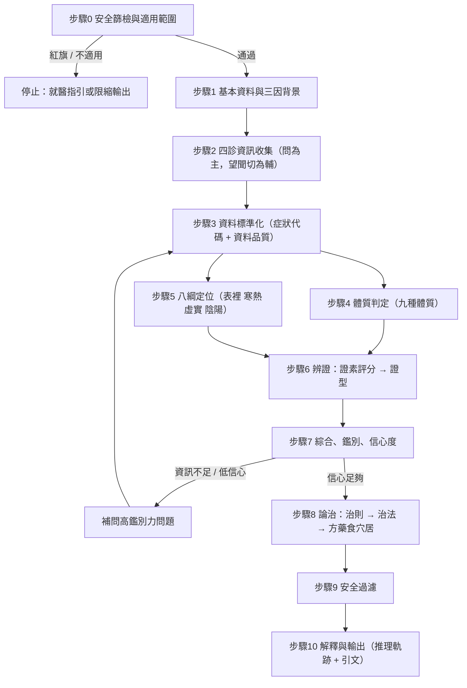

# 辨證論治作業流程（診斷 SOP）

| | |
|---|---|
| **版本** | 0.1（草案，待討論修訂） |
| **狀態** | 草案——與使用者逐段討論後修訂；修訂後同步更新 [PRD](PRD.md) |
| **最後更新** | 2026-10-03 |
| **語言** | 繁體中文（本專案唯一非英文文件） |
| **關聯文件** | [PRD](PRD.md)・[reference/ 資料來源目錄](../reference/README.md) |

> **本文件的地位**：App 的「問什麼、怎麼算、怎麼推薦」以本文件為唯一依據。PRD 只摘要本文件；兩者衝突時，以本文件為準，再回頭修改 PRD。
>
> **標記說明**
> - 【待確認】：需要與你討論或需專業審核的決策點，彙整於 [附錄 D](#附錄-d待討論事項)。
> - ✔ 已核對：該引文已與 `reference/sources/TCM-Library` 的原文逐字比對過（簡體原文，內容層面核對；建置知識庫時再做繁體轉換與第二來源交叉驗證）。
> - ○ 待核對：來源書籍已在 reference 中找到，但條文／出處細節尚未逐字核對。
> - 權重、閾值、係數皆為**示意值**，須經中醫師校準後才能用於正式版本。

---

## 0. 文件說明

### 0.1 目的

把中醫「四診 → 辨證 → 論治」的思維，拆成電腦與使用者都能執行的明確步驟：每一步**做什麼（What）**、**怎麼做（How）**、**理論依據（Source）**、**產出（Output）**、**在 App 中如何呈現**。

### 0.2 適用範圍

| 適用 | 不適用（App 會停止或限縮輸出） |
|---|---|
| 18 歲以上成人 | 18 歲以下 |
| 非急症、功能性或慢性的不適（亞健康）：睡眠、疲倦、消化、寒熱汗出、頭身疼痛、情緒壓力、婦女經帶、輕症外感初起 | 急症、重症、需要住院或處置者 |
| 非懷孕、非哺乳 | 懷孕、哺乳（僅提供溫和生活建議） |
| 以學習、自我了解、就醫前整理資訊為目的 | 癌症治療中、腎衰竭或洗腎、肝硬化、器官移植、重度精神疾病等（僅提示就醫） |

### 0.3 設計原則

1. **四診合參**：不憑單一症狀下結論（《難經·六十一難》、《靈樞·邪氣藏府病形》）。
2. **以證為綱**：辨「證」而非辨「病」——同病異治、異病同治。
3. **可解釋**：每個結論都能回溯到「哪些症狀」＋「哪條古籍理論」。
4. **原文優先**：引用以古籍原文為準；白話與英文是附屬層。
5. **保守誠實**：資訊不足時明說「資訊不足」，不硬給答案；自我檢查（舌、脈）可信度低，降權處理。
6. **安全優先**：紅旗症狀先於一切；建議須通過安全過濾才能呈現。

### 0.4 理論框架的取捨【待確認 D1】

| 情境 | 主要辨證體系 | 備註 |
|---|---|---|
| 外感新病（起病急、≤14 天，惡寒／發熱／咽痛／鼻塞等） | 八綱＋**六經辨證**（《傷寒論》）；溫熱屬性用**衛氣營血／三焦**（《溫病條辨》） | MVP 僅涵蓋輕症外感（表證）；高燒等一律導向就醫 |
| 內傷雜病（慢性、功能性） | 八綱＋**臟腑辨證**＋**氣血津液辨證** | MVP 主體 |
| 統一計算層 | **證素辨證**（病位證素 × 病性證素）：把各體系轉成同一組可計分的「證素」，再組合成證型 | 見第 8 節；現代參考：朱文鋒《證素辨證學》○ |

不納入 MVP：五運六氣（驗證困難、學派爭議大）【待確認 D8】。

---

## 1. 流程總覽



| 步 | 名稱 | 做什麼（What） | 怎麼做（How） | 主要理論依據 | 產出 |
|---|---|---|---|---|---|
| 0 | 安全篩檢 | 排除急症與不適用族群 | 紅旗清單＋適用範圍檢查 | 標本緩急（《素問·標本病傳論》✔） | 通過／停止／限縮 |
| 1 | 基本資料 | 取得年齡、性別、地域、季節、生活、用藥 | 結構化表單 | 三因制宜（《素問·五常政大論》✔、《異法方宜論》✔） | 個人背景 |
| 2 | 四診收集 | 取得症狀與體徵 | 十二面向適應式問卷＋引導式自我觀察 | 四診合參（《難經·六十一難》✔）、十問歌（《景岳全書》✔） | 原始答案 |
| 3 | 標準化 | 把答案轉成標準症狀代碼並標註品質 | 症狀庫對照、同義詞分流、衝突檢查 | — | 標準化症狀集 |
| 4 | 體質 | 判定基礎體質傾向 | 九種體質量表＋轉換分 | 《靈樞·陰陽二十五人》✔、《通天》✔；王琦九種體質 | 體質傾向 |
| 5 | 八綱 | 初判表裡、寒熱、虛實、陰陽 | 症狀→八綱加權 | 《醫學心悟》八綱✔、《景岳全書·六變辨》✔ | 八綱向量 |
| 6 | 辨證 | 算出各證素強度並組成證型 | 加權計分＋必要／排除條件＋證型庫比對 | 臟腑、氣血津液、六經、衛氣營血 | 證型候選 |
| 7 | 綜合鑑別 | 處理兼夾、衝突，排序，算信心 | 合併規則＋鑑別問題＋信心公式 | 標本緩急✔；寒熱真假（《傷寒論》厥陰篇✔） | 排序證型＋信心 |
| 8 | 論治 | 由證型決定治則、治法與方藥食穴居 | 證型→治法→方劑對照表＋方證對應度 | 治病求本等（《素問》✔）、《醫學心悟·醫門八法》✔ | 推薦候選 |
| 9 | 安全過濾 | 剔除或降級不安全的推薦 | 規則表（孕、藥物交互、強藥、證型衝突） | 無盛盛無虛虛（《素問·五常政大論》✔） | 通過的推薦＋被抑制項與原因 |
| 10 | 輸出 | 呈現結論、原因、引文、限制 | 報告模板＋引文系統 | 原文引用 | 結果報告 |

---

## 2. 步驟 0：安全篩檢與適用範圍

### 2.1 目的

在任何辨證之前，先判斷這個人**現在是否該去看醫生而不是用 App**。

### 2.2 怎麼做

1. 以**是／否題**逐項詢問紅旗症狀；任何一項為「是」→ 立即停止，顯示對應等級的就醫指引。
2. 檢查適用範圍（年齡、懷孕、重大疾病）；不適用者轉入「限縮模式」（只提供溫和生活建議與就醫提示，不出證型與方劑）。
3. 在地緊急資源依地區顯示（例如台灣：119 緊急救護、1925 安心專線）【待確認 Q1】。

### 2.3 紅旗清單（初稿，須由醫師審定【待確認 D7】）

| 等級 | 症狀／情況 | 處理 |
|---|---|---|
| **A 立即求救** | 胸痛或胸悶壓迫並伴冷汗；呼吸困難；意識不清／昏厥；突發單側肢體無力、口角歪斜、言語不清；大量出血、吐血、黑便或血便；突發劇烈頭痛（有生以來最痛）；抽搐；嚴重過敏（喉頭緊縮、全身蕁麻疹伴呼吸困難）；自傷或傷人念頭 | 停止流程；顯示緊急求助與心理支持資源 |
| **B 24 小時內就醫** | 發燒 ≥ 39°C 或發燒超過 3 天；持續嘔吐、無法進食水或明顯脫水；劇烈腹痛；不明原因體重快速下降；血尿；新出現的腫塊；黃疸；咳血；視力突然改變；新發心悸並脈搏不規則 | 停止辨證；建議儘快就醫 |
| **C 不適用／限縮** | 未滿 18 歲；懷孕或哺乳；癌症治療中；洗腎或腎衰竭；肝硬化；器官移植；重度精神疾病；已確診嚴重心肺疾病 | 限縮模式 |

### 2.4 理論依據

- **標本緩急**：《素問·標本病傳論》「小大不利治其標，小大利治其本」✔——急重者先治其標，在 App 即「先送醫」。
- 紅旗清單本身以**現代醫學急症判準**為主，古籍只提供「急則治標」的理念支持，不作為判準來源。

### 2.5 App 對應

獨立的第一關頁面；A 級與 B 級有不同顏色與版面；不得「略過」。

---

## 3. 步驟 1：基本資料與三因背景

### 3.1 目的與依據

中醫辨證強調「因人、因時、因地制宜」。此步取得個人背景，供後續**先驗判斷**與**推薦調整**，不直接決定證型。

### 3.2 欄位

| 欄位 | 為何要問 | 理論依據 | 如何使用 |
|---|---|---|---|
| ★年齡、性別 | 不同生命階段的氣血盛衰不同 | 《素問·上古天真論》女七男八（「女子七歲，腎氣盛」「丈夫八歲」）✔ | 年齡層先驗（如更年期前後）；安全過濾 |
| ★是否懷孕／哺乳 | 用藥與穴位禁忌 | 《素問·六元正紀大論》「有故無殞，亦無殞也」✔——古人有條件地用藥，需醫師判斷，**App 不採用** | 觸發限縮模式 |
| 身高、體重（BMI）、體型 | 形體與痰濕、氣虛、陰虛傾向相關 | 《靈樞·陰陽二十五人》✔（形與氣質分類）；肥人多痰、瘦人多火之說（《丹溪心法》○） | 弱先驗，不單獨計分 |
| 居住地區／氣候 | 因地制宜 | 《素問·異法方宜論》✔（東西南北中五方所宜） | 濕熱／乾燥傾向先驗；食療建議調整 |
| 當前季節（自動，由日期推得） | 因時制宜 | 《素問·四氣調神大論》✔、《素問·五常政大論》「必先歲氣，無伐天和」✔ | 時令先驗（夏多暑濕、冬多寒、秋多燥）；養生建議 |
| 作息、飲食、運動、菸酒 | 病因與調攝的重點 | 《素問·上古天真論》「食飲有節，起居有常，不妄作勞」✔ | 病因提示；生活建議個人化 |
| 情緒壓力 | 七情內傷 | 《素問·舉痛論》九氣（「怒則氣上」…「思則氣結」）✔ | 情志證素先驗 |
| ★目前用藥、過敏史、慢性病史 | 交互作用與禁忌 | （現代藥學，非古籍） | **只用於安全過濾**，不影響辨證 |
| 主訴（可複選）＋自由備註 | 決定問診模組 | 十問歌之「主訴」概念 | 啟動模組（見 4.7）；自由備註不入計算 |

★＝必填。

---

## 4. 步驟 2：四診資訊收集

### 4.1 總則

- 《難經·六十一難》：「望而知之謂之神，聞而知之謂之聖，問而知之謂之工，切脈而知之謂之巧」✔
- 《靈樞·邪氣藏府病形》：「見其色，知其病，命曰明；按其脈，知其病，命曰神；問其病，知其處，命曰工」✔
- 《素問·陰陽應象大論》：「善診者，察色按脈，先別陰陽；…視喘息，聽音聲，而知所苦」✔
- 診察時機：《素問·脈要精微論》「診法常以平旦，陰氣未動，陽氣未散，飲食未進…」✔ → App 建議**晨起未進食、未劇烈活動時**記錄舌象與脈率；使用自然光。

**線上自助的先天限制**：App 無法真正「切脈」「望診」，因此以**問診為核心**，望、聞、切採「引導式自我觀察」並降權（4.6）。

### 4.2 問診（十問歌延伸為十二面向）

依據：《景岳全書·傳忠錄·十問篇》✔（張介賓）十問歌「一問寒熱二問汗，三問頭身四問便，五問飲食六問胸，七聾八渴俱當辨…」，後世（陳修園《醫學實在易》○）改編加入「九問舊病十問因」及婦女經期；本 App 再補**睡眠**與**情志**，共十二面向。

| # | 面向 | 要問什麼（題目範例，白話） | 辨證意義 | 理論依據 |
|---|---|---|---|---|
| 1 | 寒熱 | 怕冷還是怕熱？手腳冰涼嗎？是否同時怕冷又發熱？有沒有午後潮熱？寒熱交替？ | 惡寒發熱並見→表證；只怕冷不發熱→裡寒／陽虛；只發熱不怕冷→裡熱；午後潮熱、五心煩熱→陰虛；寒熱往來→少陽 | 《傷寒論》第7條「病有發熱惡寒者，發於陽也；無熱惡寒者，發於陰也」✔；《素問·調經論》「陽虛則外寒，陰虛則內熱」✔；少陽「往來寒熱」✔ |
| 2 | 汗 | 平時容易出汗嗎？白天動則汗出，還是晚上睡著出汗？完全不出汗？ | 自汗→氣虛／陽虛／營衛不和；盜汗→陰虛；無汗惡寒→表實 | 《素問·陰陽別論》「陽加於陰，謂之汗」✔；《傷寒論》第2、12、35、53條（中風有汗、傷寒無汗、「病常自汗出」營衛不和）✔ |
| 3 | 頭身 | 哪裡痛？什麼樣的痛（脹、刺、冷、灼、重、隱、絞）？固定或遊走？頭重、身重、肢體麻木？ | 脹痛→氣滯；刺痛固定→血瘀；冷痛→寒；灼痛→熱；重痛→濕；隱痛→虛；痛處依經絡判斷臟腑 | 《素問·舉痛論》✔（寒氣客於脈外則血少…諸痛成因）；《靈樞·經脈》✔（所生病） |
| 4 | 二便 | 大便幾天一次？乾、溏、黏滯、完穀不化、解不乾淨？小便量、顏色、夜尿、頻急澀痛？ | 便溏→脾虛／寒；便乾→熱、津虧、氣滯；黏滯臭穢→濕熱；夜尿多→腎陽虛；尿黃短→熱 | 《素問·標本病傳論》✔（二便為標本之關鍵）；《靈樞·口問》「中氣不足，溲便為之變」✔；《素問·至真要大論》病機十九條「諸病水液，澄澈清冷，皆屬於寒」「諸轉反戾，水液渾濁，皆屬於熱」✔ |
| 5 | 飲食與口味 | 食慾如何？吃了是否脹？口苦、口黏、口甜、口淡、口酸？喜冷還是喜熱食？ | 食少腹脹→脾虛；口苦→肝膽熱；口黏膩→濕；口淡→脾虛；口酸→肝胃不和 | 《素問·陰陽應象大論》五臟與味、竅對應✔；《靈樞·脈度》「脾氣通於口」✔ |
| 6 | 胸腹 | 胸悶、心悸、脅肋脹、胃脘痛或脹、腹痛？按壓會舒服（喜按）還是更痛（拒按）？噯氣、反酸？ | 喜按→虛；拒按→實；腹滿時減→寒（虛）；脅脹→肝；心悸→心 | 《金匱要略·腹滿寒疝宿食病》「按之不痛為虛，痛者為實」「腹滿時減，復如故，此為寒，當與溫藥」✔；《傷寒論》「胸脅苦滿」✔ |
| 7 | 耳目口咽 | 耳鳴（如潮／如蟬）？視物模糊、眼乾澀？咽乾、咽痛、咽中有異物感？ | 耳為腎竅，目為肝竅；耳鳴如潮多實、如蟬多虛；咽乾→陰虛／熱 | 《靈樞·脈度》「肝氣通於目…腎氣通於耳」✔ |
| 8 | 口渴飲水 | 口渴嗎？想喝冷的還是熱的？渴但不想喝水？ | 渴喜冷飲→熱；渴喜熱飲或不欲飲→寒濕／痰飲；口乾只想漱口不嚥→瘀 | 《傷寒論》第6條「發熱而渴，不惡寒者，為溫病」✔；《金匱要略·痰飲咳嗽病》✔ |
| 9 | 睡眠 | 入睡難、易醒、早醒、多夢、嗜睡？醒後精神如何？ | 難入睡＋心煩→心火／心腎不交；易醒多夢＋心悸健忘→心脾兩虛；脘腹不適致不寐→胃不和；痰熱擾心 | 《靈樞·營衛生會》「氣至陽而起，至陰而止」✔；《靈樞·邪客》半夏湯治「目不瞑」✔；《素問·逆調論》「胃不和則臥不安」✔ |
| 10 | 情志 | 常抑鬱、易怒、焦慮、易受驚、悲傷、思慮過度嗎？ | 怒→肝；喜→心；思→脾；憂悲→肺；恐驚→腎 | 《素問·陰陽應象大論》✔；《素問·舉痛論》九氣✔；《靈樞·本神》「肝藏血，血舍魂」等五神臟✔ |
| 11 | 經帶（女性、非孕） | 月經週期、經量、經色、血塊、痛經、經前乳脹；白帶性質 | 經色淡量少→血虛；有血塊色暗→瘀；經前脹→肝鬱；帶黃稠→濕熱 | 《素問·上古天真論》月事以時下✔；《金匱要略》婦人三篇○ |
| 12 | 病程與誘因 | 這個狀況多久了？怎麼開始的？什麼會加重或減輕？吃過什麼藥？ | 新病多實多表、久病多虛多裡；誘因提示病因 | 《靈樞·百病始生》✔（病起於風雨寒暑、清濕、喜怒）；十問歌「舊病」「因」 |

### 4.3 望診（引導式自我觀察）

| 項目 | 內容 | 辨證意義（示意） | 理論／書目 |
|---|---|---|---|
| 神 | 精神、目光、反應 | 得神者昌，失神者亡 | 《素問·移精變氣論》「得神者昌，失神者亡」✔；《靈樞·本神》✔ |
| 面色 | 青赤黃白黑；明潤或晦暗 | 白→虛／寒／血虛；黃→脾虛／濕；赤→熱；青→寒／痛／瘀；黑→腎虛／水飲／瘀 | 《素問·五藏生成》五色✔；《靈樞·五色》「五色獨決於明堂」✔ |
| **舌質** | 顏色（淡白、淡紅、紅、絳、青紫、瘀斑）；形（胖大、齒痕、瘦薄、裂紋、芒刺）；態 | 淡胖齒痕→陽虛／脾虛濕盛；紅少苔→陰虛；紅絳→熱；紫暗瘀斑→血瘀 | 《傷寒舌鑑》（張登，清）✔存在；《臨症驗舌法》（據資料集標示楊雲峰）✔存在；《察舌辨症新法》（劉恆瑞）✔存在 |
| **舌苔** | 色（白、黃、灰黑）；厚薄；潤燥；膩、腐；剝落 | 薄白→正常或表證；白膩→痰濕／寒濕；黃膩→濕熱；厚腐→食積；少苔或剝→陰虛 | 同上 |
| 舌下絡脈 | 是否青紫粗長 | 血瘀 | 同上○ |
| 其他 | 唇、爪甲、皮膚、毛髮；痰、涕、尿、便的顏色與質地 | 水液澄澈清冷屬寒、渾濁屬熱 | 《素問·至真要大論》病機十九條✔；《望診遵經》（汪宏，清）✔存在 |

**引導方式**：每個選項配示意圖與文字；說明光線、時間（晨起）、避免染苔食物；選項皆含「不確定」。**MVP 不做照片辨識**【待確認 D4】。

### 4.4 聞診（自述）

| 項目 | 辨證意義（示意） | 理論 |
|---|---|---|
| 聲音：低微無力／洪亮；嘶啞 | 低微懶言→氣虛；洪亮→實熱；嘶啞→肺陰虛或外感 | 《素問·脈要精微論》「言而微，終日乃復言者，此奪氣也」✔；《素問·陰陽應象大論》「聽音聲，而知所苦」✔ |
| 呼吸：氣短、喘、常嘆息 | 氣短→氣虛；嘆息→肝鬱 | 同上○ |
| 咳嗽、噯氣、呃逆 | 依聲音、痰、時間判斷 | ○ |
| 氣味：口氣、體味 | 酸腐→食積；臭穢→濕熱 | ○ |

### 4.5 切診的居家替代

App **不宣稱**能辨識二十八脈，也不以按脈得出結論。可取得的替代資訊：

| 項目 | 作法 | 對應與限制 |
|---|---|---|
| 脈率 | 晨起靜坐 1 分鐘，手腕、頸部或智慧手錶量測 | 《素問·平人氣象論》「人一呼脈再動，一吸脈亦再動，呼吸定息脈五動，閏以太息，命曰平人」✔。教材對照：遲脈（一息三至）約 < 60 次／分；數脈（一息六至）約 > 90 次／分（《瀕湖脈學》✔存在，○逐字核對）。**運動員、藥物、發燒、焦慮皆會干擾**，故低權重 |
| 脈律 | 規則、偶有停跳、明顯不規則 | 中醫的結、代、促；**不規則脈率先導向就醫**（B 級）而非辨證 |
| 腹部按壓自查 | 喜按／拒按；腹部溫涼；脹滿 | 《金匱要略·腹滿寒疝宿食病》✔ |
| 四肢溫涼 | 手足冰冷／手足心熱 | 陽虛／陰虛提示 |
| 皮膚按壓 | 小腿按壓是否凹陷 | 水濕提示○ |

**脈象缺失的補償**：證型庫會列出「典型脈象」作為**教育說明**顯示，但**不納入計分**。

### 4.6 資料品質係數 q（示意，須校準【待確認 D3】）

| 資料類別 | q | 說明 |
|---|---|---|
| 問診症狀（自述） | 1.0 | 問診本身即症狀的來源 |
| 器材量測（脈率） | 0.9 | 客觀但有干擾 |
| 引導式自我觀察（舌、面色） | 0.7 | 自我判讀誤差大 |
| 「不確定／跳過」 | 不計分 | 同時降低**覆蓋率**，進而降低信心 |
| 明確回答「沒有」 | 計為負向證據 | 有助鑑別（如「不口渴」） |

### 4.7 適應式問卷策略

1. **核心題**：十二面向各 1–2 題（約 25 題），所有人都問。
2. **主訴模組**追問（MVP 共 8 個）：

   | 模組 | 追問重點 | 常見證型候選 |
   |---|---|---|
   | 睡眠 | 入睡／維持／夢、心悸、口苦、腹脹、情緒 | 心脾兩虛、心腎不交、痰熱擾心、肝血虛、肝火上炎 |
   | 疲倦乏力 | 食慾、大便、氣短、怕冷、舌象 | 脾氣虛、氣血兩虛、脾陽虛、腎陽虛 |
   | 消化（脹／食慾／便） | 脹與食的關係、喜按拒按、口味、舌苔 | 脾氣虛、脾陽虛、痰濕內阻、濕熱蘊結、肝胃不和、胃陰虛 |
   | 寒熱汗出 | 惡寒或畏寒、手足溫度、盜汗或自汗 | 營衛不和、肺氣虛、陰虛、陽虛 |
   | 頭身疼痛 | 部位、性質、誘因 | 血瘀、氣滯、風寒束表、肝火上炎 |
   | 情緒壓力 | 易怒、抑鬱、胸脅、咽異物感 | 肝氣鬱結、肝火上炎、心腎不交 |
   | 婦女經帶 | 週期、經量色、血塊、經前症 | 肝氣鬱結、肝血虛、血瘀、氣血兩虛 |
   | 外感初起（輕症） | 惡寒或發熱輕重、汗、咽、鼻、咳 | 風寒束表、太陽中風、風熱犯表 |

3. **下一題選擇**：優先選「**鑑別力最高**」的題——能最大化當前前兩名候選證素分差變化的題目（資訊增益）。
4. **停止條件**：信心達「中」以上且核心題覆蓋 ≥ 80%，或題數達上限（建議 50 題），或使用者主動結束。
5. **時間預算**：目標中位數 ≤ 10 分鐘。

---

## 5. 步驟 3：資料標準化

### 5.1 怎麼做

1. **症狀代碼**：每個答案映射到知識庫的 `symptom_id`，並記錄：`present`（有／無／不確定）、`severity`（輕／中／重）、`frequency`、`duration`、`trigger`、`source_class`（問診／量測／引導觀察）。
2. **同義詞分流**：看似相同、辨證意義不同的詞必須拆開：
   - **惡寒**（加衣蓋被仍冷，常伴發熱，多為表證）≠ **畏寒**（得溫則減，多為裡寒／陽虛）。
   - **口渴喜冷**≠**口渴不欲飲**。
   - **腹脹喜按**≠**腹脹拒按**。
3. **一致性檢查**：互斥答案（同期「便乾」與「便溏」）→ 追問「是否交替」，而非靜默擇一。
4. **負向資訊保留**：「沒有」與「沒問」不同。

### 5.2 輸出（示意）

```json
{
  "symptoms": [
    {"id": "SYM_POSTPRANDIAL_BLOAT", "present": true, "severity": 2, "source_class": "inquiry"},
    {"id": "SYM_LOOSE_STOOL",        "present": true, "severity": 3, "source_class": "inquiry"},
    {"id": "SYM_THIRST",             "present": false,               "source_class": "inquiry"},
    {"id": "SIGN_TONGUE_PALE_SWOLLEN_TOOTHMARK", "present": true,    "source_class": "guided_observation"}
  ],
  "coverage": {"core_answered": 22, "core_total": 25}
}
```

---

## 6. 步驟 4：體質判定

### 6.1 古籍根源

| 出處 | 概念 |
|---|---|
| 《靈樞·陰陽二十五人》✔ | 依五行（木、火、土、金、水形人）與五音再分，共二十五種形、色、性情的類型 |
| 《靈樞·通天》✔ | 太陰、少陰、太陽、少陽、陰陽和平之人（五態人） |
| 《靈樞·五變》「同時得病，其病各異」✔ | 同樣外邪，因體質而病不同——體質決定「易感性」與「從化」 |

### 6.2 現代標準：九種體質（王琦；《中醫體質分類與判定》ZYYXH/T157-2009）

| 體質 | 總體特徵（簡） | 偏向關聯證素（僅作先驗提示） |
|---|---|---|
| 平和質 | 體態適中、面色紅潤、精力充沛、睡眠食慾佳 | — |
| 氣虛質 | 易疲乏、氣短、易出汗、易感冒 | 氣虛（肺、脾） |
| 陽虛質 | 畏寒怕冷、手足不溫、喜熱飲食 | 陽虛（脾、腎） |
| 陰虛質 | 手足心熱、口燥咽乾、喜冷飲、大便乾 | 陰虛 |
| 痰濕質 | 體形肥胖、腹部肥滿、口黏膩、苔膩 | 痰、濕 |
| 濕熱質 | 面垢油光、易生痤瘡、口苦、大便黏滯 | 濕、熱 |
| 血瘀質 | 膚色晦暗、易有瘀斑、唇暗 | 血瘀 |
| 氣鬱質 | 神情抑鬱、情緒不穩、煩悶 | 氣滯（肝） |
| 特稟質 | 過敏體質、先天稟賦特殊 | 過敏→**不予補益類推薦**，加強警示 |

### 6.3 判定規則（依標準）

- 各體質：`轉換分 = (原始分 − 條目數) ÷ (條目數 × 4) × 100`（每條 1–5 分）。
- **平和質**：轉換分 ≥ 60，且其他八種均 < 30 → 「是」；轉換分 ≥ 60，且其他八種均 < 40 → 「基本是」；其餘 → 「否」。
- **偏頗體質**：轉換分 ≥ 40 → 「是」；30–39 → 「傾向是」；< 30 → 「否」。
- 可同時有多種偏頗體質；輸出主體質＋次體質。
- **題目文字授權**：標準量表可能受版權限制，需取得授權或依標準精神自行編寫題目【待確認 D6】。

### 6.4 體質在辨證中的角色【待確認 D3】

「證」是**當下狀態**，「體質」是**基底傾向**。本草案規定：

1. 體質**不直接加分**到證素，避免用基底覆蓋當下症狀證據。
2. 體質僅用於：(a) 兩個證型分數接近時的**平手裁決**；(b) 調整推薦風格（例如陽虛質偏溫、陰虛質偏潤）；(c) 預防與長期調養建議。

---

## 7. 步驟 5：八綱定位

### 7.1 依據

- 《素問·陰陽應象大論》：「善診者，察色按脈，先別陰陽」✔
- 《景岳全書·傳忠錄》陰陽篇、**六變辨**（表裡寒熱虛實）✔
- 《醫學心悟·寒熱虛實表裡陰陽辨》（程國彭）：「病有總要，寒熱虛實表裏陰陽八字而已」✔
- 《素問·通評虛實論》：「邪氣盛則實，精氣奪則虛」✔

### 7.2 怎麼算

每個症狀在症狀庫中對八綱有加權：

| 軸 | 判定重點（示意） | 計算 |
|---|---|---|
| **表／裡／半表半裡** | 表：起病急（≤7 天）＋**惡寒**＋發熱＋頭身痛／鼻塞（**惡寒為必要條件**）；半表半裡：寒熱往來、口苦、胸脅苦滿；其餘為裡 | 表證必要條件不滿足則表分數 ×0.3 |
| **寒／熱** | 畏寒喜熱、手足冷、口淡不渴、便溏尿清、舌淡苔白 vs 怕熱喜冷、口渴喜冷飲、便乾尿黃、舌紅苔黃 | 寒分數、熱分數分別累加；兩者皆高→「寒熱錯雜」 |
| **虛／實** | 虛：久病、勞累加重、喜按、少氣懶言、舌淡嫩；實：新病、脹痛拒按、聲高氣粗、苔厚 | 同上；兩者皆高→「虛實夾雜」 |
| **陰／陽** | 總綱，**由上述推得**，不獨立計分：寒＋虛→陰（陽虛）；熱＋實→陽；熱＋虛→陰（陰虛內熱） | — |

### 7.3 鑑別重點

- **寒熱真假**：「傷寒脈滑而厥者，裡有熱也，白虎湯主之」（《傷寒論·辨厥陰病》第350條）✔——手足冷不等於寒，需看口渴、二便、舌苔。
- **虛實真假**：腹脹是否喜按、是否時減（《金匱要略·腹滿寒疝宿食病》）✔。

### 7.4 輸出

```json
{ "exterior_interior": {"exterior": 0.1, "half": 0.0, "interior": 0.9},
  "cold_heat": {"cold": 0.55, "heat": 0.1, "mixed": false},
  "deficiency_excess": {"deficiency": 0.7, "excess": 0.2, "mixed": false},
  "yin_yang": "yang_deficiency_leaning" }
```

---

## 8. 步驟 6：辨證（證素評分 → 證型）

### 8.1 路由

| 條件 | 通道 | 說明 |
|---|---|---|
| 起病 ≤ 14 天，且有新發惡寒、發熱、咽痛、鼻塞、咳嗽之一 | **外感通道**（六經／衛氣營血，MVP 僅表證） | 若體溫高、病程拖延或有 B 級症狀→導向就醫 |
| 其他 | **內傷通道**（臟腑＋氣血津液） | MVP 主體 |
| 兩者並存（如脾虛者新感風寒） | 兩通道皆算；呈現時**先外後內** | 《素問·標本病傳論》標本緩急✔ |

### 8.2 證素表（MVP 子集）

**病位證素**：表、半表半裡、心、肝、脾、肺、腎、胃、（胞宮：女性）
**病性證素**：風寒、風熱、寒、熱（火）、濕、痰、瘀、氣滯、氣虛、血虛、陰虛、陽虛、食積

證名 ＝ 病位證素 ＋ 病性證素（例：脾＋氣虛→脾氣虛；脾＋陽虛→脾陽虛；肝＋氣滯→肝氣鬱結）。

### 8.3 評分模型（示意，須校準）

**症狀庫**中，每個症狀 `s` 對每個證素 `e` 有：
- 正向權重 `w(s,e) ∈ {1,2,3}`（1＝次要、2＝重要、3＝特異／核心）；
- 反向權重 `v(s,e) ≥ 0`（出現此症狀會**減損**該證素，如「口渴喜冷飲」減損「寒」）。

設：`sev(s)`＝嚴重度係數（輕 0.6／中 0.8／重 1.0；舌象等無程度者為 1.0）、`q(s)`＝資料品質（4.6）。

```
C(e)   = Σ_{出現的 s} w(s,e) × sev(s) × q(s)  −  Σ_{出現的 s} v(s,e) × q(s)
M(e)   = Σ_{症狀庫中屬於 e 的 s} w(s,e)                 ← 理論最大值
Pct(e) = max(0, C(e)) ÷ M(e) × 100
```

- **必要條件**：證素若定義了必要症狀集合 `R(e)`，而 `R(e)` 中無任何症狀出現 → `Pct(e) ×= 0.5`。
- **排除條件**：與證素直接矛盾的特異症狀（如「陽虛」遇到「手足心熱＋喜冷＋舌紅少苔」）→ 以反向權重處理。
- **等級（示意閾值）**：Pct ≥ 60 → **高（典型）**；40–59 → **中（傾向）**；20–39 → **弱（僅提示）**；< 20 → 不成立。【待確認 D3】

### 8.4 證型生成

1. 病位證素取 Pct ≥ 40 者最多 2 個；病性證素取 Pct ≥ 40 者最多 3 個。
2. 將（病位集合，病性集合）與**證型庫**（8.5）比對：命中則採標準證名；未命中則以「病位＋病性」動態命名並標示「組合證名（非標準）」。
3. 每個證型再檢核其**主症**（至少 1 個核心症狀出現），否則降一級。

### 8.5 證型庫（MVP 草案，23 個；皆待專家審核【待確認 D2】）

| 代碼 | 證型 | 證素組成 | 核心症狀（教材性描述） | 典型舌脈（僅說明，不計分） | 理論出處 |
|---|---|---|---|---|---|
| EX1 | 風寒束表（太陽傷寒） | 表＋風寒 | 惡寒重、發熱輕或不明顯、無汗、頭身疼痛、鼻塞流清涕 | 苔薄白；脈浮緊 | 《傷寒論》第3、35條✔ |
| EX2 | 太陽中風（表虛） | 表＋風寒（營衛失和） | 發熱、汗出、惡風 | 苔薄白；脈浮緩 | 《傷寒論》第2、12條✔ |
| EX3 | 風熱犯表 | 表＋風熱 | 發熱重惡寒輕、咽痛咽乾、口微渴、咳痰黃稠 | 舌邊尖紅，苔薄黃；脈浮數 | 《溫病條辨·上焦篇》太陰風溫條✔存在 |
| EX4 | 營衛不和 | 表＋氣虛（營衛） | 經常自汗、惡風，無明顯發熱 | 苔薄白；脈緩 | 《傷寒論》第53條「病常自汗出者」✔ |
| SP1 | 脾氣虛 | 脾＋氣虛 | 食少、食後腹脹、大便溏、倦怠乏力、少氣懶言 | 舌淡苔白（常胖有齒痕）；脈緩弱 | 《靈樞·本神》「脾氣虛則四肢不用，五藏不安」✔；《脾胃論》✔存在 |
| SP2 | 脾陽虛（脾胃虛寒） | 脾＋陽虛（＋寒） | 腹痛喜溫喜按、畏寒肢冷、便溏清稀或完穀不化、口淡不渴 | 舌淡胖苔白滑；脈沉遲 | 《傷寒論·辨太陰病》「腹滿而吐，食不下，自利益甚，時腹自痛」✔；《金匱要略·腹滿寒疝宿食病》✔ |
| SP3 | 中氣下陷 | 脾＋氣虛（＋氣陷） | 脘腹墜脹、久瀉或脫肛、內臟下垂感、氣短乏力 | 舌淡；脈弱 | 《脾胃論》✔存在 |
| SP4 | 痰濕內阻 | 脾＋濕＋痰 | 身重困倦、胸悶痰多、脘痞納呆、頭重如裹、口黏 | 舌胖苔膩；脈滑 | 《金匱要略·痰飲咳嗽病》「病痰飲者，當以溫藥和之」✔ |
| SP5 | 濕熱蘊結 | 脾（胃）＋濕＋熱 | 身熱不揚、口苦黏膩、脘腹痞滿、大便黏滯臭穢、小便短黃 | 舌紅苔黃膩；脈滑數 | 《素問·至真要大論》「諸濕腫滿，皆屬於脾」✔；《溫病條辨》三仁湯條✔存在 |
| SP6 | 胃陰虛 | 胃＋陰虛 | 胃脘隱隱灼痛、饑不欲食、口燥咽乾、大便乾結 | 舌紅少津；脈細數 | 《溫病條辨·中焦篇》益胃湯條✔存在 |
| LV1 | 肝氣鬱結 | 肝＋氣滯 | 情緒抑鬱、善嘆息、脅肋脹痛、咽中異物感、乳房脹痛、經期不調 | 苔薄白；脈弦 | 《素問·六元正紀大論》「木鬱達之」✔；《素問·舉痛論》九氣✔ |
| LV2 | 肝火上炎 | 肝＋熱（火） | 頭暈脹痛、面紅目赤、急躁易怒、口苦、耳鳴如潮、便秘尿黃 | 舌紅苔黃；脈弦數 | 病機十九條「諸風掉眩，皆屬於肝」「諸逆衝上，皆屬於火」✔ |
| LV3 | 肝血虛 | 肝＋血虛 | 頭暈眼花、視物模糊、爪甲不榮、肢體麻木、經少色淡、虛煩失眠 | 舌淡；脈細 | 《靈樞·本神》「肝藏血」✔；《素問·五藏生成》「肝受血而能視」✔ |
| LV4 | 肝胃不和（肝木乘土） | 肝＋氣滯、胃（脾） | 胃脘脹痛連脅、噯氣、泛酸、因情緒而加重 | 苔薄白或薄黃；脈弦 | 《金匱要略·臟腑經絡先後病》「見肝之病，知肝傳脾，當先實脾」✔ |
| HT1 | 心脾兩虛 | 心＋脾＋氣虛＋血虛 | 心悸、失眠多夢、健忘、食少便溏、倦怠、面色萎黃 | 舌淡；脈細弱 | 《嚴氏濟生方》歸脾湯✔存在 |
| HT2 | 心腎不交（陰虛火旺） | 心＋腎＋陰虛＋熱 | 心煩不得眠、心悸、腰膝酸軟、五心煩熱、盜汗、耳鳴 | 舌紅少苔；脈細數 | 《傷寒論·辨少陰病》「心中煩，不得臥」✔ |
| HT3 | 痰熱擾心 | 心（膽）＋痰＋熱 | 失眠多夢易驚、胸悶痰多、口苦、心煩 | 舌紅苔黃膩；脈滑數 | 《三因極一病證方論》溫膽湯✔存在；《靈樞·邪客》不寐✔ |
| LG1 | 肺氣虛（衛表不固） | 肺＋氣虛 | 氣短聲低、自汗、畏風、易感冒 | 舌淡苔白；脈弱 | 《丹溪心法》玉屏風散✔存在 |
| LG2 | 肺陰虛 | 肺＋陰虛 | 乾咳少痰、口燥咽乾、潮熱盜汗、聲音嘶啞 | 舌紅少津；脈細數 | 《金匱要略·肺痿肺癰咳嗽上氣病》麥門冬湯條✔ |
| KD1 | 腎陰虛 | 腎＋陰虛 | 腰膝酸軟、頭暈耳鳴、五心煩熱、潮熱盜汗、口燥咽乾 | 舌紅少苔；脈細數 | 《小兒藥證直訣》地黃丸✔存在 |
| KD2 | 腎陽虛 | 腎＋陽虛 | 腰膝酸冷、畏寒肢冷（下肢甚）、夜尿頻多、精神萎靡、浮腫 | 舌淡胖苔白；脈沉細（尺弱） | 《金匱要略·血痹虛勞病》八味腎氣丸條✔ |
| QB1 | 氣血兩虛 | 氣虛＋血虛 | 神疲乏力、頭暈目眩、心悸、面色淡白或萎黃、氣短、唇甲色淡 | 舌淡嫩；脈細弱 | 《正體類要》（薛己）、《瑞竹堂經驗方》八珍✔存在 |
| QB2 | 血瘀 | 瘀 | 刺痛固定拒按、夜間加重、面色晦暗、唇甲青紫、經色暗有血塊 | 舌紫暗或瘀斑；脈澀 | 《素問·調經論》「血氣不和，百病乃變化而生」✔；《醫林改錯》✔存在 |

> 每個證型在正式知識庫中另需有完整症狀權重表（≥ 15 個症狀，含反向症狀）與鑑別表。此為 **下一輪與你逐項討論的重點**。

### 8.6 外感通道：六經提綱（備查；MVP 僅表證）

| 六經 | 提綱條文（宋本通行編號） | MVP 處理 |
|---|---|---|
| 太陽 | 第1條「太陽之為病，脈浮，頭項強痛而惡寒」✔ | EX1、EX2、EX4 |
| 陽明 | 第180條「陽明之為病，胃家實是也」✔ | 不納入；高熱口渴等→就醫 |
| 少陽 | 第263條「少陽之為病，口苦、咽乾、目眩也」✔ | 不納入；往來寒熱→B 級就醫提示 |
| 太陰 | 第273條「太陰之為病，腹滿而吐，食不下，自利益甚，時腹自痛」✔ | 對應內傷通道 SP2 |
| 少陰 | 第281條「少陰之為病，脈微細，但欲寐也」✔ | 不納入（重症） |
| 厥陰 | 第326條「厥陰之為病，消渴，氣上撞心…」✔ | 不納入 |

條文序號依通行宋本編號；建置知識庫時以 TCM-Library 條目 ID 對應核對。溫熱類外感（衛氣營血、三焦）MVP 僅含 EX3（風熱犯表），其餘待後續擴充。

### 8.7 示意演算（權重為假設值）

使用者：成年女性，主訴「疲倦」。答案：食後腹脹（中）、大便溏（重）、疲倦乏力（中）、少氣懶言（輕）、舌淡胖有齒痕（引導觀察）、身重困倦（輕）、不口渴。

**脾氣虛**（症狀庫權重：食少3、食後腹脹3、便溏3、疲倦乏力2、少氣懶言2、面色萎黃1、舌淡胖齒痕2、浮腫1；M＝17）

| 症狀 | w | sev | q | 貢獻 |
|---|---|---|---|---|
| 食後腹脹 | 3 | 0.8 | 1.0 | 2.4 |
| 大便溏 | 3 | 1.0 | 1.0 | 3.0 |
| 疲倦乏力 | 2 | 0.8 | 1.0 | 1.6 |
| 少氣懶言 | 2 | 0.6 | 1.0 | 1.2 |
| 舌淡胖齒痕 | 2 | 1.0 | 0.7 | 1.4 |

C ＝ 9.6；**Pct ＝ 9.6 ÷ 17 ＝ 56.5% → 中（傾向）**

**濕**（症狀庫：身重困倦3、苔膩3、胸脘痞悶2、便溏黏滯2、頭重如裹2、口黏2、舌胖齒痕1；M＝15）：便溏 2.0（w2×1.0）＋身重（3×0.6＝1.8）＋舌胖齒痕（1×1.0×0.7＝0.7）＝ 4.5 → **30% → 弱（僅提示）**

→ 結果：**脾氣虛（傾向，56%）**；「兼濕」僅作提示。演算顯示模型**不會因單一重症狀就過度判定**。

---

## 9. 步驟 7：綜合、鑑別與信心度

### 9.1 合併規則

1. 取 Pct ≥ 40 的證型，**最多呈現前 3 名**。
2. **寒熱錯雜／虛實夾雜**：寒、熱（或虛、實）兩組證素同時 ≥ 40 → 標示「錯雜」，信心降一級，建議就醫。
3. **標本緩急**：外感新病與內傷並存，先外後內（《素問·標本病傳論》✔）。
4. **衝突檢查**：陽虛與陰虛同時高、虛與實同時高但資料來源單一等 → 追加鑑別問題或降低信心。

### 9.2 鑑別

對前兩名證型 A、B，取「A 高權重而 B 無或為反向」的症狀集合，產生：
- **追加提問**：優先問這些症狀；
- **使用者可見的「如果…會更偏向…」**，例如：「若您常手足心熱、喜冷飲，則更偏向陰虛；若常畏寒、喜熱飲，則更偏向陽虛」。

### 9.3 信心度（示意，須校準）

```
c = 已答核心題數 / 核心題總數           （覆蓋率）
m = Pct(第1名) − Pct(第2名)             （分差）
κ = Σ(w×q) / Σ w                        （資料品質加權平均）
```

| 等級 | 條件 | 呈現 |
|---|---|---|
| 高 | Pct₁ ≥ 60 且 m ≥ 15 且 c ≥ 0.8 且 κ ≥ 0.85 | 正常顯示推薦 |
| 中 | Pct₁ ≥ 40 且 m ≥ 8 且 c ≥ 0.6 | 顯示推薦，並明示「僅供參考」 |
| 低 | 其餘但 Pct₁ ≥ 40 | 只給生活建議與補問，建議就醫 |
| 資訊不足 | Pct₁ < 40 | 不給證型與方劑；說明還缺什麼；建議就醫 |

---

## 10. 步驟 8：論治

### 10.1 治則（皆已對照原文✔）

| 治則 | 內容 | 出處 |
|---|---|---|
| 治病求本 | 找根本原因，不只壓症狀 | 《素問·陰陽應象大論》「治病必求於本」✔ |
| 標本緩急 | 急則治標、緩則治本 | 《素問·標本病傳論》✔ |
| 正治與反治 | 寒者熱之、熱者寒之；逆者正治，從者反治 | 《素問·至真要大論》✔ |
| 補虛瀉實 | 虛則補、實則瀉；**勿使實者更實、虛者更虛** | 《素問·通評虛實論》✔；《靈樞·經脈》「盛則瀉之，虛則補之」✔；《素問·五常政大論》「無盛盛，無虛虛，而遺人夭殃」✔ |
| 調整陰陽 | 以平為期 | 《素問·至真要大論》「謹察陰陽所在而調之，以平為期」✔ |
| 三因制宜 | 因時：「必先歲氣，無伐天和」；因地：異法方宜；因人：體質、年齡 | 《素問·五常政大論》✔；《素問·異法方宜論》✔；《靈樞·通天》✔ |
| 治未病 | 「不治已病，治未病」 | 《素問·四氣調神大論》✔ |
| 食養 | 「五穀為養，五果為助，五畜為益，五菜為充」；「大毒治病，十去其六…穀肉果菜，食養盡之，無使過之，傷其正也」 | 《素問·藏氣法時論》✔；《素問·五常政大論》✔ |

### 10.2 治法：八法

《醫學心悟·醫門八法》（程國彭）✔：汗、吐、下、和、溫、清、消、補。
**App 使用範圍**：汗（解表）、和、溫、清、消、補；**吐、下不屬自助範圍**，一律不推薦。

### 10.3 證型 → 治法 → 方劑（MVP 草案）

「預判層級」見 10.5；「核對」指方名已在 reference 對應書中找到（✔）或尚未核對（○）。**所有對應皆待專家審核**。

| 證型 | 治法 | 代表方（出處） | 方義要點（君臣佐使概略） | 預判層級 | 核對 |
|---|---|---|---|---|---|
| EX1 風寒束表 | 辛溫解表、發汗 | 麻黃湯（《傷寒論》第35條） | 麻黃發汗為君，桂枝助之，杏仁降肺氣，甘草調和 | C（含麻黃） | ✔ |
| EX2 太陽中風 | 解肌發表、調和營衛 | 桂枝湯（《傷寒論》第12條） | 桂枝解肌、芍藥斂陰，薑棗草調和；服後啜熱稀粥助藥力 | A | ✔（TCM-Library 有條目） |
| EX3 風熱犯表 | 辛涼解表 | 銀翹散、桑菊飲（《溫病條辨》） | 金銀花、連翹清熱解毒，薄荷、荊芥疏風 | A | ✔ |
| EX4 營衛不和 | 調和營衛 | 桂枝湯（《傷寒論》第53條） | 同上 | A | ✔ |
| SP1 脾氣虛 | 益氣健脾 | 四君子湯（《太平惠民和劑局方》） | 人參（黨參）為君益氣，白朮健脾，茯苓滲濕，甘草和中 | A | ✔ |
| SP2 脾陽虛 | 溫中健脾 | 理中丸（《傷寒論》第386條） | 乾薑溫中為君，人參補氣，白朮燥濕，甘草調中 | A | ✔ |
| SP3 中氣下陷 | 補中益氣、升陽 | 補中益氣湯（《脾胃論》；李杲） | 黃耆補氣升陽為君，參朮甘草輔，升麻柴胡升提 | A | ✔ |
| SP4 痰濕內阻 | 燥濕化痰、理氣和中 | 二陳湯、平胃散（《太平惠民和劑局方》）；痰飲偏寒可參苓桂朮甘湯（《金匱要略》） | 半夏燥濕化痰，陳皮理氣，茯苓健脾 | A | ✔ |
| SP5 濕熱蘊結 | 清熱利濕 | 三仁湯（《溫病條辨》）、甘露消毒丹（《溫熱經緯》） | 宣上、暢中、滲下，三焦分消 | A | ✔ |
| SP6 胃陰虛 | 養陰益胃 | 益胃湯（《溫病條辨·中焦篇》） | 沙參、麥冬、生地、玉竹養胃陰 | A | ✔ |
| LV1 肝氣鬱結 | 疏肝解鬱 | 逍遙散（《太平惠民和劑局方》）、柴胡疏肝散（《景岳全書》）；氣血痰火食六鬱可參越鞠丸（《丹溪心法》） | 柴胡疏肝為君，當歸芍藥養血柔肝，白朮茯苓健脾 | B（含活血藥） | ✔ |
| LV2 肝火上炎 | 清肝瀉火 | 龍膽瀉肝湯（《醫方集解》） | 龍膽草瀉肝膽實火為君；注意方中木通須用安全品種 | C（苦寒峻烈） | ✔ |
| LV3 肝血虛 | 補血養肝；虛煩失眠者養血安神 | 四物湯（《太平惠民和劑局方》）；虛煩失眠可參酸棗仁湯（《金匱要略·血痹虛勞病》） | 當歸、熟地、白芍、川芎補血和血；酸棗仁養肝安神 | B | ✔ |
| LV4 肝胃不和 | 疏肝和胃 | 柴胡疏肝散（《景岳全書》） | 疏肝理氣為主，兼和胃 | B | ✔ |
| HT1 心脾兩虛 | 補益心脾、養血安神 | 歸脾湯（《嚴氏濟生方》） | 黃耆、人參、白朮補脾氣，龍眼肉、酸棗仁、遠志養心安神 | B（含當歸） | ✔ |
| HT2 心腎不交 | 滋陰降火、交通心腎 | 黃連阿膠湯（《傷寒論》第303條）；天王補心丹（《醫方集解》收錄，原出處○） | 黃連瀉心火，阿膠、芍藥、雞子黃滋腎陰 | A（黃連苦寒，加注意） | ✔ / ○ |
| HT3 痰熱擾心 | 清熱化痰、和胃安神 | 溫膽湯（《三因極一病證方論》） | 半夏、竹茹、枳實、陳皮化痰清熱 | A | ✔ |
| LG1 肺氣虛 | 益氣固表 | 玉屏風散（《丹溪心法》） | 黃耆益氣固表為君，白朮健脾，防風祛風 | A | ✔ |
| LG2 肺陰虛 | 養陰潤肺 | 麥門冬湯（《金匱要略》）、沙參麥冬湯（《溫病條辨》） | 麥冬養肺胃陰為君，半夏降逆 | A | ✔ |
| KD1 腎陰虛 | 滋陰補腎 | 六味地黃丸（《小兒藥證直訣》地黃丸） | 熟地滋補腎陰，山茱萸、山藥補肝脾，澤瀉茯苓丹皮「三瀉」 | A | ✔ |
| KD2 腎陽虛 | 溫補腎陽 | 腎氣丸（《金匱要略》）、右歸丸（《景岳全書》） | 附子、肉桂補火，配地黃等滋陰（陰中求陽） | C（含附子） | ✔ |
| QB1 氣血兩虛 | 益氣補血 | 八珍湯（《瑞竹堂經驗方》／《正體類要》） | 四君子加四物 | B | ✔ |
| QB2 血瘀 | 活血化瘀 | 血府逐瘀湯（《醫林改錯》） | 桃紅四物加柴胡、枳殼、牛膝，行氣活血 | B（嚴格條件；孕與抗凝血禁） | ✔ |

> 「方義」僅為說明性概述；正式知識庫以古籍原文與 TCM-Library 的「原文／古注」為準，**白話提要視為次級、未審稿內容**（見 reference/README）。

### 10.4 食療、穴位、生活調攝（MVP 草案；皆待審核）

| 證型 | 食材（宜） | 自我按壓穴位 | 生活要點 |
|---|---|---|---|
| EX1/EX2 | 生薑、蔥白；熱稀粥（桂枝湯服法「啜熱稀粥」） | 風池、列缺；合谷（孕禁） | 保暖、休息、避風 |
| EX3 | 薄荷、菊花、蘆根、梨 | 大椎、曲池、合谷（孕禁） | 多飲水、清淡 |
| EX4 | 溫熱粥、小米 | 足三里、合谷（孕禁） | 避免出汗後受風 |
| SP1 | 山藥、小米、蓮子、南瓜 | 足三里、中脘 | 三餐規律、細嚼慢嚥、飯後散步 |
| SP2 | 生薑、溫熱粥、少量肉桂 | 中脘、關元（熱敷）、足三里 | 忌生冷、腹部保暖 |
| SP3 | 山藥、黃耆燉雞（少量） | 百會、氣海、足三里 | 避免久站過勞 |
| SP4 | 薏仁（孕慎）、赤小豆、茯苓、陳皮、冬瓜 | 豐隆、陰陵泉 | 少甜膩油炸、規律運動出微汗 |
| SP5 | 綠豆、冬瓜、薏仁（孕慎）、苦瓜 | 陰陵泉、曲池 | 忌菸酒辛辣、清淡飲食 |
| SP6 | 百合、銀耳、梨、麥冬茶 | 足三里、內關 | 少辛辣、少量多餐 |
| LV1 | 玫瑰花茶、佛手、陳皮 | 太衝、內關、膻中 | 抒壓、規律運動、情緒表達 |
| LV2 | 菊花茶、苦瓜、綠茶 | 太衝、行間 | 減少熬夜與辛辣、練習放鬆 |
| LV3 | 紅棗、枸杞、黑芝麻、桑葚 | 三陰交（孕禁）、太衝 | 睡足、少熬夜、少久視 |
| LV4 | 陳皮、佛手、少量多餐 | 內關、中脘、太衝 | 情緒平穩時進食 |
| HT1 | 龍眼肉、蓮子、紅棗、小麥 | 神門、內關、三陰交（孕禁） | 規律作息、減少思慮 |
| HT2 | 百合、蓮子、酸棗仁茶 | 神門、湧泉、太溪 | 睡前放鬆、避免晚間刺激 |
| HT3 | 陳皮、竹茹茶、清淡 | 豐隆、內關 | 少油膩、晚餐少吃 |
| LG1 | 山藥、黃耆燉雞（少量） | 太淵、足三里 | 防風保暖、適度鍛鍊 |
| LG2 | 梨、銀耳、百合、蜂蜜 | 太淵、魚際 | 空氣濕潤、少煙塵 |
| KD1 | 黑豆、黑芝麻、枸杞、桑葚、山藥 | 太溪、湧泉、三陰交（孕禁） | 避免熬夜、減少辛燥 |
| KD2 | 核桃、韭菜、羊肉（冬）、栗子 | 關元、腎俞、湧泉（艾灸或熱敷） | 腰腹保暖、避免久坐受寒 |
| QB1 | 紅棗、桂圓、山藥、雞肉 | 足三里、氣海、三陰交（孕禁） | 規律作息、不過勞 |
| QB2 | 黑木耳（少量）、玫瑰花、山楂（孕慎） | 血海（孕禁）、膈俞、三陰交（孕禁） | 規律活動、避免久坐不動 |

通則（依《素問·上古天真論》✔）：「食飲有節，起居有常，不妄作勞」；「恬惔虛無，真氣從之，精神內守，病安從來」。四季調養依《素問·四氣調神大論》✔（春夏秋冬各有調攝）。

### 10.5 方劑選擇與呈現規則

1. **候選**：信心 ≥ 中的證型，取對照表的代表方（每證型最多 2 個）。
2. **方證對應度** ＝ 使用者命中的方證核心症狀數 ÷ 該方的方證核心症狀數；< 60% → 不推薦該方，只給生活建議。經方的「方證」取自條文原文（《傷寒論》第16條「觀其脈證，知犯何逆，隨證治之」✔；第101條「但見一證便是，不必悉具」✔ 屬醫師判斷，App 不採「見一證即用」，採保守的 ≥ 60%）【待確認 D3】。
3. **預判層級**（由方劑成分自動計算，而非手工指定）：
   - **A**：一般顯示，附注意事項；
   - **B**：條件顯示——需通過額外安全條件（無懷孕、無抗凝血藥、無出血傾向…），不通過則轉為 C；
   - **C**：僅供學習——顯示組成與原文，**不作為推薦**，並標示「須由合格中醫師處方」。
4. **呈現內容**：方名、出處（書、篇、條文）、組成（藥名；MVP **不顯示個人劑量**【待確認 D5】）、治法、方義、**符合您的症狀**、**不符或需留意之處**、禁忌、何時就醫、是否須醫師處方。
5. **雙層文字**：原文（古籍）＋白話（說明性，標示為次級）。

---

## 11. 步驟 9：安全過濾

| 條件 | 規則 | 依據 | 處理 |
|---|---|---|---|
| 懷孕、備孕、哺乳 | 一律不出證型與方劑，僅溫和生活建議；停用活血、峻下、辛熱、滑利類與孕禁穴位（合谷、三陰交、血海等） | 現代藥學與臨床共識；《素問·六元正紀大論》「有故無殞」屬醫師專業判斷，App 不採用✔ | 限縮模式 |
| 未滿 18 歲 | 不適用 | — | 限縮模式 |
| 65 歲以上 | 僅顯示溫和項目；加強就醫提醒 | 臨床共識○ | 降級 |
| 抗凝血／抗血小板藥（warfarin、aspirin、clopidogrel、DOAC 等） | 抑制含活血類（當歸、川芎、丹參、紅花、桃仁、三七…）與銀杏之方 | 藥物交互作用文獻○ | B 層級轉 C；顯示原因 |
| 降血糖、降血壓、利尿、免疫抑制、強心苷等用藥 | 對甘草（久服低血鉀）、麻黃（升壓）、人參／黃耆（影響血糖或免疫）等顯示警示 | 藥物交互作用文獻○ | 警示或轉 C |
| 肝腎疾病、癌症、器官移植 | 不推薦任何方劑 | 臨床共識 | 限縮模式 |
| 過敏史 | 比對成分；命中則抑制 | — | 抑制並顯示原因 |
| 強藥／毒性藥：附子、烏頭、麻黃、細辛、生半夏、含馬兜鈴酸類（關木通、廣防己、青木香…）、朱砂、雄黃、巴豆等 | 含者自動為 C 層級 | 臨床共識；藥政規範○ | 僅供學習 |
| 配伍禁忌：十八反、十九畏 | 知識庫建置時驗證；方劑內不得違反 | 傳統配伍禁忌○ | 建置失敗 |
| 證型與方向衝突 | 熱證不推溫補，實證不推峻補，虛證不推攻伐 | 「寒者熱之，熱者寒之」「無盛盛，無虛虛」（《素問》✔） | 抑制並顯示原因 |
| 資訊不足／低信心 | 僅生活建議 | — | 降級 |
| 近期手術前後、長期服藥中 | 提醒先諮詢醫師 | — | 警示 |

**原則**：被抑制的項目**必須顯示原因**，不得靜默消失。

---

## 12. 步驟 10：解釋與輸出

### 12.1 報告結構

1. 安全提示與適用範圍。
2. 摘要：體質傾向；主要證型（白話）；信心。
3. **為什麼（推理軌跡）**：症狀 → 證素證據 → 理論說明 → 古籍引文；並列出**反對此證型的症狀**。
4. 建議：治則、方劑、食療、穴位、生活（各附理由與禁忌）。
5. **什麼情況應就醫**。
6. 您輸入的資料摘要（可修改後重算）。
7. **什麼資訊會改變這個結論**（鑑別提示）。

### 12.2 推理軌跡範例（以 8.7 為例）

> **您的主要傾向：脾氣虛（信心：中）**
>
> **為什麼？**
> ① 您有「大便溏」「食後腹脹」「容易疲倦」「少氣懶言」——這些是脾氣虛的核心表現。
> ② 您的舌象（自行觀察）為淡胖有齒痕，與脾虛濕盛相符；因屬自行觀察，我們給了較低權重。
> ③ 您「不口渴」，不支持熱象。
> ④ 古籍依據：《靈樞·本神》：「脾氣虛則四肢不用，五藏不安。」〔引文 ID：LS-008〕
> ⑤ 「濕」的證據偏弱（約 30%），僅作提示。
>
> **什麼會改變這個結論？** 若您同時常怕冷、喜熱飲、腹部喜暖，則更偏向「脾陽虛」；若口乾、手足心熱，則需考慮陰虛。
>
> **以下僅供學習與就醫前整理資訊，不能取代合格中醫師的診治。**

### 12.3 輸出資料（示意）

```json
{
  "kb_version": "2026.10.0",
  "constitution": {"primary": "qi_deficiency", "scores": {"qi_deficiency": 52}},
  "bagang": {"...": "..."},
  "patterns": [
    {"id": "SP1", "pct": 56.5, "level": "mid", "confidence": "mid",
     "evidence_for": [{"symptom": "SYM_LOOSE_STOOL", "contribution": 3.0}],
     "evidence_against": [],
     "citations": ["LS-008"]}
  ],
  "recommendations": [
    {"type": "formula", "id": "F_SIJUNZI", "tier": "A", "match": 0.72,
     "reasons": ["..."], "citations": ["JF-..."], "cautions": ["..."]}
  ],
  "suppressed": [
    {"id": "F_XUEFU", "reason_code": "ANTICOAGULANT_INTERACTION"}
  ]
}
```

### 12.4 免責聲明（草稿）

> 本結果依傳統中醫理論與您提供的資訊整理而成，**僅供教育與自我了解之用，不是醫療診斷或處方**。若有不適請就醫；若有胸痛、呼吸困難、意識改變、嚴重出血等緊急狀況，請立即撥打當地緊急電話。懷孕、哺乳、兒童、重大疾病或正在服藥者，使用任何中藥前請先諮詢合格中醫師與藥師。

---

## 附錄 A　引用來源總表

「取得位置」皆在 `reference/sources/` 下。TCM-Library 為簡體白文標點本；TCM-Ancient-Books 為簡體、GB18030 編碼。

| 書名 | 作者／朝代 | 本文用途（步驟） | 取得位置 | 核對 |
|---|---|---|---|---|
| 黃帝內經·素問 | 戰國至漢（託名黃帝） | 治則、陰陽、病機、三因、養生（0–1、4、7、10） | `TCM-Library/raw/neijing/suwen/suwen_NNN.txt`（NNN＝篇序） | ✔ |
| 黃帝內經·靈樞 | 同上 | 四診、五神、體質、營衛（2、4、6） | `TCM-Library/raw/neijing/lingshu/lingshu_NNN.txt` | ✔ |
| 難經 | 漢（託名扁鵲） | 四診總則（4） | `TCM-Library/raw/nanjing/nanjing_NN.txt` | ✔ |
| 傷寒論 | 東漢·張仲景 | 六經、方證、表證（7、8、10） | `TCM-Library/raw/shanghan/`；`library/jingdian/shanghan/`（660 條） | ✔（條文序號待對照） |
| 金匱要略 | 東漢·張仲景 | 腹診、痰飲、虛勞、肺病（4、8、10） | `TCM-Library/raw/jingui/jingui_NN.txt` | ✔ |
| 神農本草經 | 漢 | 藥性（10、11） | `TCM-Library/raw/bencao/` | ○ |
| 景岳全書 | 明·張介賓 | 十問篇、六變辨、柴胡疏肝散、右歸丸 | `TCM-Ancient-Books/637-景岳全書.txt` | ✔ |
| 醫學心悟 | 清·程國彭 | 八綱、醫門八法 | `TCM-Ancient-Books/601-醫學心悟.txt` | ✔ |
| 脾胃論 | 金元·李杲 | 補中益氣湯、脾胃內傷 | `TCM-Ancient-Books/614-脾胃論.txt` | ✔存在 |
| 丹溪心法 | 元末明初·朱震亨、戴思恭 | 越鞠丸、玉屏風散 | `TCM-Ancient-Books/570-丹溪心法.txt` | ✔存在 |
| 太平惠民和劑局方 | 宋·太平惠民和劑局 | 四君子湯、二陳湯、平胃散、四物湯、逍遙散 | `TCM-Ancient-Books/059-太平惠民和剂局方.txt` | ✔存在 |
| 嚴氏濟生方 | 宋·嚴用和 | 歸脾湯 | `TCM-Ancient-Books/077-严氏济生方.txt` | ✔存在 |
| 小兒藥證直訣 | 宋·錢乙 | 地黃丸（六味地黃丸） | `TCM-Ancient-Books/133-小儿药证直诀.txt` | ✔存在 |
| 三因極一病證方論 | 宋·陳言 | 溫膽湯 | `TCM-Ancient-Books/558-三因极一病证方论.txt` | ✔存在 |
| 醫方集解 | 清·汪昂 | 龍膽瀉肝湯、天王補心丹、逍遙散等 | `TCM-Ancient-Books/087-医方集解.txt` | ✔存在 |
| 溫病條辨 | 清·吳鞠通 | 銀翹散、桑菊飲、三仁湯、益胃湯、沙參麥冬湯 | `TCM-Ancient-Books/526-温病条辨.txt` | ✔存在 |
| 溫熱經緯 | 清·王士雄 | 甘露消毒丹 | `TCM-Ancient-Books/543-温热经纬.txt` | ✔存在 |
| 醫林改錯 | 清·王清任 | 血府逐瘀湯 | `TCM-Ancient-Books/204-医林改错.txt` | ✔存在 |
| 正體類要 | 明·薛己 | 八珍湯 | `TCM-Ancient-Books/247-正体类要.txt` | ✔存在 |
| 瑞竹堂經驗方 | 元·沙圖穆蘇（資料集作「沙图穆秀克」） | 八珍散 | `TCM-Ancient-Books/068-瑞竹堂经验方.txt` | ✔存在 |
| 內外傷辨惑論 | 金·李杲 | 補中益氣湯 | `TCM-Ancient-Books/232-内外伤辨.txt` | ✔存在 |
| 瀕湖脈學 | 明·李時珍 | 遲、數脈定義 | `TCM-Ancient-Books/506-濒湖脉学.txt` | ○ |
| 診家正眼 | 明·李中梓 | 脈學（補） | `TCM-Ancient-Books/507-诊家正眼.txt` | ○ |
| 脈經 | 西晉·王叔和 | 脈學（補） | `TCM-Ancient-Books/504-脉经.txt` | ○ |
| 傷寒舌鑑 | 清·張登 | 舌診 | `TCM-Ancient-Books/490-伤寒舌鉴.txt` | ✔存在 |
| 臨症驗舌法 | 據資料集標示：楊雲峰 | 舌診 | `TCM-Ancient-Books/516-临症验舌法.txt` | ✔存在 |
| 察舌辨症新法 | 劉恆瑞 | 舌診 | `TCM-Ancient-Books/521-察舌辨症新法.txt` | ✔存在 |
| 望診遵經 | 清·汪宏 | 望診 | `TCM-Ancient-Books/517-望诊遵经.txt` | ✔存在 |
| 中醫體質分類與判定 | 中華中醫藥學會（ZYYXH/T157-2009）；王琦 | 九種體質 | 未下載（需取得與授權確認） | ○ |
| 證素辨證學 | 朱文鋒 | 證素辨證架構 | 未下載 | ○ |
| WHO 傳統醫學國際標準術語 | WHO | 英文術語 | 未下載 | ○ |

---

## 附錄 B　資料結構範例（概念；正式 schema 見技術規格）

```yaml
# 證型
- id: SP1
  name: { zh-Hant: 脾氣虛, en: "Spleen qi deficiency" }
  pattern_elements: [{location: spleen}, {nature: qi_deficiency}]
  symptoms:
    - { id: SYM_LOOSE_STOOL, w: 3 }
    - { id: SYM_POSTPRANDIAL_BLOAT, w: 3 }
    - { id: SYM_THIRST_COLD_DRINK, v: 2 }     # 反向症狀
  required_any: [SYM_LOOSE_STOOL, SYM_POSTPRANDIAL_BLOAT, SYM_POOR_APPETITE]
  tongue_pulse_note: { zh-Hant: "舌淡苔白，脈緩弱", scored: false }
  sources: [{ book: 靈樞, chapter: 本神, quote_id: LS-008, status: reviewed }]
  status: draft

# 方劑
- id: F_SIJUNZI
  name: { zh-Hant: 四君子湯, en: "Four Gentlemen Decoction (Si Jun Zi Tang)" }
  source: { book: 太平惠民和劑局方, repo: TCM-Ancient-Books, commit: <pin> }
  herbs: [人參, 白朮, 茯苓, 炙甘草]          # 藥物旗標：強藥/活血/孕慎…
  treats_patterns: [SP1]
  indications: [SYM_POOR_APPETITE, SYM_LOOSE_STOOL, SYM_FATIGUE]
  contraindications: [...]
  status: draft
```

## 附錄 C　驗證計畫

1. **黃金案例集**：≥ 100 個虛擬病例（含紅旗、孕婦、藥物交互、寒熱錯雜、資訊不足等邊界案例），由中醫師標註期望證型與期望被抑制項目。
2. **一致性測試**：同一輸入必得同一輸出；知識庫改版時比對差異。
3. **鑑別力測試**：每對易混證型（如脾氣虛 vs 脾陽虛、陰虛 vs 陽虛）至少 3 題可區分。
4. **引文覆蓋率**：推薦與推理項目的引文覆蓋率須為 100%。
5. **專家審核紀錄**：每筆證型權重、方劑對照、安全規則須有審核人、日期、版本。

## 附錄 D　待討論事項

以下是需要與你逐項討論、並回寫到本文件（及 PRD）的決策點。預設值為本草案採用的假設。

| # | 議題 | 預設／我的建議 |
|---|---|---|
| D1 | 辨證主框架：內傷用臟腑＋氣血津液，外感用六經／衛氣營血；是否偏重經方派或時方派？ | 如 0.4；方劑兩派並列，標明出處 |
| D2 | MVP 證型清單（23 個）與 8 個主訴模組是否合適？要增減哪些？ | 先用 8.5 草案 |
| D3 | 評分模型：權重等級、閾值（60／40／20）、q 係數、信心公式、體質是否加分、方證對應度 60% | 用示意值；待中醫師校準 |
| D4 | 舌診、脈診：MVP 僅引導式自我觀察＋脈率；後續是否做舌象照片辨識？ | 不做照片；脈象不計分 |
| D5 | 是否顯示方劑劑量？ | 不顯示個人劑量；僅顯示組成 |
| D6 | 體質量表：取得授權，或依標準精神自行編寫題目？ | 先自行編寫，並請審核 |
| D7 | 紅旗清單由誰審定（中醫師＋西醫師）？在地化到哪些地區？ | 台灣優先；待 Q1 |
| D8 | 是否納入五運六氣、節氣調養？ | 節氣調養納入（P2）；五運六氣不納入 |
| D9 | 食療與穴位的範圍與嚴格度（只列常見安全項目？） | 僅列常見、低風險項目 |
| D10 | 以中國藥典或臺灣中藥典為準？品項與劑型差異如何處理？ | 待 Q1 |
| D11 | 英文術語標準：WHO 標準術語為主，或參考其他譯法？ | WHO 為主，並附拼音與中文 |
| D12 | 症狀庫與證型權重由誰、以什麼流程填入？（教材＋古籍＋專家） | 以教材（《中醫診斷學》）為骨架，古籍補引文，專家審核 |

## 附錄 E　版本紀錄

| 版本 | 日期 | 變更 |
|---|---|---|
| 0.1 | 2026-10-03 | 初稿：流程、十問、八綱、證素評分模型、23 證型、治則治法、安全過濾、來源總表 |
