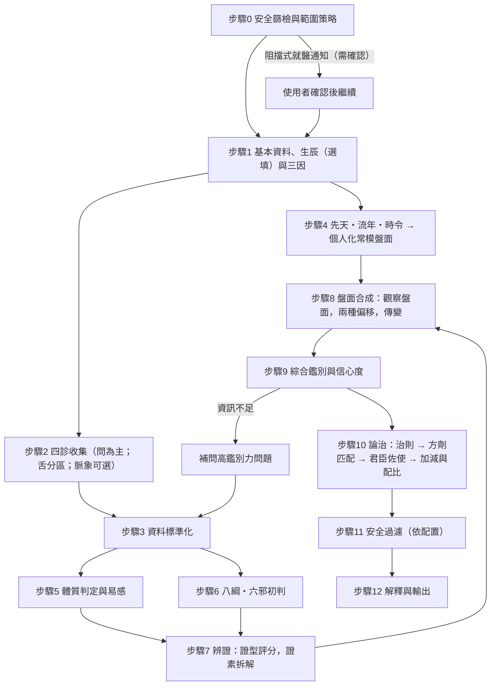

# 辨證論治作業流程（診斷 SOP）

| | |
|---|---|
| **版本** | 0.3（草案；附錄 D 的待討論事項已依 MVP 決定定案） |
| **狀態** | 草案——與使用者逐段討論後修訂；修訂後同步更新 [PRD](PRD.md) |
| **最後更新** | 2026-10-04 |
| **語言** | 繁體中文（本專案的繁體中文文件：本 SOP 與[演算法規格繁中版](wuxing-algorithm.zh-TW.md)；其餘文件為英文） |
| **關聯文件** | [PRD](PRD.md)・[陰陽五行演算法規格](wuxing-algorithm.zh-TW.md)（繁中版；[英文版](wuxing-algorithm.md)為主版本）・[data/ 知識庫說明](../data/README.md)・[reference/ 來源目錄](../reference/README.md) |

> **本文件的地位**：App 的「問什麼、怎麼算、怎麼推薦」以本文件為唯一依據。PRD 只摘要本文件；兩者衝突時，以本文件為準，再回頭修改 PRD。
> 數字與表格若與 `data/` 不一致，以 `data/` 為準（`data/` 由腳本自 `reference/` 建置並驗證）。
>
> **標記說明**
> - 【待確認】：需要與你討論或需專業審核的決策點，彙整於 [附錄 D](#附錄-d待討論事項)。
> - ✔ 已核對：引文已與 `reference/` 原文逐字比對（`data/citations.json` 中 `verified: true`；簡體原文，建置時轉繁體）。
> - ○ 待核對：來源書籍存在，但條文或細節尚未逐字核對。
> - 權重、閾值、係數皆為**示意值**，須經中醫師校準後才能用於正式版本。
>
> **v0.3 相對 v0.2 的變更**：依 2026-10-04 的決定，附錄 D 所有待討論事項定案為 MVP 建議值（MVP 完成後再回頭檢討）；§2.2 補充紅旗題的保守處理；§3.3 補充生辰資料預設不儲存。其餘內容不變。
>
> **v0.2 相對 v0.1 的重點變更**
> 1. 新增**範圍策略（應用配置）**：開發版全開、發布版限制輸出；風險族群一律「通知就醫」，但**通知後流程繼續**（不再中止）。
> 2. 新增**先天・流年・時令**三塊（生辰八字 → 先天五行；流年；四氣調神與五運六氣），算出個人化常模盤面。
> 3. 舌診新增**分區**（尖、中、根、邊）與**特殊舌象**（齒痕、裂紋、紅點…）；脈診改為**可選輸入**並進入計算。
> 4. 新增**五行臟腑盤面**（五行臟腑＋六邪＋八綱）與兩種偏移；證素可**拆解**，支援後續**配藥與加減**。
> 5. 方劑改以**君臣佐使與藥物陰陽五行利弊權重**建立知識庫，可做盤面匹配、配比與加減。

---

## 0. 文件說明

### 0.1 目的

把中醫「四診 → 辨證 → 論治」的思維，拆成電腦與使用者都能執行的明確步驟：每一步**做什麼（What）**、**怎麼做（How）**、**理論依據（Source）**、**產出（Output）**、**在 App 中如何呈現**。

### 0.2 範圍策略（應用配置）——取代 v0.1 的「適用範圍」

App 有**配置檔**決定「對誰、在什麼情況下、輸出到什麼程度」。設定在 [`data/config/scope-profiles.json`](../data/config/scope-profiles.json)。

**輸出等級**

| 等級 | 名稱 | 內容 |
|---|---|---|
| L0 | 僅供學習 | 體質與證型解釋、盤面視覺化、溫和生活與時令建議、何時／如何就醫 |
| L1 | 標準 | L0＋食療（低風險）、安全的自我按壓穴位、**A 級方劑**（組成、方義、引文；不含劑量） |
| L2 | 進階 | L1＋B 級方劑（受安全過濾條件限制）、方劑**加減**建議（不含劑量）、藥物權重檢視 |
| L3 | 完整 | L2＋C 級方劑（僅學習顯示，絕不作為推薦）、相對配比與參考用量、全部知識庫內容 |

**兩套預設**

| | `release`（發布版，預設限制） | `dev`（開發版，預設全開） |
|---|---|---|
| 成人 | L1 | L3 |
| 65 歲以上 | L1，行內提示 | L3，行內提示 |
| 未滿 18 歲、懷孕、哺乳 | **L0＋阻擋式就醫通知** | L3＋**阻擋式就醫通知** |
| 紅旗 A／B、重大疾病 | **L0＋阻擋式就醫通知** | L3＋**阻擋式就醫通知** |
| 服用抗凝血藥、其他交互作用藥、過敏符合 | L1，行內提示；交互作用項目被**抑制** | L3，行內提示；交互作用項目**只標註** |
| 資訊不足、信心低 | L0 | L3 |
| 安全過濾模式 | `suppress_hard`（硬規則移除並說明原因） | `annotate_only`（只標註，不移除） |
| 劑量／配比、加減、藥物權重、C 級 | 關 | 開 |
| 生辰八字（先天、流年） | **使用者選用（opt-in）** | 開 |
| 運氣、時令 | 開 | 開 |
| 舌象分區與特殊舌象、脈象輸入 | 開（脈象品質係數 0.5） | 開（同） |

**解析規則**（所有維度同時成立時）

1. **有效等級＝所有符合維度中最嚴格者**，再受功能開關進一步限制（開關只能縮小，不能放大）。
2. **有效通知＝最嚴重者**（阻擋式 > 行內 > 無）。
3. **流程永遠繼續**（`flow: continue`）：沒有「死路」。阻擋式通知＝全螢幕「建議就醫」說明＋使用者確認「我已了解」，之後照常往下走，只是輸出等級受限。
4. **被抑制的項目必須顯示原因**，不得靜默消失。
5. 預設版本由建置決定（正式建置＝`release`，開發建置＝`dev`），可由環境設定覆蓋。

> **為何開發版仍要通知就醫**：「即便開放所有人群，也要通知就醫」——配置只改輸出，不改這個底線。

### 0.3 設計原則

1. **四診合參**：不憑單一症狀下結論（《難經·六十一難》、《靈樞·邪氣藏府病形》）。
2. **以證為綱**：辨「證」而非辨「病」——同病異治、異病同治。
3. **可解釋**：每個結論都能回溯到「哪些症狀」＋「哪條古籍理論」。
4. **原文優先**：引用以古籍原文為準；白話與英文是附屬層。
5. **保守誠實**：資訊不足時明說；自我檢查（舌、脈）可信度低，降權處理。
6. **安全優先**：紅旗與範圍策略先於一切；建議須通過安全過濾才能呈現。
7. **先驗不製造也不掩蓋證據**：先天、流年、時令只是**有上限、可關閉、分開呈現**的參考，不加分到證型，也不抵銷真實症狀（§6、§10）。

### 0.4 理論框架

| 情境 | 主要辨證體系 |
|---|---|
| 外感新病（起病急、≤14 天） | 八綱＋**六經辨證**（《傷寒論》）；溫熱屬性用**衛氣營血／三焦**（《溫病條辨》）。MVP 僅涵蓋輕症表證 |
| 內傷雜病（慢性、功能性） | 八綱＋**臟腑辨證**＋**氣血津液辨證**。MVP 主體 |
| 統一計算層 | **證素辨證**（病位證素 × 病性證素）→ 證型 → **五行臟腑盤面**（§10） |
| 時間與稟賦參照 | **先天**（生辰八字，選用）、**流年**（八字流年＋五運六氣）、**時令**（四氣調神）→ 個人化常模（§6） |

---

## 1. 流程總覽



| 步 | 名稱 | 做什麼（What） | 怎麼做（How） | 主要依據 | 產出 |
|---|---|---|---|---|---|
| 0 | 安全篩檢 | 判斷範圍策略、通知就醫 | 紅旗＋適用範圍；套配置 | 標本緩急✔ | 有效等級、通知 |
| 1 | 基本資料 | 年齡、性別、地域、季節、用藥、生辰（選填） | 結構化表單 | 三因制宜✔ | 個人背景 |
| 2 | 四診收集 | 取得症狀與體徵 | 十二面向適應式問卷；舌分區；脈象可選 | 四診合參✔、十問歌✔ | 原始答案 |
| 3 | 標準化 | 轉標準症狀代碼並標註品質 | 症狀庫對照、衝突檢查 | — | 標準化症狀集 |
| 4 | 先天流年時令 | 算個人化常模盤面 | 八字排盤→五行權重→傳導；流年；運氣；時令 | 《素問》運氣七篇✔、四氣調神✔ | 常模盤面（三塊分列） |
| 5 | 體質 | 判定九種體質與易感 | 量表轉換分；體質×邪氣風險 | 《靈樞·通天》✔、王琦 | 體質、易感提示 |
| 6 | 八綱六邪初判 | 路由與一致性檢查 | 症狀→八綱、六邪加權 | 《醫學心悟》✔ | 初判向量 |
| 7 | 辨證 | 算各證型分數，拆解證素 | 加權計分＋必要／排除條件 | 臟腑、氣血津液、六經 | 證型排序、證素 |
| 8 | 盤面合成 | 把證型投影成觀察盤面並算偏移與傳變 | 噪聲或（noisy-OR）合成；兩種偏移；生克乘侮 | 《素問·五運行大論》✔ | 盤面、偏移、傳變 |
| 9 | 綜合鑑別 | 排序、鑑別、信心 | 合併規則＋鑑別問題 | 標本緩急✔ | 排序證型＋信心 |
| 10 | 論治 | 方劑匹配、加減、配比 | 盤面匹配＋君臣佐使＋貪婪加減 | 《素問·至真要大論》✔ | 推薦候選 |
| 11 | 安全過濾 | 剔除或標註不安全項 | 規則表（依配置） | 無盛盛無虛虛✔ | 通過項＋原因 |
| 12 | 輸出 | 呈現結論與盤面、原因、引文 | 報告模板 | 原文引用 | 結果報告 |

---

## 2. 步驟 0：安全篩檢與範圍策略

### 2.1 目的

在任何辨證之前，先判斷這個人**現在是否該去看醫生**，並決定本次輸出的**等級與通知**。**不管配置如何，都不停止流程**。

### 2.2 怎麼做

1. 以**是／否題**詢問紅旗症狀（資料：[`data/diagnosis/red-flags.json`](../data/diagnosis/red-flags.json)，28 項）。
2. 檢查範圍：年齡、懷孕／哺乳、重大疾病、用藥類別、過敏。
3. 套用配置（§0.2）：算出有效等級與通知。若有阻擋式通知 → 顯示全螢幕「建議就醫」→ 使用者確認 → 繼續。
   - **保守處理（2026-10-04 定案）**：A、B 級紅旗題若選「不確定」，**一律視為「是」**（通知中標示為「不確定」）。已勾選的 A、B 級紅旗，**只能透過明確且留有紀錄的「我答錯了」更正來撤銷**，不能默默取消。多個通知合併為**同一個畫面**，最嚴重者在最上方。
4. 在地緊急資源依地區顯示（台灣例：119、1925 安心專線）【待確認 Q1】。

### 2.3 紅旗與範圍清單（草稿，須由醫師審定【待確認 D7】）

| 等級 | 例 | 預設通知（release / dev 相同） |
|---|---|---|
| **A 立即求救**（9 項） | 胸痛壓迫伴冷汗；呼吸困難；意識不清；突發單側無力／口角歪斜／言語不清；大量出血；突發劇烈頭痛；抽搐；嚴重過敏；自傷或傷人念頭 | 阻擋式（緊急版面） |
| **B 24 小時內就醫**（9 項） | 發燒 ≥ 39°C 或 > 3 天；持續嘔吐或脫水；劇烈腹痛；不明原因體重下降；血尿；新腫塊；黃疸；咳血；視力突變；新發心悸並脈搏不規則 | 阻擋式 |
| **C 範圍外**（10 項） | 未滿 18 歲；懷孕；哺乳；癌症治療中；洗腎／腎衰竭；肝硬化；器官移植；重度精神疾病；嚴重心肺疾病 | 阻擋式；輸出等級依配置 |

### 2.4 理論依據

- **標本緩急**：《素問·標本病傳論》「小大不利治其標，小大利治其本」✔——急重者先處理標，在 App 即「先就醫」。
- 紅旗清單以**現代醫學急症判準**為主，古籍只提供「急則治標」的理念支持。

---

## 3. 步驟 1：基本資料、生辰與三因背景

### 3.1 目的與依據

中醫強調「因人、因時、因地制宜」。此步取得個人背景，供**先驗判斷**與**推薦調整**，不直接決定證型。

### 3.2 欄位

| 欄位 | 為何要問 | 理論依據 | 如何使用 |
|---|---|---|---|
| ★年齡、出生性別 | 生命階段氣血盛衰；大運順逆 | 《素問·上古天真論》女七男八（「女子七歲，腎氣盛」）✔ | 年齡層先驗；安全過濾；大運方向 |
| ★懷孕／哺乳 | 用藥與穴位禁忌 | 《素問·六元正紀大論》「有故無殞，亦無殞也」✔——屬醫師專業判斷，App 不採用 | 配置維度 |
| 身高、體重、體型 | 形體與痰濕、氣虛、陰虛傾向 | 肥人多痰、瘦人多火（《丹溪心法》○） | 弱先驗，不單獨計分 |
| 居住地區、氣候 | 因地制宜 | 《素問·異法方宜論》✔ | 濕熱／乾燥傾向先驗 |
| 當前季節（自動） | 因時制宜 | 《素問·四氣調神大論》✔、《五常政大論》「必先歲氣，無伐天和」✔ | 時令（§6） |
| 作息、飲食、運動、菸酒 | 病因與調攝重點 | 《素問·上古天真論》「食飲有節，起居有常，不妄作勞」✔ | 病因提示、生活建議 |
| 情緒壓力 | 七情內傷 | 《素問·舉痛論》九氣✔ | 情志證素先驗 |
| ★目前用藥、過敏、慢性病史 | 交互作用與禁忌 | （現代藥學） | **只用於配置與安全過濾** |
| 主訴（可複選）＋自由備註 | 決定問診模組 | 十問歌之「主訴」 | 啟動模組；備註不入計算 |
| **生辰（選填）**：出生年月日、時分（可選「不知道時辰」）、出生地（經度、時區） | 先天五行與流年（§6） | 四柱曆法（節氣、真太陽時）；詳見[演算法規格](wuxing-algorithm.md) | 僅在使用者提供且功能開啟時使用 |

★＝必填。

### 3.3 生辰資料的規則

- **選填、本機計算、不上傳**：不進網址、不進日誌；可隨時清除（見 [演算法規格 §15](wuxing-algorithm.zh-TW.md)）。
- **預設不儲存（2026-10-04 定案）**：生辰只留在本次工作階段的記憶體中；使用者勾選「在此裝置記住」才會存進本機。未勾選時，已儲存的結果只保留推導出的盤面與「已使用生辰」的標記，不保留出生時刻；重新計算時會再問一次。
- **不知道時辰**＝時柱留空，**不猜**，先天盤標示「資訊較少」。
- **出生地經度**決定真太陽時；內建城市表只是便利，**須把使用的經度與時區回顯給使用者核對**。
- 夏令時重疊／空缺的出生時間：如實報告，並列兩種可能的時柱。
- **發布版預設不啟用八字相關功能，由使用者選用**（生辰不屬於醫療必要資訊，且八字的醫學效度未經驗證）。

---

## 4. 步驟 2：四診資訊收集

### 4.1 總則

- 《難經·六十一難》：「望而知之謂之神」✔（四診層級）。
- 《靈樞·邪氣藏府病形》：「見其色，知其病，命曰明」✔。
- 《素問·陰陽應象大論》：「善診者，察色按脈，先別陰陽；…視喘息，聽音聲」✔。
- 診察時機：《素問·脈要精微論》「診法常以平旦」✔ → 建議**晨起未進食、未劇烈活動**時記錄舌象與脈率；使用自然光。

**線上自助的限制**：App 無法真正「切脈」「望診」，因此以**問診為核心**，望、聞、切採「引導式自我觀察」並降權（§4.7）。

### 4.2 問診（十問歌延伸為十二面向）

依據：《景岳全書·傳忠錄·十問篇》✔（張介賓）十問歌「一問寒熱二問汗，三問頭身四問便，五問飲食六問胸，七聾八渴俱當辨…」；本 App 補**睡眠**與**情志**，並加**病程與誘因**，共十二面向。

| # | 面向 | 要問什麼（白話） | 辨證意義 | 理論依據 |
|---|---|---|---|---|
| 1 | 寒熱 | 怕冷還是怕熱？手腳冰涼？怕冷又發熱？午後潮熱？寒熱交替？ | 惡寒發熱並見→表證；只怕冷→裡寒／陽虛；只發熱→裡熱；潮熱→陰虛；往來寒熱→少陽 | 《傷寒論》「發熱惡寒者，發於陽也」✔；《素問·調經論》「陽虛則外寒，陰虛則內熱」✔ |
| 2 | 汗 | 容易出汗？白天動則汗出還是夜間盜汗？無汗？ | 自汗→氣虛／陽虛／營衛不和；盜汗→陰虛；無汗惡寒→表實 | 《素問·陰陽別論》「陽加於陰，謂之汗」✔；《傷寒論》第2、35、53條✔ |
| 3 | 頭身 | 哪裡痛？什麼痛（脹、刺、冷、灼、重、隱、絞）？固定或遊走？頭重身重？麻木？ | 脹痛→氣滯；刺痛固定→血瘀；冷痛→寒；灼痛→熱；重痛→濕；隱痛→虛 | 《素問·舉痛論》✔；《靈樞·經脈》✔ |
| 4 | 二便 | 大便乾、溏、黏滯、完穀不化？小便量色、夜尿、頻急？ | 便溏→脾虛／寒；便乾→熱、津虧、氣滯；黏滯→濕熱；夜尿多→腎陽虛 | 《素問·標本病傳論》✔；《靈樞·口問》「中氣不足，溲便為之變」✔；《素問·至真要大論》病機十九條「諸病水液，澄澈清冷，皆屬於寒」「諸轉反戾，水液渾濁，皆屬於熱」✔ |
| 5 | 飲食口味 | 食慾？吃了脹？口苦、口黏、口淡、口酸？喜冷喜熱？ | 食少腹脹→脾虛；口苦→肝膽熱；口黏→濕；口淡→脾虛 | 《素問·陰陽應象大論》五臟與味、竅對應✔；《靈樞·脈度》「脾氣通於口」✔ |
| 6 | 胸腹 | 胸悶、心悸、脅脹、胃脘痛脹？按壓舒服（喜按）還是更痛（拒按）？噯氣、反酸？ | 喜按→虛；拒按→實；腹滿時減→寒（虛）；脅脹→肝 | 《金匱要略·腹滿寒疝宿食病》「按之不痛為虛，痛者為實」「腹滿時減，復如故，此為寒」✔ |
| 7 | 耳目口咽 | 耳鳴（如潮／如蟬）？視物模糊？眼乾澀？咽乾、咽痛、咽異物感？ | 耳為腎竅、目為肝竅；如潮多實、如蟬多虛 | 《靈樞·脈度》「肝氣通於目…腎氣通於耳」✔ |
| 8 | 口渴飲水 | 口渴？想喝冷還是熱？渴但不想喝？ | 渴喜冷飲→熱；渴喜熱飲或不欲飲→寒濕／痰飲；漱水不欲嚥→瘀 | 《傷寒論》第6條「發熱而渴，不惡寒者，為溫病」✔ |
| 9 | 睡眠 | 入睡難、易醒、早醒、多夢、嗜睡？ | 難入睡＋心煩→心火／心腎不交；易醒多夢＋心悸健忘→心脾兩虛；胃不和；痰熱擾心 | 《靈樞·營衛生會》「氣至陽而起，至陰而止」✔；《靈樞·邪客》「目不瞑」✔；《素問·逆調論》「胃不和，則臥不安」✔ |
| 10 | 情志 | 常抑鬱、易怒、焦慮、易驚、悲傷、思慮過度？ | 怒→肝；喜→心；思→脾；憂悲→肺；恐驚→腎 | 《素問·舉痛論》九氣✔；《靈樞·本神》✔ |
| 11 | 經帶（女性、非孕） | 週期、經量色、血塊、痛經、經前乳脹、帶下性質 | 經色淡量少→血虛；有血塊色暗→瘀；經前脹→肝鬱；帶黃稠→濕熱 | 《素問·上古天真論》月事以時下✔ |
| 12 | 病程與誘因 | 多久了？怎麼開始？什麼加重或減輕？吃過什麼藥？ | 新病多實多表、久病多虛多裡 | 《靈樞·百病始生》✔ |

### 4.3 望診

| 項目 | 內容 | 辨證意義（示意） | 理論／書目 |
|---|---|---|---|
| 神 | 精神、目光、反應 | 得神者昌，失神者亡 | 《素問·移精變氣論》✔ |
| 面色 | 青赤黃白黑；明潤或晦暗 | 白→虛／寒／血虛；黃→脾虛／濕；赤→熱；青→寒／痛／瘀；黑→腎虛／水飲／瘀 | 《素問·五藏生成》✔；《靈樞·五色》✔ |
| 其他 | 唇、爪甲、皮膚；痰涕尿便的顏色與質地 | 水液澄澈清冷屬寒、渾濁屬熱 | 病機十九條✔；《望診遵經》✔存在 |

### 4.4 舌診：分區與特殊舌象（v0.2 新增）

資料：[`data/diagnosis/tongue.json`](../data/diagnosis/tongue.json)（6 區、32 項特徵）。

**舌面分區**——古籍與教材並列（引文 `shanghan-zhizhang-tongue-zones`✔）：

| 分區 | 《傷寒指掌》（清·吳坤安）✔ | 現行教材（○待核對） | 反應臟腑 |
|---|---|---|---|
| 舌尖 | 舌尖屬心 | 心、肺 | 心（肺） |
| 舌中 | 中心亦屬胃 | 脾、胃 | 脾胃 |
| 舌根 | 舌根屬腎 | 腎（膀胱、大腸） | 腎 |
| 舌邊（左肝右膽） | 兩旁屬肝膽 | 肝、膽 | 肝膽 |
| 舌四畔 | 四畔屬脾 | — | 脾 |
| 全舌 | 滿舌屬胃 | — | 胃 |

**特徵分類**（使用者以示意圖引導選擇；每項皆含「不確定」）

| 類別 | 項目（代碼前綴 `T_`） | 意義（示意） |
|---|---|---|
| 舌質顏色 | 淡、淡胖、紅、絳、紫暗 | 陽虛／氣血不足；熱；血瘀 |
| 舌形 | 胖大、瘦薄、嫩 | 脾虛水濕；陰血不足；虛 |
| **特殊舌象** | **邊緣齒痕**（脾虛濕盛）、**中央裂紋**（胃陰不足）、**滿舌裂紋**（陰液耗損）、**舌尖紅點／芒刺**（心火；外感風熱初起）、**舌邊紅點**（肝膽火熱）、**舌中芒刺**（胃腸熱盛）、**瘀斑瘀點**、**舌下絡脈怒張紫暗**（血瘀） | 見括號 |
| 分區顏色 | 舌尖紅（心火）、舌邊紅（肝膽有熱） | 見括號 |
| 苔（整體） | 薄白、白膩、白滑、黃、黃膩、厚腐、少苔／剝苔、苔乾 | 正常或表證；痰濕寒濕；熱；濕熱痰熱；食積；陰虛；津傷 |
| **分區苔** | 舌尖少苔（心肺陰虛）、舌中苔厚（脾胃濕滯）、**舌中黃膩**（脾胃濕熱）、**舌中少苔／剝落**（胃陰不足）、**舌根厚膩**（下焦濕濁、腎與膀胱濕熱）、**舌根少苔／剝落**（腎陰虧虛） | 見括號 |

**引導方式**：晨起、未進食飲、未刷舌、自然光；避開染苔食物與剛喝熱飲；舌下絡脈請舌尖上翹抵上顎觀察。**品質係數 0.7**（自我觀察）。MVP 不做照片辨識【待確認 D4】。

### 4.5 聞診（自述）

| 項目 | 辨證意義（示意） | 理論 |
|---|---|---|
| 聲音：低微無力／洪亮；嘶啞 | 低微懶言→氣虛；洪亮→實熱；嘶啞→肺陰虛或外感 | 《素問·脈要精微論》「言而微，終日乃復言者，此奪氣也」✔；《素問·陰陽應象大論》✔ |
| 呼吸、咳嗽、噯氣、口氣體味 | 依聲音、痰、時間判斷 | ○ |

### 4.6 切診：脈象為**可選輸入**，進入計算，保留教育說明（v0.2 改版）

資料：[`data/diagnosis/pulse.json`](../data/diagnosis/pulse.json)（28 脈：27 脈出自《瀕湖脈學》——章名即標明陰陽屬性，已核對✔；「疾」出自《診家正眼》）。

**使用者可填的內容（全部選填）**

1. **脈率**：晨起靜坐 1 分鐘測靜息脈搏；教材對照：遲（一息三至）約 < 60 次／分；數（一息六至）約 > 90 次／分；平人（《素問·平人氣象論》「人一呼脈再動，一吸脈亦再動，呼吸定息，脈五動，閏以太息，命曰平人」✔）。**運動員、藥物、發燒、焦慮皆會干擾**。
2. **脈律**：規則／偶有停跳／明顯不規則。**不規則脈率先導向就醫提示（B 級）**。
3. **脈象（若你能摸出來）**：可多選整體脈象——**浮、沉、遲、數、滑、澀、弦、細、洪、緊、緩、濡、弱、虛、實、長、短、芤、革、牢、散、伏、動、促、結、代、微、疾**；互斥者不能同選（浮／沉；遲／數／疾；虛／實；長／短；滑／澀）。
4. **分位（更進階）**：可指定在**左寸、左關、左尺、右寸、右關、右尺**哪一處摸到（寸關尺配屬：心肝居左、肺脾居右、腎與命門居兩尺——《瀕湖脈學·四言舉要》✔）。

**進入計算的方式**

- 脈象作為**症狀代碼**（`P_*`）進入證型評分（§9），**品質係數 0.5**（自述、難以驗證），權重多為輔助；未指定分位者，分位相關證型的脈象權重打 **0.6** 折。
- 脈象缺失**不扣分**；與證型衝突的脈象以反向權重處理。
- 證型庫仍列出各證型的典型舌脈，作為**教育說明**顯示（含「為何典型脈象不一定摸得到」）。

**教育說明（結果頁固定文字）**：「脈象需要受過訓練的手指與大量練習才能穩定分辨。您填寫的脈象以較低權重參與計算，結果頁會標示；請勿僅憑自測脈象下結論，也不要因為摸不到而擔心。」

**其他居家替代資訊**：腹部按壓自查（喜按／拒按；《金匱要略·腹滿寒疝宿食病》✔）、四肢溫涼、小腿按壓是否凹陷。

### 4.7 資料品質係數 q（示意，須校準【待確認 D3】）

| 資料類別 | q | 說明 |
|---|---|---|
| 問診症狀（自述） | 1.0 | 問診本身即症狀來源 |
| 器材量測（脈率） | 0.9 | 客觀但有干擾 |
| 引導式自我觀察（舌、面色） | 0.7 | 自我判讀誤差大 |
| **自述脈象** | **0.5** | 可選輸入；最低 |
| 「不確定／跳過」 | 不計分 | 同時降低覆蓋率 |
| 明確回答「沒有」 | 計為負向證據 | 有助鑑別 |

### 4.8 適應式問卷策略

1. **核心題**：十二面向各 1–2 題（約 25 題）。題庫在 [`data/diagnosis/questions.json`](../data/diagnosis/questions.json)（36 題：23 個核心題＋13 個依相關症狀或性別才出現的追問；答案對應症狀代碼；作答後**未勾選**的選項記為「無」，略過記為「不確定」）。
2. **主訴模組**（8 個）：睡眠、疲倦乏力、消化、寒熱汗出、頭身疼痛、情緒壓力、婦女經帶、外感初起（輕症）。
3. **下一題**：優先選「鑑別力最高」的題（資訊增益）。
4. **停止條件**：信心達「中」以上且核心題覆蓋 ≥ 80%，或題數上限（50），或使用者結束。
5. **時間預算**：中位數 ≤ 10 分鐘。舌象與脈象為選填，不計入必答。

---

## 5. 步驟 3：資料標準化

1. **症狀代碼**：每個答案映射到 `data/diagnosis/symptoms.json` 的 `symptom_id`（184 項：124 症狀、32 舌象、28 脈象；舌象與脈象屬選填觀察），並記錄 `present`（有／無／不確定）、`severity`（輕／中／重）、`source_class`（問診／量測／引導觀察／自述脈象）。
2. **同義詞分流**：**惡寒**（加衣仍冷）≠ **畏寒**（得溫則減）；**口渴喜冷**≠**渴不欲飲**；**腹脹喜按**≠**拒按**；**舌邊紅**≠**舌尖紅**≠**全舌紅**（分區不同，意義不同）。
3. **一致性檢查**：互斥答案（便乾與便溏同期；浮與沉同選）→ 追問，不靜默擇一。
4. **負向資訊保留**：「沒有」與「沒問」不同。

---

## 6. 步驟 4：先天・流年・時令 → 個人化常模盤面（v0.2 新增）

> 完整演算法見 [陰陽五行演算法規格](wuxing-algorithm.md)；實作在 [`packages/wuxing`](../packages/wuxing)（74 項測試，與原引擎逐項核對）。本節只說明在診斷流程中的用法。

### 6.1 三塊

| 塊 | 來源 | 算什麼 | 上限（度） |
|---|---|---|---|
| **先天** | 生辰八字（選用）：節氣、真太陽時、四柱、人元司令 → 藏干配重 → 五行生克傳導 | 先天五行分佈（木火土金水占比）→ 相對平均（20%）偏離 | ±1.00 |
| **流年** | ① 八字流年（流年干支與大運入盤，扣除「稀釋」的中性年校正）；② **五運六氣**（歲運太過不及、司天在泉；以**大寒**為運氣年界） | 該年五行份額變化；氣候偏向 | ① ±0.75；② ±0.50 |
| **時令** | 四氣調神：春肝、夏心、長夏脾、秋肺、冬腎（以太陽視黃經定當令） | 當令五行＋其所克者受抑 | 當令 +0.5 |
| **人體偏差** | 四診觀察（§9–§10），**不受上述三塊影響** | 觀察盤面 O | ±3 |

### 6.2 個人化常模盤面 N

```
N(e) = clamp( 先天(e) + 流年八字(e) + 運氣(e) + 時令(e),  ±1.5 )        e ∈ 木火土金水
```

- 每一塊都可**單獨關閉**；各自的貢獻與一行推導（`trace`）都會輸出。
- 常模映射到五臟：**偏移氣與陽（功能）**，不偏移血與陰（物質）。
- **沒有生辰時**：先天與八字流年兩塊缺席，常模只由運氣與時令組成；App 仍可完整使用。
- **預測**：可算「現在與未來四個節令」的常模（四氣調神的後續變化）。
- **來源地位**：八字塊屬傳統文化先驗，**無臨床驗證**；運氣屬古籍理論，預測力有爭議；時令最為通用。因此三塊都只是**有上限的參照**。

### 6.3 先驗不製造也不掩蓋證據（關鍵規則）

1. 證型分數（§9）**只用症狀與體徵**，先天／流年／時令**不加分**。
2. **主要偏移** `offsetPopulation = O − 0`（相對於平均健康的人）**不被先驗抵銷**——八字預測「木弱」不能把真實的肝系症狀「解釋掉」。
3. 次要偏移 `offsetPersonal = O − N`（相對於「這個人現在的預期狀態」）與**一致性** `alignment`（同向＝與先天／時令傾向一致，可能偏體質性；反向＝與傾向相反，值得再確認；中性）**只作為脈絡與提示**，且只對有觀察偏差的維度顯示。
4. 先驗只用於：**平手裁決**（兩證型分差 < 5 分時，取與常模一致者）、**預防與調養方向**、**易感提示**、**解釋**。

### 6.4 範例（1990-05-12 14:30 上海、男；常模時刻 2026-10-03）

| 項目 | 結果 |
|---|---|
| 四柱 | 庚午 辛巳 丁丑 丁未；夏令時已扣除；真太陽時 13:39；立夏後 6.45 日、庚金司令 |
| 先天五行占比 | 木 1.2%、火 35.6%、土 32.5%、金 25.3%、水 5.3% → 度：木 缺（−0.94）、火 過旺（+0.78）、土 偏旺（+0.63）、金 平（+0.27）、水 偏弱（−0.73） |
| 流年 2026 丙午（大運 甲申，已行 7.49 年） | 八字流年度：木 −0.15、火 +0.41、土 +0.07、金 −0.17、水 −0.16 |
| 運氣 2026 | 水運太過、少陰君火司天、陽明燥金在泉 → 度：火 +0.05、土 −0.25、金 +0.20、水 +0.50 |
| 時令 | 秋（視黃經 190.3°）：金 +0.50 |
| **常模 N**（上限 ±1.5） | **木 −1.21、火 +1.24、土 +0.45、金 +0.80、水 −0.39** |
| 氣候傾向 | 暑 0.30、燥 0.30、火 0.40 |

解讀（傾向，不是診斷）：此人的先天盤木少火土多；2026 年再加火與水偏盛的氣候；秋季助金。因此「肝（木）」與「火–土」軸是值得留意的傾向。

---

## 7. 步驟 5：體質判定與易感

### 7.1 古籍根源

| 出處 | 概念 |
|---|---|
| 《靈樞·陰陽二十五人》✔ | 依五行與五音，分二十五種形、色、性情的類型 |
| 《靈樞·通天》✔ | 太陰、少陰、太陽、少陽、陰陽和平之人（五態人） |
| 《靈樞·五變》「同時得病，其病各異」✔ | 同樣外邪，因體質而病不同——體質決定「易感性」 |

### 7.2 九種體質（王琦；《中醫體質分類與判定》ZYYXH/T157-2009）

平和、氣虛、陽虛、陰虛、痰濕、濕熱、血瘀、氣鬱、特稟（資料：[`data/diagnosis/constitutions.json`](../data/diagnosis/constitutions.json)；**題庫尚未收錄**——授權問題，自行編寫待審【待確認 D6】）。

**判定規則（依標準）**：轉換分 `(原始分 − 條目數) ÷ (條目數 × 4) × 100`；平和質：≥ 60 且其他八種 < 30 →「是」，< 40 →「基本是」；偏頗體質：≥ 40「是」、30–39「傾向是」、< 30「否」。

### 7.3 體質在辨證中的角色與「時令易感」

- 「證」是當下狀態，「體質」是基底傾向；**體質不直接加分**，只用於平手裁決、推薦風格、預防調養。
- **時令易感**：體質 × 六邪風險表（[`data/wuxing/susceptibility.json`](../data/wuxing/susceptibility.json)）

  ```
  易感度(體質 c, 時間 t) = Σ_邪 風險[c][邪] × 暴露[邪](t)
  暴露[邪] = 當令之邪（春風、夏暑火、長夏濕、秋燥、冬寒）= 1.0，加上常模盤面的氣候傾向
  ```

  例：陽虛質遇冬季或寒水司天（寒風險 2）→ 提示避寒保暖；痰濕質遇長夏（濕風險 2）→ 提示化濕。依據：《素問·金匱真言論》「故春善病鼽衄，仲夏善病胸脅，長夏善病洞泄寒中，秋善病風瘧，冬善病痹厥」✔；《素問·生氣通天論》「春傷於風，邪氣留連，乃為洞泄；夏傷於暑，秋為痎瘧；…」✔；《靈樞·五變》✔。
- **特稟質**：不予補益類推薦，加強警示（規則 `R_TEBING_CONSTITUTION`）。

---

## 8. 步驟 6：八綱與六邪初判

### 8.1 依據

- 《素問·陰陽應象大論》：「善診者，察色按脈，先別陰陽」✔；《景岳全書·傳忠錄》陰陽篇、六變辨✔；《醫學心悟》：「病有總要，寒、熱、虛、實、表、里、陰、陽，八字而已」✔；《素問·通評虛實論》「邪氣盛則實，精氣奪則虛」✔。

### 8.2 初判（只作路由、一致性檢查與解釋；最終八綱由盤面推得，§10.4）

| 軸 | 判定重點（示意） |
|---|---|
| 表／裡／半表半裡 | 起病急（≤7 天）＋**惡寒**（必要條件）＋發熱＋頭身痛／鼻塞→表；寒熱往來、口苦、胸脅苦滿→半表半裡；其餘為裡 |
| 寒／熱 | 畏寒喜熱、手足冷、口淡不渴、便溏尿清、舌淡苔白 vs 怕熱喜冷、口渴喜冷飲、便乾尿黃、舌紅苔黃 |
| 虛／實 | 虛：久病、勞累加重、喜按、少氣懶言；實：新病、脹痛拒按、聲高氣粗、苔厚 |
| 陰／陽 | 總綱，由上述推得 |
| **六邪**（風寒暑濕燥火） | 外感：新發＋表證徵象；內生五氣：由證型投影（§10.2）——寒（陽虛生寒）、濕（脾虛生濕）、燥（津液虧）、火（陰虛火旺或鬱火）、風（肝風） |

寒熱真假：「傷寒脈滑而厥者，裡有熱也，白虎湯主之」（《傷寒論·辨厥陰病》）✔；虛實真假：腹脹喜按、時減（《金匱要略》）✔。

---

## 9. 步驟 7：辨證——證型評分與證素拆解

### 9.1 路由

| 條件 | 通道 |
|---|---|
| 起病 ≤ 14 天，且有新發惡寒、發熱、咽痛、鼻塞、咳嗽之一 | **外感通道**（MVP 僅表證；高熱等→B 級就醫通知） |
| 其他 | **內傷通道**（臟腑＋氣血津液） |
| 兩者並存 | 兩通道皆算，**先外後內**（《素問·標本病傳論》✔） |

### 9.2 評分模型（示意，須校準）

資料：[`data/diagnosis/patterns.json`](../data/diagnosis/patterns.json)。每個證型有正向權重 `w ∈ {1,2,3}`、反向權重 `v`、必要症狀 `required_any`。

```
C(p)   = Σ_{出現的 s} w(s,p) · sev(s) · q(s)   −   Σ_{出現的 s} v(s,p) · q(s)
M(p)   = Σ w(s,p)
Pct(p) = max(0, C) ÷ M × 100          ；  required_any 全缺 → Pct ×= 0.5
```

`sev`：輕 0.6／中 0.8／重 1.0；`q`：§4.7。等級：Pct ≥ 60 **高（典型）**；40–59 **中（傾向）**；20–39 **弱（僅提示）**；< 20 不成立【待確認 D3】。

### 9.3 證素拆解（v0.2 新增）

每個證型由 1–2 個**證素**（病位 × 病性）組成；證素的症狀權重＝它所屬各證型權重的最大值（[`data/diagnosis/pattern-elements.json`](../data/diagnosis/pattern-elements.json)，24 個證素）。用途：

1. **盤面投影**：證素 → 臟腑與六邪的**單位度投影**（§10.2）。
2. **組合證名**：沒有證型庫證型命中時，取前幾名證素（病位 ≤ 2、病性 ≤ 3，Pct ≥ 40），**動態命名**「病位＋病性」。
3. **方藥加減**：殘差盤面（還沒被糾正的偏差）對應到證素，再對應到藥物（§12.5）。

| 病位證素 | 表、半表半裡、心、肝、脾、肺、腎、胃、膽、全身 |
|---|---|
| **病性證素** | 風、寒、暑、濕、燥、火、痰、飲、瘀、食積、氣滯、氣虛、血虛、陰虛、陽虛 |

### 9.4 證型庫（MVP 草案，23 個；皆待專家審核【待確認 D2】）

| 代碼 | 證型 | 證素 | 權重項 | 代表方 | 理論出處 |
|---|---|---|---|---|---|
| EX1 | 風寒束表（太陽傷寒） | 表風、表寒 | 11 | 麻黃湯 | 《傷寒論》第3、35條✔ |
| EX2 | 太陽中風（表虛） | 表風 | 9 | 桂枝湯 | 第2條✔ |
| EX3 | 風熱犯表 | 表風、表火 | 14 | 銀翹散、桑菊飲 | 《溫病條辨·上焦篇》✔存在 |
| EX4 | 營衛不和 | 表氣虛 | 7 | 桂枝湯 | 第53條✔ |
| SP1 | 脾氣虛 | 脾氣虛 | 14 | 四君子湯、參苓白朮散 | 《靈樞·本神》「脾氣虛則四肢不用，五藏不安」✔ |
| SP2 | 脾陽虛（脾胃虛寒） | 脾陽虛、脾寒 | 17 | 理中丸 | 《傷寒論·辨太陰病》✔、第386條✔；《金匱要略》「腹滿時減，復如故，此為寒」✔ |
| SP3 | 中氣下陷 | 脾氣虛 | 11 | 補中益氣湯 | 《脾胃論》✔存在 |
| SP4 | 痰濕內阻 | 脾濕、脾痰 | 15 | 二陳湯、平胃散、苓桂朮甘湯 | 《金匱要略》「病痰飲者，當以溫藥和之」✔ |
| SP5 | 濕熱蘊結 | 脾濕、胃火 | 16 | 三仁湯、甘露消毒丹 | 病機十九條「諸濕腫滿，皆屬於脾」✔ |
| SP6 | 胃陰虛 | 胃陰虛 | 14 | 益胃湯 | 《溫病條辨·中焦篇》✔存在 |
| LV1 | 肝氣鬱結 | 肝氣滯 | 14 | 逍遙散、柴胡疏肝散、越鞠丸 | 《素問·六元正紀大論》「木鬱達之」✔；《舉痛論》「思則氣結」✔ |
| LV2 | 肝火上炎 | 肝火 | 15 | 龍膽瀉肝湯 | 病機十九條「諸風掉眩，皆屬於肝」「諸逆衝上，皆屬於火」✔ |
| LV3 | 肝血虛 | 肝血虛 | 12 | 四物湯、酸棗仁湯 | 《靈樞·本神》「肝藏血，血舍魂」✔；《素問·五藏生成》✔ |
| LV4 | 肝胃不和 | 肝氣滯、胃氣滯 | 12 | 柴胡疏肝散 | 《金匱要略》「見肝之病，知肝傳脾，當先實脾」✔ |
| HT1 | 心脾兩虛 | 心血虛、脾氣虛 | 11 | 歸脾湯 | 《嚴氏濟生方》✔存在 |
| HT2 | 心腎不交（陰虛火旺） | 心火、腎陰虛 | 15 | 黃連阿膠湯、天王補心丹 | 《傷寒論·辨少陰病》「心中煩，不得臥」✔ |
| HT3 | 痰熱擾心 | 心痰、心火 | 13 | 溫膽湯 | 《三因極一病證方論》✔存在；《靈樞·邪客》✔ |
| LG1 | 肺氣虛（衛表不固） | 肺氣虛 | 10 | 玉屏風散 | 《丹溪心法》✔存在 |
| LG2 | 肺陰虛 | 肺陰虛 | 13 | 麥門冬湯、沙參麥冬湯 | 《金匱要略》麥門冬湯條✔ |
| KD1 | 腎陰虛 | 腎陰虛 | 14 | 六味地黃丸 | 《小兒藥證直訣》✔存在 |
| KD2 | 腎陽虛 | 腎陽虛、腎寒 | 14 | 腎氣丸、右歸丸 | 《金匱要略》八味腎氣丸條✔ |
| QB1 | 氣血兩虛 | 脾氣虛、心血虛 | 14 | 八珍湯 | 《正體類要》✔存在 |
| QB2 | 血瘀 | 全身瘀 | 12 | 血府逐瘀湯 | 《素問·調經論》「血氣不和，百病乃變化而生」✔ |

**外感通道六經提綱**（備查；MVP 僅表證）：太陽第1條✔、陽明第180條✔、少陽第263條✔、太陰第273條✔、少陰第281條✔、厥陰第326條✔（條文序號依通行宋本編號，未對照資料）。

**證型自我測試**（`scripts/kb/selftest_patterns.py`）：23 個證型各自的典型病人，皆將該證型排在第 1；最小分差的易混對（需補鑑別問題）：EX2 vs EX4（3.3 分，皆屬桂枝湯證）、LG1 vs EX4（5.6）、HT2 vs KD1（11.4）。

### 9.5 範例（取自 `scripts/kb/example_pipeline.py`）

病人：食後腹脹（中）、大便溏（重）、疲倦乏力（中）、少氣懶言（輕）、食少納呆（中）、身重（輕）、不口渴；舌邊齒痕、舌淡（引導觀察）。

**脾氣虛 SP1**（M = 24）：

| 症狀 | w | sev | q | 貢獻 |
|---|---|---|---|---|
| 食後腹脹 | 3 | 0.8 | 1.0 | 2.4 |
| 大便溏 | 3 | 1.0 | 1.0 | 3.0 |
| 食少納呆 | 3 | 0.8 | 1.0 | 2.4 |
| 疲倦乏力 | 2 | 0.8 | 1.0 | 1.6 |
| 少氣懶言 | 2 | 0.6 | 1.0 | 1.2 |
| 舌邊齒痕 | 2 | 1.0 | 0.7 | 1.4 |
| 舌淡 | 2 | 1.0 | 0.7 | 1.4 |

C = 13.4；**Pct = 55.8% → 中（傾向）**。其他：氣血兩虛 20.4、中氣下陷 20.3（缺必要症狀「下墜感」，×0.5）、心脾兩虛 14.3、痰濕 12.7。

---

## 10. 步驟 8：盤面合成（v0.2 新增）

> 目標：把「當前狀況」表示成**與正常人身盤面的偏移**，並含五行臟腑、六邪、八綱。資料結構見 [`data/diagnosis/panel-schema.json`](../data/diagnosis/panel-schema.json)。

### 10.1 盤面的組成（全部是相對「平均健康的人」＝0 的偏差）

| 層 | 內容 | 範圍 |
|---|---|---|
| 臟腑層 | 十個臟腑（肝心脾肺腎＋膽小腸胃大腸膀胱）× 氣、血、陰、陽（有號）；另有「氣滯」（0–3） | −3 … +3 |
| **五行層** | `W(e) = 0.7·mean(臟.氣, 臟.陽) + 0.3·mean(腑.氣, 腑.陽)`（五行**功能**強弱） | −3 … +3 |
| **六邪層** | 風、寒、暑、濕、燥、火 | 0 … 3 |
| 病理產物層 | 痰、飲、瘀、食積 | 0 … 3 |
| **八綱層** | 表（0–1）、寒熱（−1 寒 … +1 熱）、虛實（−1 虛 … +1 實）、陰陽（由前三者推得） | 見式 |

### 10.2 觀察盤面 O（只由症狀與體徵而來）

1. 每個證型（Pct ≥ 20）取度數 `d = 3·Pct/100`，乘以它的**單位度投影**（證素 × 臟腑／六邪／產物，見 panel-schema），例：脾氣虛 → `脾.氣 −1`；肝氣鬱結 → `肝.氣滯 +1`；腎陽虛 → `腎.陽 −1、寒 +1.5`；表證 → `表 +1`。
2. 同一維度有多個貢獻時，用 **noisy-OR 飽和合成**（正負分開）：`O = 3·(1 − Π(1 − x/3))`，避免兩個描述同一虛損的證型（如脾氣虛＋中氣下陷）重複計算。
3. 沒有證型庫證型命中時，改用**證素**直接投影。

### 10.3 兩種偏移與一致性（見 §6.3）

```
offsetPopulation = O                      # 主要：相對於平均健康的人（驅動辨證、論治）
offsetPersonal   = O − N                  # 次要：相對於個人化常模（只作脈絡；只顯示有觀察偏差的維度）
alignment(e)     = aligned | opposed | neutral
```

### 10.4 八綱由盤面推得

```
寒熱 = clamp((火 + 暑 − 寒 − 0.5·陽虛總和 + 0.5·陰虛總和) / 3, −1, 1)
虛實 = clamp((正向偏差總和 + 產物 + 氣滯 − 虛損總和) / 6, −1, 1)
表   = clamp(表 / 3, 0, 1)
```

### 10.5 傳變（生克乘侮）與易感預測

依據：「見肝之病，知肝傳脾，當先實脾」（《金匱要略》✔；《難經·七十七難》✔）、《素問·玉機真藏論》「五藏受氣於其所生，傳之於其所勝」✔、《素問·五運行大論》「氣有餘則制己所勝而侮所不勝，其不及則己所不勝侮而乘之，己所勝輕而侮之」✔、《難經·六十九難》「虛者補其母，實者瀉其子」✔。

對五行偏移 `w`：

| 若 | 規則 | 影響 | 係數 |
|---|---|---|---|
| `w > 0` | 制己所勝 | 所克者 `−0.30·w` | 待校準 |
| `w > 0` | 侮所不勝 | 克我者 `−0.15·w` | |
| `w > 0` | 子盜母氣 | 其母 `−0.15·w` | |
| `w < 0` | 乘侮自深 | 自身 `−0.20·|w|` | |
| `w < 0` | 母病及子 | 其子 `−0.25·|w|` | |

輸出「傳變壓力」排序（負＝傾向被拖累），**只作解釋與選擇要護的臟腑，不加到觀察盤面**。

### 10.6 範例（承 §9.5、§6.4）

| 項目 | 結果 |
|---|---|
| 觀察盤面 O | 脾.氣 −2.16、心.血 −0.61 |
| 五行功能 W | 土 −0.76（其餘 0） |
| 八綱 | 虛實 −0.46（偏虛）、寒熱 0、表 0 |
| 常模 N | 木 −1.21、火 +1.24、土 +0.45、金 +0.80、水 −0.39 |
| 一致性 | **土：反向**（常模偏旺，症狀顯示脾虛）→ 提示這是**後天**因素（飲食、勞倦）造成，而非先天傾向；其餘中性 |
| 傳變（土虛） | 乘侮自深 土 −0.15；**母病及子：金（肺）−0.19** → 「培土生金」：補脾可兼護肺 |

---

## 11. 步驟 9：綜合鑑別與信心度

### 11.1 合併規則

1. 取 Pct ≥ 40 的證型，**最多呈現前 3 名**。
2. **寒熱錯雜／虛實夾雜**：兩組證素同時 ≥ 40 → 標示「錯雜」，信心降一級，建議就醫。
3. **標本緩急**：外感新病與內傷並存，先外後內✔。
4. **平手裁決**：前兩名分差 < 5 → 取與常模 `aligned` 者；仍平手→並列呈現並追問。
5. **衝突檢查**：陽虛與陰虛同時高、虛與實同時高但資料來源單一等 → 追加鑑別問題或降信心。

### 11.2 鑑別

對前兩名 A、B 取「A 高權重而 B 無或反向」的症狀集合 → 追加提問；使用者可見「如果…會更偏向…」，例如「若常手足心熱、喜冷飲，則更偏向陰虛」。

### 11.3 信心度（示意，須校準）

```
c = 已答核心題 / 核心題總數；  m = Pct₁ − Pct₂；  κ = Σ(w·q) / Σ w
```

| 等級 | 條件 | 呈現 |
|---|---|---|
| 高 | Pct₁ ≥ 60 且 m ≥ 15 且 c ≥ 0.8 且 κ ≥ 0.85 | 正常顯示推薦 |
| 中 | Pct₁ ≥ 40 且 m ≥ 8 且 c ≥ 0.6 | 顯示推薦，明示「僅供參考」 |
| 低 | 其餘但 Pct₁ ≥ 40 | 依配置降為 L0（規則 `R_LOW_CONFIDENCE`），給生活建議與補問 |
| 資訊不足 | Pct₁ < 40 | 同上，說明還缺什麼 |

先驗（先天、流年、時令）**不改變**信心度；它們只出現在解釋與裁決中（§6.3）。

---

## 12. 步驟 10：論治——方劑匹配、君臣佐使、加減與配比

### 12.1 治則與治法（皆已對照原文✔）

治病求本（《素問·陰陽應象大論》）、標本緩急（《標本病傳論》）、正治反治（《至真要大論》）、補虛瀉實並勿「無盛盛，無虛虛」（《通評虛實論》、《靈樞·經脈》、《五常政大論》）、調整陰陽「以平為期」（《至真要大論》）、三因制宜（《五常政大論》、《異法方宜論》、《靈樞·通天》）、治未病（《四氣調神大論》）、食養「五穀為養，五果為助…」（《藏氣法時論》）與「大毒治病，十去其六…穀肉果菜，食養盡之，無使過之，傷其正也」（《五常政大論》）。

治法八法：「論治病之方，則又以汗、和、下、消、吐、清、溫、補，八法盡之」（《醫學心悟·醫門八法》✔）。**App 使用**：汗、和、溫、清、消、補；吐、下不屬自助範圍。

### 12.2 方劑知識庫（君臣佐使與利弊權重）

資料：[`data/formulas/formulas.json`](../data/formulas/formulas.json)（33 方）與 [`data/herbs/herbs.json`](../data/herbs/herbs.json)（703 味）。

- **君臣佐使**：「主病之謂君，佐君之謂臣，應臣之謂使」（《素問·至真要大論》✔）。每味藥有角色與比例；**有效權重＝比例 × 角色權重**（君 1.0／臣 0.6／佐 0.35／使 0.15），再歸一。
- **藥物的陰陽五行與臟腑利弊權重**：
  - **四氣**→有號寒熱值（大寒 −3 … 大熱 +3）；**五味→五行**（酸木、苦火、甘土、辛金、鹹水、淡土；《素問·宣明五氣》✔「酸入肝，辛入肺，苦入心，咸入肾，甘入脾」）；**歸經**→臟腑。
  - **效應（利）**：吃了這味藥，盤面哪些維度會改變，例：人參 `脾.氣 +0.9、肺.氣 +0.7、心.氣 +0.5`；乾薑 `脾.陽 +0.8、寒 −0.8`；黃連 `火 −0.9、濕 −0.6`。
  - **負擔（弊）**：寒涼傷陽（`脾.陽、腎.陽 −`）、苦寒敗胃（`脾.氣 −`）、辛熱傷陰（`腎.陰、肝.陰 −`）、滋膩礙脾（`脾.氣 −`）、辛散耗氣（`肺.氣 −`）、甘壅助濕（`濕 +`）、活血動血（`肝.血 −`）。
  - **五味過度之害**：《素問·生氣通天論》「味過於酸，肝氣以津，脾氣乃絕」✔、「味過於咸，大骨氣勞，短肌，心氣抑」✔、「味過於甘，心氣喘滿，色黑，腎氣不衡」✔、「味過於苦，脾氣不濡，胃氣乃厚」✔、「味過於辛，筋脈沮弛，精神乃央」✔——單一味道占方劑 > 55% 時標註（規則 `R_FLAVOR_EXCESS`）。
- **方劑向量**：`panel_effect = Σ 有效權重 × 藥物效應`；`panel_burden = Σ 有效權重 × 藥物負擔`。
- **驗證**：33 方中 9 方的組成已與**原文**逐味核對（經方，並解析原文劑量）、18 方與**來源書籍**核對、6 方**部分核對**（常因簡體整理本漏字，如「芪」「芎」，或後世加味；已列出缺漏藥）。

### 12.3 安全層級（由成分**自動計算**，不人工指定）

| 層級 | 規則 | 方劑 |
|---|---|---|
| **C** 僅學習 | 含強藥（麻黃、附子）；或苦寒藥有效權重 ≥ 45%；或屬 MVP 外 | 麻黃湯、龍膽瀉肝湯、黃連阿膠湯、腎氣丸、右歸丸、小柴胡湯 |
| **B** 條件顯示 | 活血藥有效權重 ≥ 10%；或含馬兜鈴酸風險藥（木通） | 逍遙散、柴胡疏肝散、越鞠丸、四物湯、八珍湯、血府逐瘀湯、甘露消毒丹 |
| **A** 一般顯示 | 其餘（20 方） | 桂枝湯、銀翹散、桑菊飲、四君子湯、參苓白朮散、理中丸、補中益氣湯、二陳湯、平胃散、苓桂朮甘湯、三仁湯、益胃湯、溫膽湯、玉屏風散、麥門冬湯、沙參麥冬湯、歸脾湯、酸棗仁湯、天王補心丹、六味地黃丸 |

藥物交互作用**不納入層級**，由安全規則依病人用藥類別處理（§13）。

### 12.4 方劑選擇（演算法）

1. **候選**：證型 Pct ≥ 40 者所對應的方劑（每證型最多 2–3 方）。
2. **方證對應（症狀層）**：使用者命中的方證核心症狀數 ÷ 該方的核心症狀數 ≥ 60% 才保留（《傷寒論》第16條「觀其脈證，知犯何逆，隨證治之」✔；第101條「但見一證便是，不必悉具」✔ 屬醫師判斷，App 採保守的 ≥ 60%【待確認 D3】）。
3. **盤面對應（向量層）**：令殘差 `J(k) = ‖D + k·T‖²_w`，`T = 方劑效應 + 方劑負擔`（二者都是對盤面的改變），`D` 為主要偏移（§10.3），維度權重：臟腑 1.0、六邪與產物 0.7。

   ```
   k*        = argmin_{0 ≤ k ≤ 3} J(k)  = clip( −⟨D,T⟩_w / ⟨T,T⟩_w , 0, 3 )     （封閉解）
   解釋比例  = 1 − J(k*) / ‖D‖²_w          （方劑能糾正多少偏差；已把藥物負擔計入）
   ```

   `k*` 是相對強度：<0.7 清淡、0.7–1.5 標準、>1.5 加強（提示醫師調整），**不是克數**。
4. 依解釋比例排序，並套安全層級與配置（§0.2、§13）。
5. **呈現**：方名、出處、**君臣佐使表**、方義、符合您的症狀、不符或需留意之處、禁忌、何時就醫、是否須醫師處方。

### 12.5 加減（配藥調整）

優先順序：**古方原有加減**（`formulas[].modifications`，條件為症狀代碼；例如四君子湯加陳皮＝異功散、加陳皮半夏＝六君子湯；逍遙散加丹皮梔子＝丹梔逍遙散；四物湯加桃仁紅花＝桃紅四物湯）→ **殘差貪婪加減**（本節）。

```
殘差 R = D + k*·T          # 方劑用了之後仍未糾正的偏差
加：從候選藥池（曾經在相關證型方劑出現過、通過安全過濾者）挑「使 J 下降最多」的藥，作為佐，占 12% 有效權重；最多加 2 味
減：若移除某味（非君藥）後 J 反而下降（該藥負擔大於其貢獻），則減；最多減 1 味
```

每項加減都附理由：「它糾正哪個證素殘差」「它避開哪個負擔」。**加減是 L2 功能**（配置 `show_formula_modification`，release 預設關；dev 開）。

**範例**（承 §10.6）：

| 候選方 | 層級 | k* | 解釋比例 |
|---|---|---|---|
| 參苓白朮散 | A | 2.93 | 64.7% |
| **四君子湯** | A | 1.94 | **62.6%** |
| 補中益氣湯 | A | 2.14 | 61.1% |
| 玉屏風散 | A | 1.91 | 60.4% |
| 歸脾湯 | A | 3.00 | 51.3% |
| 理中丸 | A | 1.45 | 26.9%（病人無寒象，不相配） |

對參苓白朮散做殘差加減：**加大棗**（補脾氣與血，降低殘差 0.33）、**加炙甘草**（0.09）、**減薏苡仁**（0.04）；殘差由 5.04（未用藥）降到 1.31。

### 12.6 配比與劑量（受配置限制）

- 引擎內部使用**相對比例**（君臣佐使與比例、`k*`）。
- **顯示**：release 只顯示組成與角色，**不顯示用量**；dev（`show_dosage_reference`）可顯示相對配比與參考用量。經方的**原文劑量**（兩、升、枚…）已從原文解析並標明來源，但不是用量建議。
- 兒童、長者的折算只作**參考規則**（`data/safety/rules.json`：新生兒 1/6、乳兒 1/3、幼兒 1/2、學齡 2/3；長者約 2/3；教材通則，未核對），**由醫師決定**。

### 12.7 食療、穴位、生活（MVP 草案；皆待審核）

資料：[`data/diagnosis/patterns.json`](../data/diagnosis/patterns.json) 的 `treatment` 與 [`data/treatment/guidance.json`](../data/treatment/guidance.json)（31 個穴位，含孕婦禁按標記：合谷、三陰交、血海、關元、至陰、崑崙、肩井、次髎、石門）。通則（《素問·上古天真論》✔）：「食飲有節，起居有常，不妄作勞」；「恬惔虛無，真氣從之，精神內守，病安從來」。四季調養依《素問·四氣調神大論》✔。

| 證型 | 食材（宜） | 自我按壓穴位 | 生活要點 |
|---|---|---|---|
| EX1/EX2 | 生薑、蔥白、熱稀粥 | 風池、列缺、合谷（孕禁） | 保暖、休息、避風 |
| EX3 | 薄荷、菊花、蘆根、梨 | 大椎、曲池、合谷（孕禁） | 多飲水、清淡 |
| EX4 | 溫熱粥、小米 | 足三里、合谷（孕禁） | 避免出汗後受風 |
| SP1 | 山藥、小米、蓮子、南瓜 | 足三里、中脘 | 三餐規律、細嚼慢嚥、飯後散步 |
| SP2 | 生薑、溫熱粥、少量肉桂 | 中脘、關元（孕禁）、足三里 | 忌生冷、腹部保暖 |
| SP3 | 山藥、黃耆燉雞（少量） | 百會、氣海、足三里 | 避免久站過勞 |
| SP4 | 薏仁（孕慎）、赤小豆、茯苓、陳皮、冬瓜 | 豐隆、陰陵泉 | 少甜膩油炸、規律運動出微汗 |
| SP5 | 綠豆、冬瓜、薏仁（孕慎）、苦瓜 | 陰陵泉、曲池 | 忌菸酒辛辣、清淡 |
| SP6 | 百合、銀耳、梨、麥冬茶 | 足三里、內關 | 少辛辣、少量多餐 |
| LV1 | 玫瑰花茶、佛手、陳皮 | 太衝、內關、膻中 | 抒壓、規律運動 |
| LV2 | 菊花茶、苦瓜、綠茶 | 太衝、行間 | 減少熬夜與辛辣 |
| LV3 | 紅棗、枸杞、黑芝麻、桑葚 | 三陰交（孕禁）、太衝 | 睡足、少久視 |
| LV4 | 陳皮、佛手、少量多餐 | 內關、中脘、太衝 | 情緒平穩時進食 |
| HT1 | 龍眼肉、蓮子、紅棗、小麥 | 神門、內關、三陰交（孕禁） | 規律作息、減少思慮 |
| HT2 | 百合、蓮子、酸棗仁茶 | 神門、湧泉、太溪 | 睡前放鬆 |
| HT3 | 陳皮、竹茹茶、清淡 | 豐隆、內關 | 少油膩、晚餐少吃 |
| LG1 | 山藥、黃耆燉雞（少量） | 太淵、足三里 | 防風保暖、適度鍛鍊 |
| LG2 | 梨、銀耳、百合、蜂蜜 | 太淵、魚際 | 空氣濕潤、少煙塵 |
| KD1 | 黑豆、黑芝麻、枸杞、桑葚、山藥 | 太溪、湧泉、三陰交（孕禁） | 避免熬夜、減少辛燥 |
| KD2 | 核桃、韭菜、羊肉（冬）、栗子 | 關元（孕禁）、腎俞、湧泉 | 腰腹保暖 |
| QB1 | 紅棗、桂圓、山藥、雞肉 | 足三里、氣海、三陰交（孕禁） | 規律作息、不過勞 |
| QB2 | 黑木耳（少量）、玫瑰花、山楂（孕慎） | 血海（孕禁）、膈俞、三陰交（孕禁） | 規律活動 |

---

## 13. 步驟 11：安全過濾（隨配置更新）

### 13.1 原則

- 過濾規則在 [`data/safety/rules.json`](../data/safety/rules.json)（26 條），每條有 `severity`：**hard**（release 移除並顯示原因）／**soft**（標註）。
- **dev 版 `annotate_only`**：一律保留並顯示警告，讓開發者看到完整輸出。
- **永遠不靜默消失**；被抑制項目列出原因與規則代碼。
- **配置先決，過濾在後**：先依配置決定等級，再逐項過濾。

### 13.2 規則（摘要）

| 規則 | 條件 | release | dev |
|---|---|---|---|
| `R_PREG_HERB_AVOID`／`R_PREG_HERB_CAUTION`／`R_PREG_ACUPOINTS` | 懷孕＋孕禁／孕慎藥或穴位 | 抑制 | 標註 |
| `R_PREG_FOOD_CAUTION` | 懷孕＋孕期慎食的食材（薏仁、山楂、黑木耳、桂圓） | 標註（保留並提醒） | 標註 |
| `R_LACTATING_HERB` | 哺乳＋B、C 級 | 抑制 | 標註 |
| `R_MINOR_FORMULA` | 未成年＋B、C 級 | 抑制（折算表供醫師） | 標註 |
| `R_ELDERLY` | 65 歲以上＋C 級 | 標註（約 2/3 用量，由醫師定） | 標註 |
| `R_SERIOUS_CHRONIC` | 重大疾病 | 抑制全部方劑 | 標註 |
| `R_ANTICOAGULANT` | 抗凝血／抗血小板藥＋活血或可能影響凝血者 | 抑制 | 標註 |
| `R_HYPOKALEMIA` | 利尿劑、強心苷＋甘草類 | 抑制 | 標註 |
| `R_IMMUNOSUPPRESSANT` | 免疫抑制劑＋黃耆、人參 | 抑制 | 標註 |
| `R_SYMPATHOMIMETIC` | MAOI、興奮劑、降壓藥＋麻黃 | 抑制 | 標註 |
| `R_HYPOGLYCEMIC`／`R_BP_RAISING`／`R_SEDATIVE` | 降糖、降壓、鎮靜藥 | 標註 | 標註 |
| `R_STRONG_HERB` | C 級 | 僅學習顯示（release 不顯示） | 學習顯示＋標註 |
| `R_ARISTOLOCHIC` | 含木通 | 抑制（須確認川木通／通草） | 標註 |
| `R_ALLERGY` | 與登錄過敏項相符 | 抑制 | 標註 |
| `R_TEBING_CONSTITUTION` | 特稟質＋補益類 | 標註 | 標註 |
| `R_PATTERN_HEAT_VS_WARM`／`COLD_VS_COLD`／`EXCESS_VS_TONIC`／`DEFICIENCY_VS_ATTACK` | 寒熱虛實方向衝突（「寒者熱之，熱者寒之」✔、「無盛盛，無虛虛」✔） | 抑制 | 標註 |
| `R_FLAVOR_EXCESS` | 單一味道 > 55% | 標註 | 標註 |
| `R_SHIBAFAN` | 違反十八反／十九畏（《本草便讀》十八反歌✔） | 抑制 | 標註 |
| `R_LOW_CONFIDENCE` | 資訊不足、信心低 | 降為 L0 | 標註 |

### 13.3 各族群的內容（v0.2 更新）

| 族群 | 通知 | release 輸出 | dev 輸出與額外內容 |
|---|---|---|---|
| 懷孕 | 阻擋式 | L0：僅溫和生活／飲食建議；不顯示穴位孕禁項 | 全開；逐項孕禁／孕慎標註；《六元正紀大論》「有故無殞」僅作說明，不作建議依據 |
| 哺乳 | 阻擋式 | L0 | 全開＋B、C 級標註 |
| 未成年 | 阻擋式 | L0 | 全開＋年齡折算參考表（醫師決定）；兒童證型常有別，提示以兒科為準 |
| 65 歲以上 | 行內 | L1 | 全開＋降量、肝腎功能提醒 |
| 重大疾病 | 阻擋式 | L0 | 全開＋「不可替代治療」標註 |
| 紅旗 A／B | 阻擋式 | L0 | 全開＋緊急資源 |
| 服藥中 | 行內 | L1＋依藥物類別抑制 | 全開＋交互作用標註 |

---

## 14. 步驟 12：解釋與輸出

### 14.1 報告結構

1. 安全與範圍提示（含已確認的就醫通知）。
2. 摘要：體質傾向；主要證型（白話）；信心。
3. **盤面**：五行臟腑雷達與臟腑熱圖、六邪條、八綱三軸；**兩種偏移**與一致性；**個人化常模的三塊貢獻**（先天、流年時令、人體偏差）。
4. **為什麼（推理軌跡）**：症狀 → 證素證據 → 理論說明 → 古籍引文；並列**反對**此證型的症狀。
5. **傳變與易感**：生克乘侮提示；未來數個節令的易感提醒。
6. **建議**：治則；方劑（君臣佐使表、盤面匹配、加減）；食療；穴位；生活——各附理由與禁忌（依配置顯示層級）。
7. 何時就醫。
8. 您輸入的資料摘要（可修改後重算）。
9. 什麼資訊會改變結論。

### 14.2 推理軌跡範例（承 §9.5、§10.6）

> **您的主要傾向：脾氣虛（信心：中）**
> ① 「大便溏」「食後腹脹」「食少」「容易疲倦」「少氣懶言」是脾氣虛的核心表現。
> ② 舌邊齒痕、舌淡（自行觀察，已降權）與脾虛濕盛相符。
> ③ 古籍依據：《靈樞·本神》：「脾氣虛則四肢不用，五藏不安。」
> ④ **盤面**：土（脾胃）功能偏低（−0.76）。您的先天與今年秋季本來偏向「土旺」，症狀卻顯示脾虛——這更像是**後天**因素（飲食、勞倦）造成，而不是先天傾向。
> ⑤ 傳變提示：土虛者，肺（金）易受累（母病及子），調理可「培土生金」。
> ⑥ 建議方向：益氣健脾（參苓白朮散、四君子湯，兩者皆為 A 級）。
> **什麼會改變這個結論？** 若同時畏寒、喜熱飲、腹部喜暖，則更偏向脾陽虛；若口乾、手足心熱，需考慮陰虛。
> **以下僅供學習與就醫前整理資訊，不能取代合格中醫師的診治。**

### 14.3 免責聲明（草稿）

> 本結果依傳統中醫理論與您提供的資訊整理而成，**僅供教育與自我了解之用，不是醫療診斷或處方**。其中「生辰八字」「流年」「運氣」屬傳統文化的傾向參考，未經臨床驗證，不應作為任何醫療決定的依據。若有不適請就醫；若有胸痛、呼吸困難、意識改變、嚴重出血等緊急狀況，請立即撥打當地緊急電話。懷孕、哺乳、兒童、重大疾病或正在服藥者，使用任何中藥前請先諮詢合格中醫師與藥師。

---

## 附錄 A　引用來源總表

引文**登錄表**在 [`data/citations.json`](../data/citations.json)（127 條，全部通過逐字核對）；「取得位置」皆在 `reference/sources/` 下。

| 書名 | 作者／朝代 | 本文用途 | 取得位置 | 核對 |
|---|---|---|---|---|
| 黃帝內經·素問 | 戰國至漢（託名黃帝） | 治則、陰陽、病機、三因、養生、**運氣七篇**、五行配屬 | `TCM-Library/raw/neijing/suwen/` | ✔ |
| 黃帝內經·靈樞 | 同上 | 四診、五神、體質、營衛 | `TCM-Library/raw/neijing/lingshu/` | ✔ |
| 難經 | 漢 | 四診總則、母子補瀉、傳變 | `TCM-Library/raw/nanjing/` | ✔ |
| 傷寒論 | 東漢·張仲景 | 六經、方證、經方原文與劑量 | `TCM-Library/raw/shanghan/`、`library/fangji/jingfang/` | ✔（條文序號待對照） |
| 金匱要略 | 東漢·張仲景 | 腹診、痰飲、虛勞、肺病、腎氣丸與酸棗仁湯組成 | `TCM-Library/raw/jingui/` | ✔ |
| 傷寒指掌 | 清·吳坤安 | **舌面分區** | `TCM-Ancient-Books/494-` | ✔ |
| 景岳全書 | 明·張介賓 | 十問篇、六變辨、柴胡疏肝散、右歸丸 | `TCM-Ancient-Books/637-` | ✔ |
| 醫學心悟 | 清·程國彭 | 八綱、醫門八法 | `TCM-Ancient-Books/601-` | ✔ |
| 瀕湖脈學 | 明·李時珍 | **27 脈**與寸關尺配屬 | `TCM-Ancient-Books/506-` | ✔ |
| 診家正眼 | 明·李中梓 | 疾脈 | `TCM-Ancient-Books/507-` | ✔存在 |
| 本草便讀 | 清 | 十八反歌 | `TCM-Ancient-Books/031-` | ✔ |
| 太平惠民和劑局方、嚴氏濟生方、小兒藥證直訣、三因極一病證方論、脾胃論、丹溪心法、醫方集解、溫病條辨、溫熱經緯、醫林改錯、正體類要、瑞竹堂經驗方 | 宋至清 | 各方劑出處與組成核對 | `TCM-Ancient-Books/` | ✔（見 `formulas[].verification`） |
| 傷寒舌鑑、臨症驗舌法、察舌辨症新法、望診遵經 | 清 | 舌診（補） | `TCM-Ancient-Books/` | ✔存在 |
| 中醫體質分類與判定 | 中華中醫藥學會 ZYYXH/T157-2009；王琦 | 九種體質 | 未下載 | ○ |
| 證素辨證學 | 朱文鋒 | 證素辨證架構 | 未下載 | ○ |
| 四柱預測引擎（fate4，私有） | 作者既有專案 | 先天五行、流年演算法的**來源**；已於 `packages/wuxing` 獨立重寫並以數值逐項核對 | （不納入 submodule） | 見[演算法規格](wuxing-algorithm.md) |
| 香港天文台二十四節氣表 | HKO | 節氣精度驗證（240 筆） | `packages/wuxing/test/fixtures/` | ✔ |

## 附錄 B　資料結構

見 [`data/README.md`](../data/README.md)。要點：盤面（臟腑×氣血陰陽、六邪、產物、八綱）；證素投影；藥物效應與負擔；方劑向量；配置檔；安全規則。

## 附錄 C　驗證計畫

1. **黃金案例集**：≥ 100 個虛擬病例（含紅旗、孕婦、藥物交互、寒熱錯雜、資訊不足、**舌象分區、可選脈象、先天流年時令**），由中醫師標註期望證型與期望被抑制項目。
2. **一致性**：同一輸入必得同一輸出；知識庫改版時比對差異（`build_kb` 為可重現建置）。
3. **鑑別力**：證型自我測試已通過；每對易混證型至少 3 題可區分（EX2/EX4、LG1/EX4、HT2/KD1 待補）。
4. **引文**：127/127 已核對；推薦與推理項目引文覆蓋率須 100%。
5. **先驗不掩蓋證據**：測試「主要偏移等於觀察盤面，與常模無關」（已有單元測試）。
6. **參考管線**：`scripts/kb/example_pipeline.py` 為診斷演算法的可執行規格；正式引擎須與之逐案一致。
7. **專家審核紀錄**：每筆證型權重、方劑對照、藥物效應與負擔、安全規則須有審核人、日期、版本。

## 附錄 D　待討論事項

**已由你回答並納入（2026-10-03）**

| # | 議題 | 決定（2026-10-03） |
|---|---|---|
| D1 | 辨證主框架 | 內傷用臟腑＋氣血津液；外感用六經／衛氣營血；**以五行臟腑盤面統一表示**，以先天・流年時令・人體偏差三塊校準 |
| D4 | 舌診、脈診 | 舌象加**分區與特殊舌象**；**脈象為可選輸入並進入計算**，保留教育說明；仍不做照片辨識 |
| D5 | 劑量 | 引擎支援**配比與加減**；顯示受配置限制（dev 開、release 關） |
| D7 | 紅旗處理 | 一律**通知就醫後流程繼續**；輸出等級由配置決定。審定者：MVP 期間不發布臨床輸出，**於 M3 前指定**（PRD Q8） |
| D8 | 五運六氣、節氣 | **納入**（有上限的先驗）；並加入流年與四氣調神的後續變化 |
| 新 | 範圍策略 | 配置檔：dev 全開、release 預設限制；風險族群一律通知就醫 |

**MVP 決定（2026-10-04）：採用建議值，MVP 完成後再回頭檢討**

| # | 議題 | MVP 決定 |
|---|---|---|
| D2 | MVP 證型清單（23 個）與 8 個主訴模組 | 用 §9.4 草案 |
| D3 | 評分模型參數（權重、閾值 60／40／20、q 係數、信心公式、方證對應 60%、先驗上限、傳變係數、方劑解釋比例） | 示意值；**移到資料檔 `data/diagnosis/scoring-params.json`**（任務 K-01），M3 由中醫師校準後凍結 |
| D6 | 體質量表 | 自行編寫題目（任務 K-08），並於審核輪次由中醫師審定 |
| D9 | 食療與穴位範圍與嚴格度 | 僅列常見、低風險項目 |
| D10 | 以中國藥典或臺灣中藥典為準 | 待 Q1 |
| D11 | 英文術語標準 | WHO 為主，附拼音與中文 |
| D12 | 症狀庫與權重填寫流程 | 已實作腳本管線（教材骨架＋古籍引文＋專家審核）；審核流程見 [content-review.md](content-review.md) |

**v0.2 新增議題——同樣於 2026-10-04 依建議值定案**

| # | 議題 | MVP 決定 |
|---|---|---|
| D13 | 發布版八字功能預設：選用（opt-in）還是關閉？ | **選用**（使用者自行開啟，並顯示文化先驗聲明） |
| D14 | 長夏範圍：小暑—立秋（`changxia`）或四季各 18 天土旺（`tuwang18`） | 預設 `changxia`，兩者皆可設定 |
| D15 | 方劑層級門檻：苦寒 ≥ 45% 為 C、活血 ≥ 10% 為 B | 暫用；待藥師審核 |
| D16 | 加減自動化範圍：只做古方原有加減，或也做殘差貪婪加減？ | dev 兩者都做；release 關閉 |
| D17 | 先天塊在「平手裁決」之外是否影響呈現順序？ | 不影響排序，只影響解釋 |
| D18 | 以五行 W 值畫雷達圖時，是否同時顯示常模輪廓？ | 顯示（虛線），主圖仍為相對平人 |

## 附錄 E　版本紀錄

| 版本 | 日期 | 變更 |
|---|---|---|
| 0.1 | 2026-10-03 | 初稿：流程、十問、八綱、證素評分、23 證型、治則治法、安全過濾、來源總表 |
| 0.2 | 2026-10-03 | 範圍策略與配置；先天・流年・時令與個人化常模；舌象分區與特殊舌象；可選脈象；五行臟腑盤面（觀察盤面、兩種偏移、傳變）；證素拆解；君臣佐使與藥物利弊權重；方劑盤面匹配、加減與配比；安全過濾隨配置更新；範例數字取自參考管線；待討論事項更新 |
| 0.3 | 2026-10-04 | 附錄 D 待討論事項定案為 MVP 建議值（D2、D3、D6、D9–D18；MVP 完成後再檢討）；§2.2 紅旗題「不確定」視為「是」、A／B 級紅旗只能以記錄在案的更正撤銷、多通知合併；§3.3 生辰預設不儲存；關聯文件連結改指向演算法規格繁中版 |
