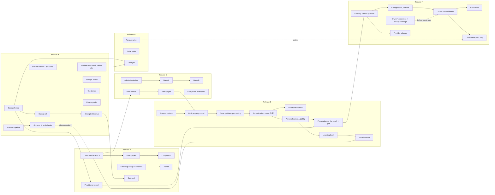

# Post-MVP Roadmap

| | |
|---|---|
| **Version** | 0.3 (draft) |
| **Status** | Plan; nothing in it is built yet. Decisions are defaults and are recorded in the [decision register](decisions.md) |
| **Last updated** | 2026-10-05 |
| **Audience** | Maintainers, reviewers, whoever funds or schedules the work |
| **Related** | [Post-MVP index](README.md) · [Requirements](requirements.md) · [PRD §4.3, §13](../PRD.md) · [Release process §11](../release-process.md) · [`TASKS.md`](../../TASKS.md) §PM |

---

## 1. Starting point

The MVP is technically complete: every build task of [`TASKS.md`](../../TASKS.md) is done (110 of 124 tasks when this plan was written; the other 14 are human-gated — reviews, evaluations, the signed checklist — or deliberately not triggered, such as the performance tasks PF-01 and PF-03, or K-19, which waits on the review rounds). Measured on 2026-10-05:

| Area | State |
|---|---|
| Flow | Landing → profile → screening → inquiry → observation → constitution → review → result, history and compare, print and practitioner summary, birth-place picker, acupoint figures; `zh-Hant` and `en`; light and dark; four text sizes |
| Knowledge base | 23 patterns, 8 complaint modules, 36 questions, 184 symptoms, 33 formulas (all with a verification record), 703 herbs (94 curated), 127 verified quotations, 31 acupoints, 47 foods, 484 cities; all `draft`, none reviewed |
| Engine | Pure TypeScript, deterministic, `assess` p95 5.6 ms against a 50 ms budget; parity with the Python oracle; twelve properties; 210 safety cases from 102 vignettes |
| Web | 502 unit and component tests; 87 end-to-end runs on Chrome and the cross-browser set on Safari's engine and Firefox; axe clean in a real browser in light and dark |
| Budgets | Initial JavaScript 121.7 of 200 KB gzip; all JavaScript 226.1 of 260; knowledge base per session 84.3 of 100 |
| Delivery | Static build for Cloudflare Pages with generated headers, redirects and 404; CI, nightly, visual and deploy workflows written — none has run, because nothing is pushed |
| Not done, by design | Review of any content, golden cases agreed by a practitioner, Lighthouse and manual assistive-technology passes, the signed release checklist, emergency numbers verified by a regional owner |

The product can be used and demonstrated today, and **cannot be released to the public** until the review track has produced its records. The post-MVP work below is arranged so that none of it waits for that track and none of it weakens it.

## 2. Principles

1. **Reach and resilience before breadth.** A second language, offline use and a way to keep one's data make the existing content useful to more people for free. New clinical content multiplies the review load, so it comes later and only as fast as review capacity allows.
2. **Local-first stays the product.** No accounts and no server-held health data. What other products do with a server, this one does with a file the person holds (backup, export, calendar entry).
3. **Each feature carries a review class** (N, L, C or R, [README §3](README.md#3-review-classes)). Release order follows risk: classes N and L first, C when reviewers are available, R only as evaluated experiments.
4. **Measure without telemetry.** Quality is shown by tests, property checks, end-to-end scenarios, studies with consenting participants, and voluntary feedback exports — never by watching users.
5. **Budgets are part of the feature.** A feature that cannot meet the size and speed budgets lazily, for the people who use it, is redesigned.
6. **A feature is not done until it is folded in:** requirements in the PRD, design in the specs, stored data in the privacy inventory, checks in the test plan.

## 3. Release train

Versions are assigned when a release is tagged ([release process §1](../release-process.md)); the targets below are only a guide. A feature ships in whichever release is current when its gates are met: if the review track finishes first, Release A may be part of 1.0.

| Release | Theme | Contents | Review class | Target |
|---|---|---|---|---|
| **A** | **Reach and resilience** | Simplified Chinese interface (FR-21) · offline use and installation (FR-22) · backup and restore, encrypted option, storage health (FR-23) · tap-tempo pulse (FR-28) · region packs, Hong Kong first (FR-29) | N, L | 1.1 |
| **B** | **Learn and follow up** | Knowledge browser (FR-14) with pattern comparison (FR-25) · structured practitioner export (FR-26) · follow-up nudge, calendar reminder and trends (FR-27) · local data lock (FR-24) | N, L | 1.2 |
| **C** | **Breadth** | Library expansion in waves (FR-30) · herb browser · five-phase extensions: southern hemisphere, ambiguous hour pillars, astronomy data regeneration, season model (FR-31) | C (some N) | 1.3 |
| **D** | **Research** | Tongue-photo assistance (FR-32) · camera pulse (FR-33) · file-based sync (FR-34) — each starts as an evaluated spike; shipping is a separate go decision | R | 2.x |
| **E** | **Knowledge and prescription** | Knowledge base v2: sources and theory (FR-35) · herb property model (FR-36) · formula mechanism and verification (FR-37) · personalised prescription by 三因制宜 (FR-38) · the learning book in Traditional Chinese (FR-39) | C (R for amounts) | 2.x |
| **F** | **AI-assisted intake** | Conversational intake (FR-40) · AI observation of tongue and face (FR-41) · configuration, gateway and consent (FR-42) — an input aid; the engine decides | R | 2.x |

### 3.1 Release A — Reach and resilience

*Why first:* the work is mostly mechanics, it protects the person's own data (a browser can discard storage, and an offline-capable app makes that loss more likely to matter), and a Simplified Chinese interface roughly doubles the readers the existing content can serve.

| Feature | Outcome | Notes |
|---|---|---|
| Simplified Chinese (FR-21) | `/zh-Hans/…` for the whole flow, built from the Traditional source by a reviewable pipeline | Needs a linguistic reviewer for Mainland usage and legal review of the notices before it is offered publicly |
| Offline and install (FR-22) | After the first visit a whole assessment works with no network; the app installs like an app; updates never interrupt an assessment | A service worker is the highest-risk piece of this release; kill switch and rollback rehearsal are part of the work |
| Backup and restore (FR-23) | One file holds history and settings; restore on another device; optional passphrase encryption; the person sees storage health | Restores are validated and never trusted blindly |
| Tap-tempo pulse (FR-28) | An alternative to the 30-second timer | Small; shares the observation screen |
| Region packs (FR-29) | The mechanism to add a region (emergency numbers, wording, default language); Hong Kong is the first candidate | The data rows need verification by a regional owner; without it a region stays hidden |

**Exit:** [`CHECKLIST.md`](../../CHECKLIST.md) §3, *Release A*.

### 3.2 Release B — Learn and follow up

*Why second:* the learner and the practitioner personas ([PRD §3](../PRD.md#3-target-users)) are served only partly by the result report. Everything here displays or reorganises content that already passed review, so it needs no new clinical review, only that the reviewed items are shown with their cautions and never as personal advice.

| Feature | Outcome | Notes |
|---|---|---|
| Knowledge browser (FR-14) | Patterns, constitutions, tier-A formulas, acupoints, foods, quotations and terms with provenance, search in both scripts and pinyin | Herbs beyond those in shown formulas wait for Release C |
| Pattern comparison (FR-25) | Two or three patterns side by side: what they share and which question tells them apart | Reuses the discriminating questions of K-07 |
| Practitioner export (FR-26) | A structured file and a clean print for a practitioner, within the output level | Same file family as the backup |
| Follow-up and trends (FR-27) | "Look again in N weeks" as an in-app nudge and a calendar file; a view of how bands changed over three or more assessments | No push notifications: they would need a server |
| Data lock (FR-24) | Passphrase encryption of the stored history on the device | Built after backup, because restore is the recovery path |

**Exit:** [`CHECKLIST.md`](../../CHECKLIST.md) §3, *Release B*.

### 3.3 Release C — Breadth

*Why third:* new patterns, modules and herbs are class C. Each needs the full content chain: sources, discriminating questions, formula verification, safety rules, golden and vignette cases, and the review rounds. The work is designed now (admission criteria, tooling, candidate list) so that it can start the day reviewers exist.

| Feature | Outcome | Notes |
|---|---|---|
| Library expansion (FR-30) | Wave A, proposed to the clinical reviewer: a respiratory module and four everyday gaps (qi-and-yin deficiency, food stagnation, aching from cold and damp, period pain from cold); Wave B follows the first wave's evidence and the physician's view on lower-burner damp-heat | Acute febrile stages (營分, 血分, high-fever 氣分) are **not** self-assessment patterns: they belong to red flags. The knowledge budget fits one wave, so Wave B starts with chunking the question bank by module |
| Herb browser | The 609 derived herbs become browsable with a delivery that respects the budget | Needs the sample review of derived herbs (V-04) first |
| Five-phase extensions (FR-31) | Southern-hemisphere seasons; both hour pillars near a boundary; astronomy tables regenerated in-repo; the 長夏 model as a declared choice | Calendar changes alter outputs, so each is a parameter or engine version change with parity cases |

**Exit:** [`CHECKLIST.md`](../../CHECKLIST.md) §3, *Release C*.

### 3.4 Release D — Research

Each item starts as a time-boxed spike with a written evaluation protocol and stop conditions ([research-tracks design](design/research-tracks.md)). A spike that fails its protocol is closed, not extended. A spike that passes becomes a requirement with its own review and legal gates; nothing in this release ships by default.

### 3.4a Release E — Knowledge and prescription (from the owner's direction of 2026-10-07)

*The app diagnoses first, then makes the medicament for each person.* The corpus already holds the classics; the knowledge base starts to **use** them ([knowledge base v2](design/knowledge-base-v2.md)). Each herb gets coordinates in the tradition's own terms and an effect that depends on the dose; each formula's effect is computed from its herbs, its roles are measured, and the app says **why** it fits a diagnosis; the library's 33 formulas are verified against their own indications; and the formula is **personalised** by 三因制宜 — herbs and amounts — under the safety layer ([prescription model](design/prescription-model.md)). Local and deterministic. **Amounts stay behind the output levels** (L3 and a proposed practitioner profile) until a legal view says otherwise. A short book in Traditional Chinese explains the model to a culturally fluent reader.

*Added by the owner's decisions of 2026-10-07 (second, [PD-28, PD-13, PD-14](decisions.md)):* the panel gains **營衛** from the classics, contradictory readings weighted by applicability ([營衛 in the model](design/ying-wei.md), FR-43); and the app serves **learners and practitioners** — declared with an attestation — with the full medication plan and the reasons for its modifications, while a general reader keeps today's levels ([prescription model §7.4](design/prescription-model.md), FR-44).

### 3.4b Release F — AI-assisted intake (from the owner's direction of 2026-10-07)

Fewer options, more conversation; AI looks at the tongue and the face — **as an input aid**: the person confirms what the AI understood, and the deterministic engine decides ([AI-assisted intake](design/ai-assisted-intake.md)). A gateway in this repository holds the provider key; off by default in the public build, opt-in per person, nothing identifying sent, nothing stored. It changes the local-first promise for the people who use it, so it waits for the owner's decision, a privacy redesign and a legal view before reaching the public. *The owner approved the design on 2026-10-07 (PD-21, PD-25): its mock-provider parts are built first (PM-44 … PM-48); the real provider waits for the owner's key and deployment (PM-49), photos for the spike's gates (PM-50).*

### 3.5 Not planned

Accounts or server-side sync, e-commerce or practitioner marketplaces, telemedicine, LLM-generated diagnosis or advice (an AI *input aid* is Release F; the diagnosis stays deterministic), automatic telemetry, native app wrappers. The reasons are recorded in [decisions](decisions.md) so that they are revisited with evidence, not by habit.

## 4. Sequencing

Rules of thumb behind the order: the backup comes before the lock (restore is the recovery path); the learn shell comes before the herb browser (it provides the routes and the search); file sync builds on the backup format and the installed app; library waves start only when the admission tooling and at least a clinical reviewer exist; in Release E the herb model comes before the formula and the prescription (each builds on the one before) and the learning book after the model it explains; Release F follows E (an input aid is worth building on a prescription that is already explained) and begins with a mock provider, so the whole flow is built and tested before any key, deployment or data leaves a device.

## 5. Effort

Rough sizes from [`TASKS.md`](../../TASKS.md) §PM, one engineer, no waiting time for review (S ½ day, M 1½, L 4, XL 8+):

| Release | Tasks | Sizes | About |
|---|---:|---|---|
| A | 12 | 3 L · 6 M · 3 S | 22 working days |
| B | 8 | 3 L · 4 M · 1 S | 18 |
| C | 9 | 2 XL · 1 L · 4 M · 2 S | 27 or more (the XL tasks are content, bounded by review) |
| D | 3 | 1 L · 2 M | 7 (spikes) |
| E | 10 | 6 L · 3 M · 1 S | 29 (the review of the new content is separate) |
| F | 7 | 1 XL · 3 L · 3 M | 25 or more (waits for the owner's decisions, a deployment and the evaluation) |

## 6. Quality debt carried into the post-MVP period

Known and recorded, not new. Items that need people stay with the review track and are listed only so that nobody builds on them unknowingly.

| Item | Owner |
|---|---|
| All medical content is `draft`; the 609 derived herbs are unreviewed; the 94 curated herbs, formulas and guidance await V-02 … V-04 | Review track |
| Golden set is 30 synthetic cases, 0 agreed by a practitioner; held-out concordance is below target (77 % and 50 %) | Review track (V-05) |
| The seed cases for the four patterns that need tongue or pulse to cross the 40 % threshold (EX3, SP6, HT2, KD1) contain only inquiry answers, so for example G-0003 reports "none" | Review track (calibration; the reseed script should also carry the typical observation) |
| Lighthouse CI and the manual assistive-technology passes have not run; the workflows exist | Owner and testers |
| Hand-made Chinese city names, acupoint drawing placements and Wikisource second-source quotations are unreviewed | Review track |
| English prose is a machine draft; classical-quotation translations are still to do | Review track (I-06, V-06) |
| The astronomy tables were taken over from the source engine; regenerating them from the archive is open | PM-28 (needs a download approval) |
| Offline retry in Safari's engine: a failed lazy-chunk fetch is remembered until reload, so the retry button does not recover there | Fixed by PM-04/PM-05 (precache removes the case) |

## 7. Risks specific to this period

| Risk | Effect | Mitigation |
|---|---|---|
| A faulty service worker keeps serving a broken app | Users stuck on an old or broken version | `sw.js` is never cached by the host; kill switch and boot-failure unregister; rollback rehearsal; release rule that the precache list equals the build |
| Mechanical Traditional→Simplified conversion of medical text | Wrong terms (乾/干, 髮/发, 製/制) in medical statements | Use the Simplified source text where it exists; reviewed override table; purity and glossary checks; Mainland linguistic review before public offer |
| Encrypted history cannot be recovered after a forgotten passphrase | Permanent loss of the person's own data | Opt-in; plain-language warning; backup prompt before enabling; no hint or recovery by design |
| Imported files are untrusted | Wrong or hostile data in the app, or a dev-profile result shown in a release build | Schema validation, size limits, profile check on import, no raw rendering; fuzz tests |
| Knowledge pages read as personal advice | Harm; breach of the output-level rules | Learn mode applies the conservative baseline and shows cautions beside every item; no "you" wording |
| Review capacity is the bottleneck for Release C | Wave A waits | Tooling and candidates ready first; Release C is not on the critical path of A and B |
| New dependencies | Supply-chain and licence exposure | Prefer platform APIs (WebCrypto, Cache API, Intl); every new dependency goes through the licence allow-list and needs approval to download |
| Storage eviction (notably Safari's seven-day rule for sites that are not visited) | History disappears without notice | Storage health view, persistence request, installed-app guidance, backup nudges |
| Regional regulation differs (Mainland, Hong Kong, Singapore) | Notices or claims unfit for the region | A region is enabled only with verified numbers and a legal check; the language does not imply the region |
| Reference amounts read as a prescription by a layperson (Release E) | Harm; an act regulated as prescribing | Amounts are computed for all and shown only at L3 and in a practitioner profile until a legal view (PD-13); every prescription says a practitioner decides |
| Derived herb properties or a formula's measured roles are wrong | A wrong explanation or 加減 | Every value names its rule; the library's verification report; the draft label; pharmacy and clinical review; failures are listed, never auto-fixed |
| The AI invents or misses a finding, or an emergency is told in conversation (Release F) | A wrong result; a missed urgency | Findings with quoted evidence confirmed by the person; the deterministic red flags first and re-opened by a matching statement; evaluation per language before public use |
| Data leaves the device for AI help | The local-first promise broken for that person | Off by default; opt-in per module with consent; minimisation enforced in code; nothing stored; the privacy redesign before public use (PD-21) |
| Cost of model calls | Running cost grows with use | A per-session budget and a daily ceiling at the gateway; the app works fully without it |

## 8. Success measures

No telemetry: each measure is a test, a review result or a study.

| Release | Measure |
|---|---|
| A | A whole assessment completes in the end-to-end suite with the network disabled after the first load (Chromium, WebKit, Firefox); a backup restores byte-equal records (property test over generated histories); `zh-Hans` has no fallback string, no Traditional-only character and a signed linguistic review; the initial bundle stays within budget |
| B | Every knowledge page names its sources and carries its cautions (test over all pages); the learn routes are axe-clean in light and dark; an encrypted store never contains plaintext sensitive fields (test over the raw IndexedDB); usability round R2 includes the learner and the practitioner tasks |
| C | Every added pattern passes the admission checklist in the build; vignettes and golden cases exist for it; reviewers have signed its area |
| D | Each spike reports against its protocol; no spike ships without a go decision |
| E | Every derived herb value names its rule (validator); the library's verification report is generated in the build; property tests: no excluded herb ever appears in a prescription, amounts never leave their range, toxic herbs are never raised; the diagnosis and the golden results are unchanged; no amount in a public build; the learning book passes the Traditional-only and quotation checks |
| F | Per-language evaluation against scripted personas meets the design's lines; no red-flag vignette ends without the deterministic notice; nothing identifying is sent (test); nothing is stored |

## 9. Needs input from outside the repository

These cannot be decided or verified by engineering and are recorded as open until someone provides them. None blocks the design work.

| Needed | For |
|---|---|
| Legal view on offering the app and its notices in the Mainland, Hong Kong and Singapore | FR-21, FR-29 |
| Verified emergency and crisis numbers per region, by someone who lives there | FR-29 |
| A Mainland-Mandarin bilingual reviewer | FR-21 |
| The final product name and domain | Public release (UQ1) |
| Clinical and pharmacy reviewers for each wave | FR-30, herb browser |
| Approval before downloading anything new (datasets, models, archives, tools) — *given by the owner 2026-10-07 for `VSOP87D.ear` and the eight works of knowledge base v2 §3 (PD-19)* | PM-28, Release D, Release E (§3 of knowledge base v2) |
| A legal view on showing reference amounts to declared learners and practitioners, per market, before a public launch — *the owner decided the audience (PD-13, PD-14); the view remains advisable* | FR-38, FR-44 |
| The gateway's deployment and the provider key — *the owner approved the design (PD-21)* | FR-40 … FR-42 |
| A privacy redesign (DPIA-style) and a data-processing agreement with the model provider | FR-40 … FR-42 |
| Clinical and pharmacy reviewers for the herb properties, pairings, processing, dose bands and 三因 rules, and for the 營衛 readings and weights | FR-35 … FR-38, FR-43 |

## 10. Changelog

| Version | Date | Change |
|---|---|---|
| 0.1 | 2026-10-05 | Initial post-MVP roadmap |
| 0.2 | 2026-10-07 | Releases E (knowledge and prescription) and F (AI-assisted intake), from the owner's direction of 2026-10-07 |
| 0.3 | 2026-10-07 | §3.4a, §3.4b, §9: the owner's decisions of 2026-10-07 (second) — 營衛 in the model, learners and practitioners, approvals, Release F's design approved |
