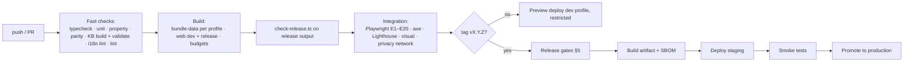

# Release Process

| | |
|---|---|
| **Version** | 0.1 (draft) |
| **Status** | Partly implemented — CI workflow and `scripts/check-release.ts` exist (R-01…R-03); deployment, SBOM and the integration jobs do not yet |
| **Last updated** | 2026-10-04 |
| **Audience** | Maintainers |
| **Related** | [Tech spec §5, §6, §11](tech-spec.md) · [Test plan §6](test-plan.md) · [Content review §7](content-review.md) · [Safety policy §8](safety-policy.md) · [Privacy](privacy.md) · [`CHECKLIST.md`](../CHECKLIST.md) |

---

## 1. Versions and what they mean

| Version | Form | Bumped when | Shown |
|---|---|---|---|
| **App** | `MAJOR.MINOR.PATCH` (pre-1.0: `0.x.y`) | Any shipped change; `PATCH` for fixes and data-only hotfixes, `MINOR` for features, `MAJOR` for breaking storage/behaviour | Settings, result footer, saved reports |
| **Knowledge base** | content hash of the bundle manifest | Any change to `data/` | Same |
| **KB schema** | integer in each file's `_meta.schema` | A breaking field change ([KB schema §11](kb-schema.md)) | Checked at load; mismatch refuses to run |
| **Engine** | semver (`ENGINE_VERSION`) | Any behavioural change of the diagnosis maths or output shape | Saved reports |
| **Parameters** | fingerprint of `scoring-params.json` + `@tcm/wuxing` `paramsFingerprint()` | Any parameter change | Saved reports |
| **Storage schema** | integer (IndexedDB) | Any change to the saved-assessment shape (forward migration shipped) | Internal |
| **Disclaimer** | version string | Any change of disclaimer wording | Acknowledgement record |

A saved report records app, KB, engine, parameters, profile and language so it can always be explained and compared ([tech spec §8.3](tech-spec.md)).

---

## 2. Source control

- **Trunk-based** on `main`; short-lived branches; `main` is always releasable and protected (CI required, no force-push).
- **One commit per finished task** (the project rule). A task = one entry in [`TASKS.md`](../TASKS.md); the commit message references the task id.
- **Commit messages:** `type(scope): summary` — types `feat`, `fix`, `docs`, `kb` (knowledge base content/pipeline), `data` (regenerated `data/`), `test`, `refactor`, `perf`, `build`, `ci`, `chore`; body explains *why*; regenerated `data/` is committed **with** the generator change that caused it (never separately).
- **Tags:** `vMAJOR.MINOR.PATCH` on `main` for releases; annotated, signed if possible.
- **Medical content changes** require the review steps in [content review](content-review.md) before merge to `main`, or a `draft` status that keeps them out of release levels.
- **Submodules** under `reference/sources/` stay pinned; bumping one is its own commit and triggers a KB rebuild and review of affected records.

---

## 3. Environments and profiles

| Environment | Profile | Audience | Rules |
|---|---|---|---|
| Local | `dev` | Developers | `pnpm dev`; inspector enabled |
| **Preview** (per PR) | `dev` | Maintainers and reviewers | **Never public:** access-restricted or `noindex` + unguessable URL, "DEV" badge visible; auto-deleted on merge/close. Used for calibration sessions and review |
| **Staging** | `release` | Maintainers | Release candidate, identical to production build |
| **Production** | `release` | Public | Only built from a tag; `check-release.ts` must pass |

Environment variables (build time):

| Variable | Meaning | Default |
|---|---|---|
| `APP_PROFILE` | `release` or `dev` | `release` for tag builds and production; `dev` for local/preview |
| `APP_OVERRIDES` | Path to a JSON file merged over the selected profile and re-validated (e.g. a stricter beta) | none |
| `APP_BASE_URL` | Public base URL and asset base | `/` |
| `APP_BUILD_ID` | Commit sha and build time (displayed in dev, short form in release) | from CI |
| `APP_DRAFT_LABEL` | `on` to show N-DRAFT on every result screen (closed beta exception) | `off` |

There is **no runtime profile switch in release** ([tech spec §6.1](tech-spec.md)).

---

## 4. Pipeline

Jobs and blocking rules are in the [test plan §6](test-plan.md). The pipeline publishes, per tag, an **artifact** containing `dist/` (assets + `kb/<version>/`), `manifest.json`, the SBOM (CycloneDX), the dependency licence report, the KB coverage report (counts by review status), and the release notes.

### 4.1 `check-release.ts` assertions (on the built release output)

1. Built with `APP_PROFILE=release`; the profile name embedded in the bundle is `release`.
2. The dev profile block, `annotate_only`, the `/_dev` route, the `ProfileBadge` and review-status badges are absent.
3. No dose or amount fields (`classical_amounts`, `typical_g`, `dose_g_reference`, `dose_references`) anywhere in `kb/`.
4. No tier-C formulas, no formula `modifications`, no herb effect/burden data, when the profile's maximum reachable level does not allow them ([tech spec §5.3](tech-spec.md)).
5. CSP present with the required directives; no inline `<script>`; all assets content-hashed.
6. `manifest.json` hashes match the files; KB schema version equals the app's.
7. Every `blocking_ack` population/condition of the release config is still blocking (config sanity) and `flow` = `continue`.
8. Review gates ([content review §7](content-review.md)) satisfied for the enabled levels — or `APP_DRAFT_LABEL=on` with a recorded beta exception.
9. `console.*` calls are stripped from app code; no source maps with sources in production (or they are not publicly served).

---

## 5. Release gates

A tag build is promoted only when **all** hold. The checklist form is [`CHECKLIST.md`](../CHECKLIST.md) (release section).

| Gate | Evidence |
|---|---|
| **Technical** | All CI jobs green; budgets met (initial JS ≤ 200 KB gzip, chunk budgets, Lighthouse); no open S1/S2 defects |
| **Safety** | Safety vignette suite and properties green; every red-flag item verified; notices present in both languages |
| **Content** | Review records valid for the enabled levels, or a recorded closed-beta exception with the draft label on; golden-case concordance reported |
| **Accessibility** | axe clean; manual screen-reader and keyboard pass recorded for this version |
| **Privacy** | Privacy tests green; hosting log behaviour confirmed; public privacy statement matches the build |
| **Legal/wording** | Wording lint clean; legal reviewer sign-off on disclaimers, claims, store/marketing copy (first public release and on material changes) |
| **Licences** | Dependency licence report within the allowlist; data licence ledger ([`reference/README.md`](../reference/README.md)) up to date; attributions on the Sources screen |
| **Documentation** | Changelog and release notes complete; docs updated for behaviour changes (PRD/SOP/spec versions bumped where needed) |

---

## 6. Deployment

- **Static hosting** (target to be chosen — tech spec TQ1). Required capabilities: custom response headers (CSP, caching), SPA fallback for `/:lang/*` to `index.html` with a 404 status only for unknown languages, HTTPS with HSTS, Brotli/gzip.
- **Caching:** hashed assets and `kb/<version>/*` → `Cache-Control: public, max-age=31536000, immutable`; `index.html` and `kb/manifest.json` → `no-cache` (revalidate). A new release changes the KB URL, so users never mix an old app with a new KB.
- **Headers:** CSP as in the [tech spec §11](tech-spec.md); `X-Content-Type-Options: nosniff`; `Referrer-Policy: no-referrer`; `Permissions-Policy` denying camera/microphone/geolocation; `Cross-Origin-Opener-Policy: same-origin`.
- **Robots:** production allows the landing page; preview/dev hosts send `X-Robots-Tag: noindex`.
- **`/.well-known/security.txt`** with the safety/security report channel.
- **Smoke tests after deploy:** fetch `/` and `/zh-Hant/`, `/en/`; fetch the manifest and each chunk and verify hashes; run E1 headless against the deployed URL; verify headers.

---

## 7. Rollback and hotfixes

| Topic | Rule |
|---|---|
| **Rollback** | Redeploy the previous artifact (keep the last 5). KB is versioned by URL, so app and KB cannot mismatch. |
| **Storage compatibility** | Storage-schema bumps follow *expand/contract*: release N reads old and new shapes and writes the old shape; release N+1 writes the new one. A rollback never meets data it cannot read. |
| **Data hotfix** (safety rule, flag, wording) | The fastest path: change the curated table → build → targeted tests → reviewer sign-off (S1/S2) → tag `PATCH` → deploy. Target ≤ 24 h for S1 ([safety policy §8](safety-policy.md)). |
| **Kill-switch** | If a formula or rule must be disabled immediately, the quickest control is a KB change (mark it `restricted`; the engine treats it as suppressed with the reason "temporarily withdrawn"); no remote flag service exists. |
| **Post-incident** | Regression test first; review of the affected area; public changelog note. |

---

## 8. Dependencies, licences and supply chain

- **Runtime dependencies are few and reviewed:** React, wouter, Zustand; `@tcm/wuxing`, `@tcm/engine`, `@tcm/kb`, `@tcm/i18n` have none. Any addition needs a privacy and bundle-size review ([privacy §6](privacy.md)).
- **Updates:** weekly Renovate/Dependabot PRs; security updates within 3 working days; `pnpm audit` in CI; installs with `--frozen-lockfile --ignore-scripts`.
- **Licence allowlist (code):** MIT, ISC, BSD-2/3, Apache-2.0, 0BSD; anything else needs approval. **Data:** MIT (TCM-Library, tcm-mkg); `TCM-Ancient-Books` has no licence → verification and short quotations only; CC-BY data (e.g. a city list) requires attribution on the Sources screen; non-commercial-only data is excluded from commercial builds (PRD Q7).
- **SBOM** (CycloneDX) and the licence report are generated per release and attached to the artifact.

---

## 9. Release notes and changelog

`CHANGELOG.md` (Keep a Changelog style) with sections *Added · Changed · Fixed · Content · Safety · Known issues*. Each release states: the three version stamps (app / KB / engine), **what changed in the knowledge base** (records added/changed, review coverage by area), any change to the safety rules or notices, migration notes, and the beta-exception text if applicable.

---

## 10. Support and reporting

Issue templates: **Bug**, **Content problem** (item id, KB version, source), **Safety report** (never include health data; the in-app "Report a problem" link pre-fills ids and versions), **Translation**. Triage within one working day; severity and response targets per [safety policy §8](safety-policy.md).

---

## 11. Milestones and release mapping

| Milestone | Deliverable | Profile and audience |
|---|---|---|
| M0 | Documentation set | — |
| M1 | Complete first-pass KB + schema + question bank | — |
| M2 | MVP app | Dev builds for the team and reviewers; **no public release** |
| M3 | Reviewed content, hardening | Staging release builds |
| M4 | Closed beta | Release profile, invitation-only, beta exception recorded if content is still draft |
| 1.0 | Public release | Release profile; all gates satisfied; no exception |

---

## 12. Repository hygiene (to add)

`LICENSE` ✔ · `CONTRIBUTING.md` · `SECURITY.md` (report channel) · issue and PR templates (task id, review impact, privacy impact, i18n impact, a11y impact) · `CODEOWNERS` (content areas → reviewer roles) · `CHANGELOG.md` · `.github/workflows/ci.yml` and `release.yml`.

---

## 13. Open questions

**Decided 2026-10-04** (MVP; to be revisited after the MVP is finished):

| # | Question | Decision (MVP) |
|---|---|---|
| RQ1 | Hosting provider and whether previews can be access-restricted | **Cloudflare Pages** (see [tech spec TQ1](tech-spec.md#13-open-technical-questions)). PR previews are `dev`-profile builds and must sit behind access control (Cloudflare Access or equivalent); if that is not configured, previews are disabled and reviewers use local builds |
| RQ2 | Where the public repository lives and whether it is public at beta | The repository stays **private until the closed beta (M4)**; the code licence stays Apache-2.0; making it public at 1.0 requires the licence ledger and `NOTICE` (task K-18) to be complete |
| RQ3 | Signing of tags and artifacts | Signed tags; SHA-256 checksums of the artifact |
| RQ4 | Who may approve S1 hotfixes | Content owner + one reviewer |

---

## 14. Changelog

| Version | Date | Change |
|---|---|---|
| 0.1 | 2026-10-04 | Initial release process |
