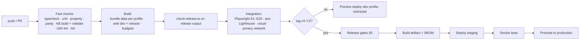

# Release Process

| | |
|---|---|
| **Version** | 0.4 (draft) |
| **Status** | Partly implemented — CI workflow and `scripts/check-release.ts` exist (R-01…R-03); deployment, SBOM and the integration jobs do not yet |
| **Last updated** | 2026-10-04 |
| **Audience** | Maintainers |
| **Related** | [Tech spec §5, §6, §11](tech-spec.md) · [Test plan §6](test-plan.md) · [Content review §7](content-review.md) · [Safety policy §8](safety-policy.md) · [Privacy](privacy.md) · [`CHECKLIST.md`](../CHECKLIST.md) |

---

## 1. Versions and what they mean

| Version | Form | Bumped when | Shown |
|---|---|---|---|
| **App** | `MAJOR.MINOR.PATCH` (pre-1.0: `0.x.y`) | Any shipped change; `PATCH` for fixes and data-only hotfixes, `MINOR` for features, `MAJOR` for breaking storage/behaviour | Settings, result footer, saved reports |
| **Knowledge base** | content hash of the bundle manifest | Any change to `data/` | Same |
| **KB schema** | integer in each file's `_meta.schema` | A breaking field change ([KB schema §11](kb-schema.md)) | Checked at load; mismatch refuses to run |
| **Engine** | semver (`ENGINE_VERSION`) | Any behavioural change of the diagnosis maths or output shape | Saved reports |
| **Parameters** | fingerprint of `scoring-params.json` + `@tcm/wuxing` `paramsFingerprint()` | Any parameter change | Saved reports |
| **Storage schema** | integer (IndexedDB) | Any change to the saved-assessment shape (forward migration shipped) | Internal |
| **Disclaimer** | version string | Any change of disclaimer wording | Acknowledgement record |

A saved report records app, KB, engine, parameters, profile and language so it can always be explained and compared ([tech spec §8.3](tech-spec.md)).

---

## 2. Source control

- **Trunk-based** on `main`; short-lived branches; `main` is always releasable and protected (CI required, no force-push).
- **One commit per finished task** (the project rule). A task = one entry in [`TASKS.md`](../TASKS.md); the commit message references the task id.
- **Commit messages:** `type(scope): summary` — types `feat`, `fix`, `docs`, `kb` (knowledge base content/pipeline), `data` (regenerated `data/`), `test`, `refactor`, `perf`, `build`, `ci`, `chore`; body explains *why*; regenerated `data/` is committed **with** the generator change that caused it (never separately).
- **Tags:** `vMAJOR.MINOR.PATCH` on `main` for releases; annotated, signed if possible.
- **Medical content changes** require the review steps in [content review](content-review.md) before merge to `main`, or a `draft` status that keeps them out of release levels.
- **Submodules** under `reference/sources/` stay pinned; bumping one is its own commit and triggers a KB rebuild and review of affected records.

---

## 3. Environments and profiles

| Environment | Profile | Audience | Rules |
|---|---|---|---|
| Local | `dev` | Developers | `pnpm dev`; inspector enabled |
| **Preview** (per PR) | `dev` | Maintainers and reviewers | **Never public:** access-restricted or `noindex` + unguessable URL, "DEV" badge visible; auto-deleted on merge/close. Used for calibration sessions and review |
| **Staging** | `release` | Maintainers | Release candidate, identical to production build |
| **Production** | `release` | Public | Only built from a tag; `check-release.ts` must pass |

Environment variables (build time):

| Variable | Meaning | Default |
|---|---|---|
| `APP_PROFILE` | `release` or `dev` | `release` for tag builds and production; `dev` for local/preview |
| `APP_OVERRIDES` | Path to a JSON file merged over the selected profile and re-validated (e.g. a stricter beta) | none |
| `APP_BASE_URL` | Public base URL and asset base | `/` |
| `APP_BUILD_ID` | Commit sha and build time (displayed in dev, short form in release) | from CI |
| `APP_DRAFT_LABEL` | `on` for a closed beta with unreviewed content (the recorded exception): the build is **noindex** (robots meta and `robots.txt`) and `check-release` is run with `--draft-label`; the N-DRAFT notice itself follows the content's review status, not this flag | `off` |

There is **no runtime profile switch in release** ([tech spec §6.1](tech-spec.md)).

---

## 4. Pipeline

Jobs and blocking rules are in the [test plan §6](test-plan.md). The pipeline publishes, per tag, an **artifact** containing `dist/` (assets + `kb/<version>/`), `manifest.json`, the SBOM (CycloneDX), the dependency licence report, the KB coverage report (counts by review status), and the release notes.

### 4.1 `check-release.ts` assertions (on the built release output)

1. Built with `APP_PROFILE=release`; the profile name embedded in the bundle is `release`.
2. The dev profile block, `annotate_only`, the `/_dev` route, the `ProfileBadge` and review-status badges are absent.
3. No dose or amount fields (`classical_amounts`, `typical_g`, `dose_g_reference`, `dose_references`) anywhere in `kb/`.
4. No tier-C formulas, no formula `modifications`, no herb effect/burden data, when the profile's maximum reachable level does not allow them ([tech spec §5.3](tech-spec.md)).
5. CSP present with the required directives; no inline `<script>`; all assets content-hashed; every file the page points to (scripts, styles, icons, the web-app manifest and its icons) is in the output and none lives on another host.
6. `manifest.json` hashes match the files; KB schema version equals the app's; the Simplified-Chinese display lists are present, hashed, within budget and **aligned with the Chinese strings of the chunks they ship with** ([design](post-mvp/design/simplified-chinese.md)).
7. Every `blocking_ack` population/condition of the release config is still blocking (config sanity) and `flow` = `continue`.
8. Review gates ([content review §7](content-review.md)) satisfied for the enabled levels — or `APP_DRAFT_LABEL=on` with a recorded beta exception — and then the build must be non-indexable (a `noindex` robots meta in `index.html` and `Disallow: /` in `robots.txt`; the dev profile gets the same).
9. `console.*` calls are stripped from app code; no source maps with sources in production (or they are not publicly served).
13. **Service worker and boot script** ([offline design](post-mvp/design/offline-and-install.md) §3.4, §3.5): `sw.js` is present, carries exactly this build's files — the shell, the knowledge files and the Simplified files, recomputed from the output, none missing, none extra, none in the wrong list, an id that is the hash of them — names no external address, does not list itself and is at most 10 KB gzip; `boot.js` is present, loaded by the page as a classic script, self-contained and at most 2 KB gzip; `_headers` serves both `no-cache` and the CSP names `worker-src` and `manifest-src`.
14. **Installability** ([offline design](post-mvp/design/offline-and-install.md) §3.6): the page links a web-app manifest that is `standalone`, with `id`, `start_url` and `scope` `/`, a name, short name, language and two `#rrggbb` colours, and **no** shortcuts, categories, related applications or screenshots; it lists a 192 and a 512 PNG icon and a 512 maskable one, each present and of the size it says; and the page has an `apple-touch-icon` (a square PNG of at least 180 px) for iOS.
15. **The herb browser** ([knowledge browser design](post-mvp/design/knowledge-browser.md) §7, PM-24): when the manifest lists one, its index and shards are in the output, content-hashed, within their budgets and equal to the manifest; the index and the shards agree (every herb in the shard its slug maps to, and nothing else, and as many as the manifest says); nothing in them carries a dose, herb weights or the repository path of a source; each file has its Simplified display list, aligned with its own strings; and a build **without the draft label lists only herbs a sample review has covered** (`status: reviewed` — none yet, so a public build has no herb browser).
10. `NOTICE.txt` is shipped and carries the attributions (the MIT permission notice of TCM-Library, the Apache licence statement): material derived from MIT-licensed sources requires its notice to travel with the app.
12. **Emergency numbers:** a build without the draft label ships only regions whose numbers a regional owner has verified (a dated `verification` record no older than 24 months) and the generic `OTHER` row that lists none; the closed beta may carry the draft rows ([design](post-mvp/design/tap-tempo-and-regions.md)).
16. **The learning book** ([knowledge browser design](post-mvp/design/knowledge-browser.md) §7.3, PM-43): when the manifest lists it, its one file is in the output, content-hashed, within its budget and equal to the manifest; it is the book the manifest names (Traditional Chinese, the chapters in order); every quotation names a citation the build ships; no book file the manifest does not list; and a build **without the draft label carries it only once it is reviewed** (none yet, so a public build has no book).
18. **Learners and practitioners** ([prescription model §7.4](post-mvp/design/prescription-model.md), PM-53): the general reader's profile reaches at most L1 and shows no amount; the reference file is in the manifest, hash-checked, content-hashed, within its budget, with its display list, cached as immutable — and allowed without the draft label only once every formula and herb record in it is reviewed; each role keeps the blocking cells (L0 · blocking), the condition and state cells, the other populations and the safety enforcement of the general profile; the prescription's messages are never in the first load.
17. **AI help is off** ([AI-assisted intake](post-mvp/design/ai-assisted-intake.md) §6, PM-46): the profile's `ai` section turns no module on and names no gateway; the page's `connect-src` is `'self'` alone; no script holds AI help's client, card or messages (the gateway's routes, `ai.settings.title`, `ai.consent.title`) — with or without the draft label, until AI help's gates are passed.
11. The host files are present and right: `_headers` (the CSP with `frame-ancestors`, `nosniff`, referrer policy, immutable caching for `/assets/*` and for each chunk of this build (the herb browser's files and the book included), `no-cache` for the manifest, no `Cache-Control` on `/*`), `_redirects` (every language falls back to the app, no catch-all), `404.html`, and an unexpired `security.txt` ([§6](#6-deployment)).

---

## 5. Release gates

A tag build is promoted only when **all** hold. The checklist form is [`CHECKLIST.md`](../CHECKLIST.md) (release section).

| Gate | Evidence |
|---|---|
| **Technical** | All CI jobs green; budgets met (initial JS ≤ 200 KB gzip, chunk budgets, Lighthouse); no open S1/S2 defects |
| **Safety** | Safety vignette suite and properties green; every red-flag item verified; notices present in both languages |
| **Content** | Review records valid for the enabled levels, or a recorded closed-beta exception with the draft label on; golden-case concordance reported |
| **Accessibility** | axe clean; manual screen-reader and keyboard pass recorded for this version |
| **Privacy** | Privacy tests green; hosting log behaviour confirmed; public privacy statement matches the build |
| **Legal/wording** | Wording lint clean; legal reviewer sign-off on disclaimers, claims, store/marketing copy (first public release and on material changes) |
| **Licences** | Dependency licence report within the allowlist; data licence ledger ([`reference/README.md`](../reference/README.md)) up to date; attributions on the Sources screen |
| **Documentation** | Changelog and release notes complete; docs updated for behaviour changes (PRD/SOP/spec versions bumped where needed) |

---

## 6. Deployment

- **Static hosting:** Cloudflare Pages ([tech spec TQ1](tech-spec.md#13-open-technical-questions)). Required capabilities: custom response headers (CSP, caching), SPA fallback for `/:lang/*` to `index.html` with a 404 status only for unknown languages, HTTPS with HSTS, Brotli/gzip.
- **Caching:** hashed assets and `kb/<version>/*` → `Cache-Control: public, max-age=31536000, immutable`; `index.html` and `kb/manifest.json` → `no-cache` (revalidate). A new release changes the KB URL, so users never mix an old app with a new KB.
- **Headers:** CSP as in the [tech spec §11](tech-spec.md); `X-Content-Type-Options: nosniff`; `Referrer-Policy: no-referrer`; `Permissions-Policy` denying camera/microphone/geolocation; `Cross-Origin-Opener-Policy: same-origin`.
- **Robots:** a public release ships `robots.txt` allowing the site (but not `/kb/`) and the app marks every route except the start page and the sources `noindex` at run time (a result or a step in the flow is personal); a dev build or a closed beta (draft label) is `noindex` in the page and in `robots.txt`, and preview/dev hosts also send `X-Robots-Tag: noindex`.
- **`/.well-known/security.txt`** with the safety/security report channel.
- **Smoke tests after deploy:** fetch `/` and `/zh-Hant/`, `/en/`; fetch the manifest and each chunk and verify hashes; run E1 headless against the deployed URL; verify headers.

> **Implementation (R-04).** The build generates, next to the app (`scripts/deploy-files.ts`, written by the Vite plugin `tcm-deploy`): **`_headers`** (CSP *with* `frame-ancestors 'none'`, `nosniff`, `Referrer-Policy: no-referrer`, a `Permissions-Policy` denying camera, microphone and geolocation, COOP, HSTS, and `X-Robots-Tag: noindex` for a dev build or closed beta; `/assets/*` and **each content-hashed knowledge-base chunk of that build** immutable, `/kb/manifest.json` `no-cache` — cache rules are per exact path and never overlap, because Cloudflare combines the values of every matching rule, and `/*` sets none so documents revalidate by default); **`_redirects`** (every language segment, canonical and the lower-case aliases the app understands, falls back to `index.html` with 200); **`404.html`** (static, bilingual, no script or style; having it turns off Pages' blanket SPA mode, so an unknown first segment is a **real 404** and the app renders its own not-found screen only under a known language); **`/.well-known/security.txt`** (contact from `SECURITY.md`, `Expires` 180 days after the build). `check-release` rule 11 asserts all of it on every build. **`scripts/serve-dist.ts`** serves a build like Pages (applies `_headers` and `_redirects`, 404.html with status 404) and **`scripts/smoke.ts <url>`** checks a running site: the app answers under every language and route and is revalidated, the headers, an unknown language is a 404 with the headers, the manifest is `no-cache` and every chunk matches its hash and is immutable, hashed assets are immutable, the root files and security.txt (unexpired) exist, and noindex is sent exactly when it should be. CI runs the smoke test against every build through the emulator; `.github/workflows/deploy.yml` (tag `v*` → CI → build once → staging → smoke → **production after approval** → smoke) runs it against the deployed URLs, and `rollback.yml` redeploys the artifact of an earlier run (kept 90 days). One-time setup by the owner: the Cloudflare Pages projects, the secrets `CLOUDFLARE_API_TOKEN` / `CLOUDFLARE_ACCOUNT_ID`, the variables `CF_PAGES_STAGING_PROJECT`, `CF_PAGES_PRODUCTION_PROJECT`, `STAGING_URL`, `PRODUCTION_URL`, `DRAFT_LABEL`, and the `staging` / `production` environments (production with required reviewers). Per-PR dev previews behind access control are not automated yet.

---

## 7. Rollback and hotfixes

| Topic | Rule |
|---|---|
| **Rollback** | Redeploy the previous artifact (kept 90 days) with the *Rollback* workflow: run id of the good Deploy run, target environment; it smoke-tests the result. KB is versioned by URL, so app and KB cannot mismatch. |
| **Storage compatibility** | Storage-schema bumps follow *expand/contract*: release N reads old and new shapes and writes the old shape; release N+1 writes the new one. A rollback never meets data it cannot read. |
| **Data hotfix** (safety rule, flag, wording) | The fastest path: change the curated table → build → targeted tests → reviewer sign-off (S1/S2) → tag `PATCH` → deploy. Target ≤ 24 h for S1 ([safety policy §8](safety-policy.md)). |
| **Rollback rehearsal** | With the service worker a rollback is an ordinary update: the previous artifact's `sw.js` differs in bytes from the current one, installs beside it, and the person is offered *Reload*; nothing interrupts an answer and the draft survives. End-to-end scenario E22b rehearses it with two real builds served in turn (deploy B over A, then A again over B, then B for a closed tab); the first deployment repeats it by hand on staging with two real artifacts — deploy N, open the app, deploy N−1 with the *Rollback* workflow, confirm the notice and *Reload*, and note the result in the release notes — before the worker is announced. |
| **Kill worker** | A faulty service worker is removed from every browser that visits by deploying `node scripts/make-kill-sw.ts [dist]` (it writes a `sw.js` that deletes the `tcm-app-*` caches, takes its clients, reloads them and unregisters itself). The host never caches `/sw.js`, so the next visit receives it. The development build serves the same worker as its `sw.js`, so a reviewer who once visited a release build never sees a stale preview ([offline design](post-mvp/design/offline-and-install.md) §5). |
| **Kill-switch** | If a formula or rule must be disabled immediately, the quickest control is a KB change (mark it `restricted`; the engine treats it as suppressed with the reason "temporarily withdrawn"); no remote flag service exists. |
| **Post-incident** | Regression test first; review of the affected area; public changelog note. |

---

## 8. Dependencies, licences and supply chain

- **Runtime dependencies are few and reviewed:** React, wouter, Zustand; `@tcm/wuxing`, `@tcm/engine`, `@tcm/kb`, `@tcm/i18n` have none. Any addition needs a privacy and bundle-size review ([privacy §6](privacy.md)).
- **Updates:** weekly Renovate/Dependabot PRs; security updates within 3 working days; `pnpm audit` in CI; installs with `--frozen-lockfile --ignore-scripts`.
- **Licence allowlist (code):** MIT, ISC, BSD-2/3, Apache-2.0, 0BSD (and the few others in `scripts/licenses.json`); anything else needs approval. **Data:** MIT (TCM-Library, tcm-mkg); `TCM-Ancient-Books` has no licence → verification and short quotations only; CC-BY data (e.g. a city list) requires attribution on the Sources screen; non-commercial-only data is excluded from commercial builds (PRD Q7).
- **SBOM** (CycloneDX) and the licence report are generated per release and attached to the artifact.

> **Implementation (R-05).** `.github/dependabot.yml` (npm/pnpm, pip for `scripts/requirements.txt`, github-actions; weekly, grouped). Every action in every workflow is pinned to a **full commit SHA** with its version in a comment (checked by `pnpm check:hygiene`; Dependabot updates both). `scripts/licenses.ts` + `scripts/licenses.json`: `pnpm check:licenses` fails when a package that **ships** in the web app is outside the permissive allow-list (MIT, MIT-0, ISC, Apache-2.0, BSD-2/3-Clause, 0BSD, BlueOak-1.0.0, CC0-1.0, Unlicense) or when a build-time tool uses a licence outside that list plus the build-only ones (MPL-2.0, CC-BY-4.0, Python-2.0); exceptions are recorded per `package@version` with a reason and must not go stale. The CI `deps` job also runs `pnpm audit` (high and critical **block** for what ships; build-time findings are reported) and uploads `licenses.md` and `sbom.cdx.json` (CycloneDX 1.5, from the installed packages, deterministic) as the `dependency-reports` artifact, kept 90 days. Installs use `--frozen-lockfile --ignore-scripts`.

---

## 9. Release notes and changelog

`CHANGELOG.md` (Keep a Changelog style) with sections *Added · Changed · Fixed · Content · Safety · Known issues*. Each release states: the three version stamps (app / KB / engine), **what changed in the knowledge base** (records added/changed, review coverage by area), any change to the safety rules or notices, migration notes, and the beta-exception text if applicable.

---

## 10. Support and reporting

Issue templates: **Bug**, **Content problem** (item id, KB version, source), **Safety report** (never include health data; the in-app "Report a problem" link pre-fills ids and versions), **Translation**. Triage within one working day; severity and response targets per [safety policy §8](safety-policy.md).

---

## 11. Milestones and release mapping

| Milestone | Deliverable | Profile and audience |
|---|---|---|
| M0 | Documentation set | — |
| M1 | Complete first-pass KB + schema + question bank | — |
| M2 | MVP app | Dev builds for the team and reviewers; **no public release** |
| M3 | Reviewed content, hardening | Staging release builds |
| M4 | Closed beta | Release profile, invitation-only, beta exception recorded if content is still draft |
| 1.0 | Public release | Release profile; all gates satisfied; no exception |

---

## 12. Repository hygiene (to add)

`LICENSE` ✔ · `CONTRIBUTING.md` · `SECURITY.md` (report channel) · issue and PR templates (task id, review impact, privacy impact, i18n impact, a11y impact) · `CODEOWNERS` (content areas → reviewer roles) · `CHANGELOG.md` · `.github/workflows/ci.yml` and `release.yml`.

---

## 13. Open questions

**Decided 2026-10-04** (MVP; to be revisited after the MVP is finished):

| # | Question | Decision (MVP) |
|---|---|---|
| RQ1 | Hosting provider and whether previews can be access-restricted | **Cloudflare Pages** (see [tech spec TQ1](tech-spec.md#13-open-technical-questions)). PR previews are `dev`-profile builds and must sit behind access control (Cloudflare Access or equivalent); if that is not configured, previews are disabled and reviewers use local builds |
| RQ2 | Where the public repository lives and whether it is public at beta | The repository stays **private until the closed beta (M4)**; the code licence stays Apache-2.0; making it public at 1.0 requires the licence ledger and `NOTICE` (task K-18) to be complete |
| RQ3 | Signing of tags and artifacts | Signed tags; SHA-256 checksums of the artifact |
| RQ4 | Who may approve S1 hotfixes | Content owner + one reviewer |

---

## 14. Changelog

| Version | Date | Change |
|---|---|---|
| 0.1 | 2026-10-04 | Initial release process |
| 0.2 | 2026-10-07 | §4.1 rule 16: the learning book (PM-43) |
| 0.3 | 2026-10-08 | §4.1 rule 17: AI help is off in a release (PM-46) |
| 0.4 | 2026-10-08 | §4.1 rule 18: learners and practitioners (PM-53) |
