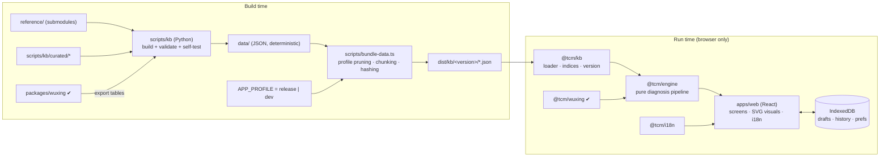

# Technical Specification — TCM Self-Assessment App

| | |
|---|---|
| **Version** | 0.4 (draft) |
| **Status** | Draft — implementation not started (only `packages/wuxing`, `data/` and `scripts/kb` exist) |
| **Last updated** | 2026-10-06 |
| **Derives from** | [PRD v0.3](PRD.md) · [Diagnosis SOP v0.2](diagnosis-sop.zh-TW.md) · [Algorithm spec](wuxing-algorithm.md) |
| **Sibling docs** | [UI/UX spec](ux-spec.md) · [KB schema](kb-schema.md) · [i18n guide](i18n-guide.md) · [Safety policy](safety-policy.md) · [Privacy](privacy.md) · [Test plan](test-plan.md) · [Release process](release-process.md) |

> **Reading guide.** §1–§3 are the architecture and the decisions behind it; §4 the packages; §5–§6 how data and the
> application profile reach the browser; §7 the diagnosis engine contract; §8 the application; §9–§12 cross-cutting
> concerns; §13 the open technical questions. Anything marked **✔** exists in the repository today; everything else is
> a specification to implement (see [`TASKS.md`](../TASKS.md)).

---

## 1. Constraints that shape the design

These come from the PRD and the SOP; every choice below is justified against them.

| # | Constraint | Source | Consequence |
|---|---|---|---|
| C1 | Fully client-side; **no personal data leaves the device**; works on static hosting | PRD G7, NFR Privacy | No backend, no accounts, no analytics that see answers; local persistence only |
| C2 | The diagnostic core is **deterministic and explainable**; no LLM | PRD §2.2, Q3 | Pure functions, versioned parameters, structured trace instead of prose |
| C3 | **Profiles** (`dev` all open, `release` restricted) are a build-time property; a release build must not be able to show dev-only content | PRD FR-17, SOP §0.2 | Profile-aware **data pruning** at build time, not only UI gating; CI assertions |
| C4 | The SOP and the Python reference pipeline are the specification; the engine must match them case by case | SOP App. C #6 | Parity tests against fixtures generated by `scripts/kb` |
| C5 | Bilingual zh-Hant (default) + English, no hard-coded strings; strict key coverage | PRD FR-2 | Typed message catalogs; engine returns **message keys + params**, never sentences |
| C6 | Mobile-first; initial JS ≤ 200 KB gzip; LCP ≤ 2.5 s on mid-range mobile / 4G; INP ≤ 200 ms | PRD NFR | Code-splitting, lazy knowledge chunks, no chart/UI framework bloat |
| C7 | WCAG 2.1 AA; colour never the only signal; visualisations have text/table equivalents | PRD NFR | Hand-built SVG components with accessible alternatives |
| C8 | Content changes (data) must never require engine or UI changes; engine and UI changes never edit content | PRD NFR Maintainability | Strict layering and a versioned KB contract |
| C9 | Saved reports record KB version, engine parameter fingerprint, profile | PRD NFR Content integrity | Version stamps in every layer; migration policy for stored data |
| C10 | Medical content is `draft` until reviewed | PRD §8.4 | Review status travels with every record into the UI (badge in dev, notice in release) |

---

## 2. Architecture overview



**Layering rules (enforced by lint, `import/no-restricted-paths`):**

```
apps/web  →  @tcm/engine  →  @tcm/kb (types only)  and  @tcm/wuxing
apps/web  →  @tcm/kb (loader)   apps/web  →  @tcm/i18n
@tcm/engine never imports react, the DOM, fetch, IndexedDB, Date.now(), Math.random(), or apps/*
@tcm/wuxing imports nothing (zero dependencies)  ✔
```

The engine takes **all** of its inputs as arguments (knowledge base, subject, findings, `now`, profile) and returns plain
data. That makes it trivially testable, usable in a Web Worker later, and re-runnable on a saved assessment.

### 2.1 Repository layout (target)

```
tcm-app/
├─ apps/web/                  # Vite + React + TypeScript single-page app
├─ packages/
│  ├─ wuxing/        ✔        # yin-yang / five-phase engine (zero deps, 88 tests)
│  ├─ kb/                     # KB types (generated from JSON Schema), loader, indices, versioning, pruning rules
│  ├─ engine/                 # diagnosis pipeline: policy → … → explanation (pure, deterministic)
│  └─ i18n/                   # tiny typed message formatter + catalog checker
├─ data/             ✔        # generated knowledge base (JSON) + data/schema/*.schema.json (new)
├─ reference/        ✔        # source texts (git submodules)
├─ scripts/
│  ├─ kb/            ✔        # Python KB pipeline + reference diagnosis pipeline (the engine's oracle)
│  ├─ bundle-data.ts          # profile pruning, chunking, content hashing → dist/kb/<version>/
│  ├─ check-release.ts        # release-profile assertions on a built bundle
│  └─ check-i18n.ts           # key coverage / placeholder parity / forbidden-term lint
├─ docs/  ✔   TASKS.md   CHECKLIST.md   CONTRIBUTING.md
├─ pnpm-workspace.yaml   package.json   tsconfig.base.json   eslint.config.js
└─ .github/workflows/ci.yml
```

---

## 3. Technology choices and decisions

| ID | Decision | Alternatives considered | Why |
|---|---|---|---|
| **T1** | **TypeScript everywhere** in `packages/*` and `apps/web`, `strict`, `noUncheckedIndexedAccess`, `exactOptionalPropertyTypes`, `erasableSyntaxOnly` (as in `packages/wuxing` ✔) | JS + JSDoc | Engine correctness; shared types between engine, KB and UI; packages stay runnable with Node type-stripping (no build step for tests) |
| **T2** | **pnpm workspaces**, Node ≥ 22.18 (type stripping on by default) | npm workspaces, Turborepo/Nx | Lightweight; no orchestration layer needed for 4 packages + 1 app |
| **T3** | **React 19 + Vite** (SPA), CSS Modules + CSS custom properties (design tokens); **Zustand** for app state; **wouter** (≈2 KB) for routing | Preact (smaller), Svelte/Solid, Next.js/Astro (SSG), Tailwind, React Router | Mainstream and contributor-friendly; the 200 KB budget holds (React ≈ 55 KB gz). **Fallback:** alias to `preact/compat` if the budget is exceeded. SSR/SSG is unnecessary: no SEO-critical content, all content is behind the assessment; the landing page is small and pre-renderable later |
| **T4** | **No UI kit and no chart library.** Hand-built accessible primitives and SVG visuals | MUI/Radix/Chakra, D3/Chart.js/ECharts | Budget (C6), full control over zh/en typography and accessibility (C7), the visuals are few and specific (radar, organ heat-map, tongue map, bars) |
| **T5** | **Own tiny i18n** (`@tcm/i18n`): typed keys, `{param}` interpolation, plural via `Intl.PluralRules`, `Intl.NumberFormat/DateTimeFormat` | i18next, FormatJS/intl-messageformat | zh has no plurals and en needs only simple ones; saves ≈ 15–30 KB; key-parity checking is easy when the format is ours. Revisit if ICU select/ordinal needs grow |
| **T6** | **Engine = pure TS package**, runs on the main thread (full assessment ≪ 50 ms); written so it can move to a Worker unchanged | Worker from day one; WASM | Measured: wuxing chart ≈ 1 ms (✔); pattern scoring, formula matching and greedy 加減 are O(patterns × symptoms + formulas × dims + pool × herbs) — trivial. Workers add async plumbing for no gain |
| **T7** | **Python for the KB build only**; the app never runs Python. The Python reference pipeline stays as the **oracle** for TS parity | Port the KB pipeline to TS | The pipeline already exists, is deterministic and validated; source texts are processed with OpenCC/PyYAML; TS port would add risk without value |
| **T8** | **JSON Schema is the single contract** for `data/**` ✔ (task K-02): `data/schema/*.schema.json` (authored in `scripts/kb/schemas.py`), validated in Python (`jsonschema`) and used to **generate** the TS types in `@tcm/kb` (`json-schema-to-typescript`, committed, freshness-checked in CI) | Hand-written types in both languages; zod/valibot at runtime | One source of truth across two languages; zero runtime cost in production |
| **T9** | **Profile = build-time, with data pruning.** `APP_PROFILE` selects `release` or `dev`; the bundler emits only that profile's config and **strips content the profile can never reach** (doses, tier-C formulas, herb weights, the dev profile itself) | Runtime flag only | A restricted build cannot leak restricted content even if the UI is bypassed (C3) |
| **T10** | **Engine parameters live in data**, not in code: a new `data/diagnosis/scoring-params.json` (severity factors, quality coefficients, thresholds, dimension weights, 加減 limits …) read by **both** the Python oracle and the TS engine | Constants duplicated in each language | Calibration by a practitioner = a data change; parity cannot drift |
| **T11** | **Storage = IndexedDB** (drafts, history) + `localStorage` for tiny preferences (language, theme, acknowledgements). No cookies | `localStorage` only; OPFS | History records are 20–60 KB each; IndexedDB is async and larger; all access wrapped, with in-memory fallback when unavailable (private windows) |
| **T12** | **Static deployment**, strict CSP, content-hashed assets, KB served as hashed JSON under `kb/<version>/` | SSR host | C1; immutable caching; trivial rollback |
| **T13** | **Testing:** `node:test` for packages, **Vitest + Testing Library** for the web app, **Playwright + axe-core** for E2E/accessibility, **Lighthouse CI** for budgets | Jest, Cypress | Matches the existing zero-dep test style; Vite-native unit tests; Playwright covers mobile viewports and both languages |
| **T14** | **Randomness and time are injected.** The engine takes `now` (UTC ms) and never reads a clock; no randomness anywhere | — | Determinism (C2); reproducible reports |

Pinned toolchain: Node ≥ 22.18, TypeScript ≥ 5.8, Python ≥ 3.11 (KB build only). Exact dependency versions are pinned by lockfiles; the doc names no
versions beyond the minimums.

---

## 4. Packages

### 4.1 `@tcm/wuxing` ✔

Yin-yang / five-phase engine; **already implemented and verified** ([algorithm spec](wuxing-algorithm.md)). The app consumes:

| Use | API |
|---|---|
| Birth → chart (optional module) | `buildChart(BirthInput)`, `buildBase(chart)` |
| Innate block | `innateProfile(base)` |
| Annual and seasonal blocks | `buildReferencePanel(base \| null, jdUT, params)`, `seasonAt`, `yunqiAt` |
| Forecast of the next seasons | `forecastReferencePanels(base \| null, fromJdUT, count, params)` |
| Offsets and alignment | `analyzeOffset(observedW, reference)` |
| Transmission (生克乘侮, 母子) | `transmission(...)` |
| Parameter provenance | `DEFAULT_PARAMS`, `paramsFingerprint()` |

Delivery: the package is ≈ 160 KB of source, of which 51 KB is the VSOP87 table. Season and 五運六氣 are on in both profiles and need the solar
longitude, so the module is needed for **every** assessment, not only the birth module: it is bundled into the lazy *engine chunk* (`@tcm/engine` +
`@tcm/wuxing`), fetched at the first inquiry and never in the initial bundle. Birth data merely adds the chart and innate/annual blocks.

### 4.2 `@tcm/kb` ✔ (task E-02)

Types, loader, indices and version handling for the knowledge base. **No medical logic.**

```ts
export interface KnowledgeBase {
  readonly version: string;                 // content hash of the manifest
  readonly profile: "release" | "dev";
  readonly schemaVersion: number;
  readonly config: ScopeConfig;             // resolved profile only (see §6)
  readonly symptoms: ReadonlyMap<SymptomId, Symptom>;
  readonly questions: readonly Question[];  // question bank (new, see §5.4)
  readonly patterns: readonly Pattern[];
  readonly elements: readonly PatternElement[];
  readonly constitutions: readonly Constitution[];
  readonly redFlags: readonly RedFlag[];
  readonly tongue: TongueKb; readonly pulse: PulseKb; readonly panelSchema: PanelSchema;
  readonly formulas: ReadonlyMap<FormulaId, Formula>;
  readonly herbs: ReadonlyMap<HerbId, Herb> | null;     // null when the profile cannot reach L2
  readonly safety: SafetyKb; readonly treatment: TreatmentKb;
  readonly params: ScoringParams;                       // data/diagnosis/scoring-params.json (T10)
  readonly wuxing: WuxingTables;                        // correspondences, susceptibility, yunqi texts
  citation(id: CitationId): Citation | undefined;       // lazy chunk; resolves after load()
}

export function loadKnowledgeBase(opts: { baseUrl: string; fetch?: typeof fetch }): Promise<KnowledgeBase>;
export function indexKnowledgeBase(raw: RawKbChunks): KnowledgeBase;   // pure; used by Node tests with fs
```

- `indexKnowledgeBase` is pure so the engine tests can build a KB from `data/` with `fs` in Node.
- Types are generated from `data/schema/*.schema.json` (T8) into `src/generated/`; a CI step regenerates and fails on diff.
- The loader verifies `manifest.json` (version, file hashes, schema version) and refuses to run on a **schema-version mismatch** (the app and the KB were built together; a mismatch can only mean a stale cache).
- **Review status** (`draft` / `curated-draft` / `derived` / `reviewed`) is a field on every record and is exposed to the UI (see [content review](content-review.md)).

### 4.3 `@tcm/engine` (in progress: `policy.ts` ✔ E-04, `normalize.ts` ✔ E-05, `patterns.ts` ✔ E-09, `reference.ts` ✔ E-06, `panel.ts` ✔ E-10, `formulas.ts` ✔ E-12, `modify.ts` ✔ E-13, `reconcile.ts` ✔ E-11, `orient.ts` ✔ E-08, `safety.ts` ✔ E-14, `explain.ts` ✔ E-15, `questionnaire.ts` ✔ E-16, `assess.ts` + `recommend.ts` ✔ E-17)

The diagnosis pipeline. One module per SOP step; each is a pure function with its own unit tests. Contract in §7.

```
src/
  types.ts                 # Subject, Findings, Policy, Assessment, TraceItem …
  policy.ts                # step 0   resolvePolicy(config, subject, flags, state?) → Policy
  normalize.ts             # step 3   findings → standard symptom set, conflicts, quality classes
  reference.ts             # step 4   birth/season/yunqi → ReferenceBlock (adapter over @tcm/wuxing)
  constitution.ts          # step 5   9-type scoring + susceptibility
  orient.ts                # step 6   八綱/六邪 routing and consistency checks
  patterns.ts              # step 7   pattern scoring + 證素 decomposition
  panel.ts                 # step 8   noisy-OR observed panel, offsets, 八綱 derived, transmission
  reconcile.ts             # step 9   ranking, differential, confidence
  formulas.ts              # step 10  matching (k*, explained fraction), tiers, 君臣佐使 view, proportions
  modify.ts                # step 10  classical 加減 + residual greedy 加減
  safety.ts                # step 11  rule evaluation, suppress/annotate
  explain.ts               # step 12  trace items, "what would change this"
  questionnaire.ts         # adaptive next-question selection (information gain)
  learn.ts                 # not a pipeline step: the features of a pattern in bands (key / common / supporting / against) and the comparison of two or three patterns (PM-14, PM-16)
  assess.ts                # orchestration: the one public entry point
  index.ts
```

### 4.4 `@tcm/i18n` ✔ (task I-01)

```ts
type Messages = Record<string, string>;
function createI18n<K extends string>(catalogs: { "zh-Hant": Record<K,string>; en: Record<K,string> }): {
  t(key: K, params?: Record<string, string | number>): string;
  plural(key: K, n: number, params?: …): string;
  number(n: number, opts?: Intl.NumberFormatOptions): string;
  date(ms: number, opts?: Intl.DateTimeFormatOptions): string;
  localized<T extends { "zh-Hant": string; en?: string | null }>(v: T): { text: string; fellBack: boolean };
};
```

Rules: `en` falls back to `zh-Hant` (never the reverse); `localized()` reports a fallback so the UI can show the Chinese text with pinyin. Details in the
[i18n guide](i18n-guide.md).

### 4.5 `apps/web`

Vite + React single-page app: screens, state, persistence, SVG visuals, print stylesheet. See §8–§10 and the [UI/UX spec](ux-spec.md).

### 4.6 Scripts

| Script | Role |
|---|---|
| `scripts/kb/*` ✔ | Build and validate `data/` from `reference/` plus curated tables; `example_pipeline.py` is the engine oracle |
| `scripts/kb/export_parity_cases.py` (new) | Generates `packages/engine/test/fixtures/parity.json` from the Python reference over seeded random + hand-written cases |
| `scripts/bundle-data.ts` (new) | Profile pruning, chunking, content hashing, manifest (§5) |
| `scripts/check-release.ts` (new) | Asserts that a release bundle contains no dev profile, no dose data, no tier-C formula (§6.3) |
| `scripts/check-i18n.ts` (new) | Catalog key parity (zh-Hant ⇄ en), placeholder parity, forbidden-term lint, unused/missing keys |

---

## 5. Data pipeline and delivery

### 5.1 Flow

```
reference/ ──► scripts/kb (Python) ──► data/*.json      (committed; byte-deterministic; CI: rebuild + git diff --exit-code)
                                         │
              APP_PROFILE ───────────────┤
                                         ▼
                              scripts/bundle-data.ts
                                1. validate against data/schema (fail on any error)
                                2. prune for the profile (§5.3)
                                3. split into chunks (§5.2), minify (no whitespace)
                                4. content-hash each chunk; write manifest.json; version = hash(manifest)
                                         ▼
                              apps/web/dist/kb/<version>/…        (immutable, long-cache)
```

### 5.2 Chunks and budgets

Measured on the current `data/` (minified JSON, gzip):

| Chunk | Contents | Load time | Size (gz) now | Budget |
|---|---|---|---:|---:|
| `core` | config (resolved profile), symptoms, questions, patterns, elements, constitutions, red flags, tongue, pulse, panel schema, scoring params, safety, treatment (engine part), wuxing tables, glossary | at app start (after first paint) | ≈ 38 KB (before the new files of §5.4) | 60 KB |
| `formulas` | 33 formulas | on first result | ≈ 19 KB | 30 KB |
| `herbs-core` | the 94 curated herbs, reduced to the fields needed (id, names, effects, harms, flags, role display) | when the profile can reach L2 and a result is shown | ≈ 14 KB | 25 KB |
| `citations` | 127 quotations | first time a citation chip opens or the result renders | ≈ 5 KB | 15 KB |
| `guidance` | the texts of the treatment guidance (K-11): where each acupressure point is and its cautions, the diet entries with nature, flavour, rationale and citations, the per-pattern lifestyle lines, in both languages. The engine's part of the guidance (codes, meridians, pregnancy flags, the pregnancy-caution list, the general regimen) stays in `core`; the indexer merges the two into `kb.treatment` | with the result | ≈ 10 KB | 20 KB |
| `herbs-index` · `herbs-<k>` ✔ (PM-24) | the **herb browser**: a compact browse index of all 703 herbs (tuples: slug, names, category, nature, flavours, channels, the first functions, flags, pregnancy level, status — ≈ 26 KB gz) and **16 detail shards** by a hash of the slug (each herb's whole page: all functions, the caution text, interactions, classical formulas, source — 3–5 KB gz each). Content-hashed and listed in the manifest (`herbBrowser`) like every chunk; **never** part of the knowledge-base version or of the per-session figure; no dose, no herb weights and no repository path in them. Only herbs a sample review has covered ship in a public build (none yet: no file at all); the closed beta and dev ship all, each labelled a draft | only when someone browses herbs: the index for a list, one shard for a page | ≈ 26 KB + 16 × 4 KB | 36 KB · 8 KB per shard |
| `hans-main` · `hans-cities` · `hans-herbs-<index|k>` | the **Simplified-Chinese display lists** (post-MVP, [design](post-mvp/design/simplified-chinese.md)): for the Chinese strings of the chunks above (resp. the city list), the Simplified form of each, one per line, aligned with the sorted list of those strings that the client rebuilds from the chunks; the data itself is never converted | only for a person who uses Simplified Chinese: with the knowledge base, resp. with the city list | ≈ 22 KB · ≈ 1.5 KB | 30 KB · 6 KB |

Total KB currently **≈ 143 KB gzip** for everything including all 703 herbs. With pruning (§5.3) a **release** session fetches roughly **55–65 KB gzip**
(core, tier-A formulas without amounts, citations; no herb records), a **dev** session about 100 KB (plus `herbs-ext` on demand). The 975 KB `herbs.json` is never shipped whole. Per-chunk budgets are asserted by `bundle-data.ts` (fails the build on overrun).

### 5.3 Profile pruning ✔ (task E-03: `packages/kb/src/bundle.ts`, `scripts/bundle-data.ts`)

A profile cannot show anything above its **maximum reachable level** `Lmax(profile)` = the highest `level` in any population/condition/state entry,
further capped by feature flags. Pruning removes whatever is unreachable:

| Content | Kept when |
|---|---|
| Dose and amounts (`classical_amounts`, `composition[].classical_amount`, `typical_g`, `dose_g_reference`, `safety.dose_references`) | `features.show_dosage_reference` can be true **and** `Lmax = L3` |
| Tier-C formulas | `features.show_tier_c` and `Lmax = L3` |
| Tier-B formulas | `Lmax ≥ L2` |
| Formula modifications, `herbs-core` effects/harms (herb weights) | `features.show_formula_modification` or `show_herb_weights`, and `Lmax ≥ L2` |
| The other profile's block in `scope-profiles.json` | never kept — only the active profile is emitted |
| Internal provenance (`kb_commit`, `source.repo_path`, verification file paths, the Simplified-script source quotation and `source_path` of citations) and the resolution documentation strings | `dev` only |
| Herb records | Only the 94 curated herbs (formula herbs and the modification pool), and only when herb records are reachable; the 609 derived herbs are a knowledge-browser concern (P2). A tiny `herbNames` map (id → name, Latin) always ships with the formulas so a bundle without herb records can still name every herb |

For the **release** profile as configured today (adult L1, every other cell ≤ L1, all of dose / modification / weights / tier C off) the bundle contains:
tier-A formulas without amounts, no herb records beyond display names, no dev profile. `scripts/check-release.ts` asserts this on the built output (§6.3).

### 5.4 KB additions this spec requires

The first-pass `data/` does not yet contain everything the engine and UI need. These are tracked as KB tasks (see `TASKS.md`):

| New file | Purpose | Notes |
|---|---|---|
| `data/schema/*.schema.json` | JSON Schema contract (T8) | Validated by Python and used to generate TS types |
| `data/diagnosis/scoring-params.json` ✔ (task K-01) | Engine parameters (T10): severity factors `{light 0.6, moderate 0.8, severe 1.0}`, quality coefficients `{inquiry 1.0, measured 0.9, guided 0.7, pulse 0.5}`, noisy-OR floor 20, merge threshold 40, tie margin 5, confidence thresholds, 方證 ≥ 60 %, `k` max 3, 加減 limits (add ≤ 2, remove ≤ 1, share 12 %), dimension weights, alignment threshold 0.25 | Today these are constants in `selftest_patterns.py` / `example_pipeline.py` |
| `data/diagnosis/questions.json` ✔ (task K-05) | **Question bank** for the adaptive inquiry: id, dimension (12), module(s), plain-language prompt (zh-Hant, en), answer options → symptom ids + severity, `core` flag, prerequisite (e.g. female-only, non-pregnant), exclusivity group | Today only the symptom registry exists; the SOP defines ≈ 25 core questions and 8 modules (§4.8) but they are not yet data |
| `data/diagnosis/exclusions.json` ✔ (task K-06) | Mutually exclusive symptom groups (浮/沉, 遲/數/疾, 便乾/便溏 …) and synonym-split rules (惡寒 ≠ 畏寒) | For SOP §5.3 consistency checks |
| `data/diagnosis/constitution-items.json` | Own-written 9-type questionnaire items and scoring map (SOP D6) | Needs review; licence-safe |
| `data/geo/cities.json` ✔ (K-10) | Birth-place picker: English and Traditional-Chinese name, other Chinese forms for the search, latitude and longitude (0.01°), IANA time zone | GeoNames `cities15000`, CC BY 4.0, 484 places built from the committed extract in `reference/geonames/`; the `cities` chunk (16 KB gzip, budget 25) is fetched and hash-checked when the birth card opens (`kb.cities()`), not with the rest; always paired with manual longitude/time-zone entry |
| `data/treatment/guidance.json` ✔ (K-11) | Acupoint location text and cautions, diet entries with rationale and citations, bilingual per-pattern lifestyle; the drawings are original SVG in the web app (U-25, `screens/result/figures/AcupointFigures.tsx`), placed by Chinese name | Shipped in the `guidance` chunk (§5.2) |
| English prose in patterns, formulas, treatment | English rendering of rationale, principles, cautions | Machine draft + review; fallback is zh-Hant |

---

## 6. Application configuration (profiles)

### 6.1 Build-time selection

```
APP_PROFILE=release pnpm --filter web build     # default for `build`
APP_PROFILE=dev     pnpm --filter web dev|build:dev
```

- The profile is injected as a compile-time constant (`__APP_PROFILE__`). `bundle-data.ts` emits **only** the selected profile (§5.3).
- "Overridable by environment configuration" (PRD FR-17) means **build-time environment variables** (`APP_PROFILE`, `APP_OVERRIDES` = path to a JSON file merged over the selected profile and re-validated). There is **no runtime override in release**: a static site cannot trust a runtime switch.
- In `dev` builds only, the developer inspector (`/_dev`) can switch the active *sub-profile cell* (e.g. force L0 for a population) to test resolution; the code is behind `if (__APP_PROFILE__ === "dev")` and tree-shaken from release.
- The active profile name is shown as a badge in dev builds, and is stored with every saved report.

### 6.2 Policy resolution (step 0 and step 9 re-check)

`resolvePolicy(config, subject, flags, state?) → Policy` — pure, total, table-driven by `data/config/scope-profiles.json`.

```ts
interface Policy {
  profile: "release" | "dev";
  level: "L0" | "L1" | "L2" | "L3";          // effective: min over matched dimensions, then capped by feature flags
  notice: "none" | "inline" | "blocking_ack"; // effective: max severity over matched dimensions
  matched: Array<{ dimension: "population"|"condition"|"state"; key: string; level: Level; notice: Notice }>;
  features: { dosage: boolean; modification: boolean; herbWeights: boolean; tierC: boolean; acupoints: boolean; diet: boolean };
  safetyEnforcement: "suppress_hard" | "annotate_only";
  flow: "continue";                          // always
  emergencyResources: boolean;               // red flag A or B matched
}
```

Algorithm:

1. **Populations** matched from `subject` (`adult` ⊕ `elderly_65_plus`, `minor_under_18`, `pregnant`, `lactating`); **conditions** from red-flag answers (`red_flag_A`, `red_flag_B`), chronic-disease list (`serious_chronic_disease`), medication classes (`on_anticoagulant`, `on_other_interacting_medication`), allergy match against the *candidate formulas* (re-evaluated in step 11), acute external symptoms (from findings); **states** from the engine (`low_confidence`, `insufficient_information`, `conflicting_data`) — known only after step 9.
2. `level` = the **minimum** of all matched cells; `notice` = the **maximum** (`blocking_ack > inline > none`); feature flags may only **lower** the level or switch features off (never raise).
3. The result is computed twice: before the inquiry (population + red flags + medications → drives the notice screen) and after step 9 (adds `state`). The second result may only be **equal or more restrictive**; the UI shows an inline explanation when the level drops ("not enough information").
4. `flow` is the constant `"continue"`. A `blocking_ack` notice yields a `RequiredAcknowledgement` the UI must collect (stored with the assessment) before showing results; **it never stops the engine**.
5. Every suppression is recorded as `SuppressedItem { kind, id, ruleId, reasonKey }` and rendered by the UI; items never disappear silently (SOP §0.2 #4).

Invariants (property-tested): resolution is monotone (adding a risk can only lower the level or raise the notice); `dev` never returns a level below L3 for any combination (feature flags aside); `release` never returns above L1 for the current configuration; `flow` is always `"continue"`; `blocking_ack` is returned for every population and condition that the configuration marks as such, in **both** profiles.

### 6.3 Release safeguards

| Safeguard | Mechanism |
|---|---|
| Dev profile cannot ship | `check-release.ts` fails the release pipeline if the bundle contains the dev profile block, `annotate_only`, `/_dev` route code, review-status badges, or any dose / amount field; it also fails if `APP_PROFILE` ≠ `release` for the production job |
| Dev profile opens everything | A test asserts every `dev` cell is `L3`, every blocking notice of `release` is still `blocking_ack` in `dev` (PRD NFR Configuration) |
| Restricted content absent, not hidden | Pruning (§5.3) removes the data itself; the engine additionally never produces fields above the policy (type-level: `FormulaView.amounts` exists only in the `dosage` variant) |
| Visible provenance | Footer of every result shows `profile · KB version · engine version · params fingerprint` (release shows a short form) |

---

## 7. Diagnosis engine contract

### 7.1 Public API ✔ (`packages/engine/src/assess.ts`, task E-17)

```ts
export interface Subject {            // SOP §3
  ageYears: number; sex: "female" | "male"; pregnancy: "no" | "possible" | "yes" | "not-applicable"; lactating: boolean;
  medications: MedicationClass[];     // classes, "other" for anything unlisted
  allergies: string[];                // herb / food names, matched by name
  seriousChronicDisease: boolean;
  birth?: BirthInput;                 // optional, local only
}
export interface AssessInput {
  subject: Subject;
  redFlags: ReadonlySet<string>;      // answered yes OR unsure (unsure counts as yes)
  findings: Findings;                 // Record<SymptomId, Finding>: inquiry, tongue, face, voice, pulse
  context?: { course?: "acute" | "subacute" | "chronic" };      // from the course question (SOP §9.1 routing)
  options: { now: number /* UTC ms, injected (T14) */; birthModule: boolean /* user opt-in */; seasonModel?: "changxia" | "tuwang18";
             seasons?: "north" | "south" | "off" /* how the season is counted; absent = north, and the result is exactly what it was before the choice existed */ };
}

assess(kb, input): Assessment                          // the whole pipeline
resolvePolicy(kb, facts): Policy                       // step 0 (and the state re-check)
nextQuestions(kb, inquiryState, k): NextQuestions      // adaptive inquiry (§7.5)
ENGINE_VERSION                                         // semver; bump on any behavioural change
```

```ts
interface Finding { state: "present" | "absent" | "unsure"; severity?: "light" | "moderate" | "severe"; source?: "inquiry" | "measured" | "guided" | "pulse"; position?: PulsePosition }

interface Assessment {
  meta: { engineVersion; kbVersion; profile; computedAt; seasonModel; paramsFingerprint;
          seasons?: "south" | "off" };    // present only for a basis other than north; paramsFingerprint then ends "+south" / "+noseason"
  policy: Policy;                         // final: after the states the engine found and an allergy match
  requiredAcknowledgements: NoticeId[];   // blocking notices to collect before showing the result; the flow continues
  quality: { coverage; kappa; unansweredCore; conflicts; unknownFindings; unmatchedAllergies };
  reference: ReferenceBlock | null;       // personal reference panel; blocks reported separately
  orientation: Orientation;               // channel (external / internal), 表裡, cold-heat and deficiency-excess leans
  consistency: ConsistencyFlag[];         // 寒熱真假 / 虛實真假: signs against the panel
  patterns: ScoredPattern[];              // all, best first (ties by id)
  elements: ScoredElement[];              // 證素
  panel: PanelResult;                     // observed, projections, W, 八綱, offsetPopulation (PRIMARY), offsetPersonal, alignment, transmission
  verdict: Verdict;                       // ≤ 3 patterns, 錯雜, tie-break, confidence + inputs, differential, policy states
  recommendations: Recommendations;       // principles, formulas (君臣佐使 view, k*, explained, 加減), study-only, foods, points, lifestyle, general
  suppressed: SuppressedItem[];           // everything removed or limited, with rule id or the level reason
  trace: TraceItem[];                     // structured reasoning (§7.2)
}
```

`Assessment.constitution` (step 5, task E-07) carries the quiz result — nine converted scores with levels, primary and secondary tendency, the balanced verdict — and, for the primary constitution, the susceptibility to the season now and in the coming seasons when a reference exists. It is `null` when the quiz was skipped (`AssessInput.constitutionAnswers` absent). It never changes a pattern score; the only effect on the recommendations is the safety rule for the allergic constitution (primary = `C_TEBING`). Types with fewer than half their items answered are not scored.

### 7.2 No prose from the engine

The engine returns **structured trace items**; the UI turns them into sentences with message catalogs (C5). Classical text and KB-authored rationale come from KB
records (already bilingual), never from engine strings.

```ts
type TraceItem =
  | { kind: "evidence";   patternId: PatternId; symptomId: SymptomId; weight: number; severity: Sev; quality: number; contribution: number }
  | { kind: "against";    patternId: PatternId; symptomId: SymptomId; penalty: number }
  | { kind: "element";    elementId: ElementId; pct: number; degree: number; projection: Record<PanelDim, number> }
  | { kind: "theory";     patternId: PatternId; citations: CitationId[] }
  | { kind: "panel";      dim: PanelDim; value: number; from: PatternId[] }
  | { kind: "prior";      block: "innate" | "annualBazi" | "yunqi" | "season"; element: Element; degree: number; capped: boolean }
  | { kind: "alignment";  element: Element; alignment: "aligned" | "opposed" | "neutral"; effect: "context" | "tiebreak" }
  | { kind: "transmission"; ruleId: string; from: Element; to: Element; strength: number }
  | { kind: "formula";    formulaId: FormulaId; k: number; explained: number; coreMatch: number; matched: SymptomId[]; unmatched: SymptomId[] }
  | { kind: "modification"; op: "add" | "remove" | "classical"; herbId: HerbId; gain: number; correctsElements: ElementId[]; avoidsBurden: PanelDim[] }
  | { kind: "suppressed"; itemKind: string; itemId: string; ruleId: string }
  | { kind: "whatWouldChange"; ifSymptoms: SymptomId[]; shiftsTo: PatternId };
```

### 7.3 Pipeline (mapping to the SOP)

| SOP step | Module | Pure inputs → output | Spec |
|---|---|---|---|
| 0 | `policy.ts` | config, subject, flags → `Policy` | §6.2; SOP §0.2, §2 |
| 3 | `normalize.ts` | findings → standard set; exclusion conflicts (SOP §5.3); coverage; `κ` | SOP §4.7, §5 |
| 4 | `reference.ts` | birth?, now, season model → `ReferenceBlock` (innate, annual BaZi, yunqi, season; capped; trace) | [algorithm §9](wuxing-algorithm.md); delegates to `@tcm/wuxing` |
| 5 | `constitution.ts` | answers → 9 scores, primary/secondary, susceptibility × season | SOP §7 |
| 6 | `orient.ts` | findings → 八綱/六邪 routing vector (routing and consistency only) | SOP §8 |
| 7 | `patterns.ts` | normalised findings → `Pct` per pattern: `Σ w·sev·q − Σ v·q` over `max_score`, ×0.5 without a `required_any`; element decomposition | SOP §9.2–9.3 |
| 8 | `panel.ts` | scores → observed panel by noisy-OR (floor 20, per-sign, cap 3); `W`; derived 八綱; offsets (population primary / personal context); alignment; transmission | SOP §10; the Python `noisy_or_panel`, `wuxing_function`, `bagang` are the oracle |
| 9 | `reconcile.ts` | scores, quality → top ≤ 3 (Pct ≥ 40), 錯雜 rule, tie-break (margin < 5 → `aligned`), confidence (c, m, κ), differential | SOP §11 |
| 10 | `formulas.ts`, `modify.ts` | verdict, panel → candidates; symptom fit ≥ 60 %; `k* = clip(−⟨D,T⟩_w/⟨T,T⟩_w, 0, 3)`; explained fraction; tiers (computed); classical 加減 then greedy residual 加減 | SOP §12 |
| 11 | `safety.ts` | candidates, subject, policy → kept / annotated / suppressed + reasons | SOP §13; `data/safety/rules.json` |
| 12 | `explain.ts` | everything → `trace[]`, `whatWouldChange`, report sections | SOP §14 |

**Binding rules (enforced by tests):**

1. **Priors never create or hide evidence.** `reference` and `constitution` never enter step 7; `offsetPopulation` = `observed` exactly, for every possible reference (SOP §6.3, tested as a property).
2. **Missing optional data never lowers a score** (tongue, pulse, birth). `absent` and `unsure` both add **nothing** to a pattern's score (the denominator Σw is fixed): `absent` is an *answered* question (it counts for coverage and is never asked again), `unsure`/skip is unanswered (it lowers coverage only). Evidence **against** a pattern is a *present* contradictory symptom (SOP §9.2 `v`), not an `absent` one.
3. **Deterministic ordering.** Every sort breaks ties by id; no iteration over unordered keys without sorting; no floating-point accumulation order that depends on object key order.
4. **Policy applies at the producer.** Steps 10–12 receive the `Policy` and omit what it forbids; the UI cannot render what it was not given.
5. **Tiers are computed from herbs, not stored** (SOP §12.3): the engine recomputes the tier from `composition` and herb flags and a test asserts it equals the KB's `tier` field (guards KB/engine drift).

### 7.4 Parity with the Python oracle (C4)

- `scripts/kb/export_parity_cases.py` ✔ (task K-15) runs the oracle (`scripts/kb/oracle.py`, the importable form of the `selftest_patterns` / `example_pipeline` logic) over: the SOP worked example, the 23 "typical patient" cases, ≥ 200 seeded random findings sets, and edge cases (all-absent, all-unsure, conflicting exclusions). It writes `{input, expected}` with **full-precision** numbers to `packages/engine/test/fixtures/parity.json`.
- `packages/engine/test/parity.test.ts` asserts: pattern `Pct` within **1e-9**, panel values within **1e-9**, formula ranking identical, `k*` and explained fraction within **1e-9**, greedy 加減 steps identical.
- The fixture is **regenerated and committed** whenever `scoring-params.json` or the KB changes; a CI job rebuilds it and fails on diff, so the oracle and the engine cannot silently diverge.
- After practitioner golden cases exist (test plan §4) they take precedence as the expectation of record; the Python oracle then remains as a second implementation, not the authority.

### 7.5 Adaptive questionnaire (`nextQuestions`)

Input: answers so far. Output: ranked questions. For the candidate set (patterns with Pct ≥ 20 plus the top confusable pairs), score each unanswered question by
**expected reduction in uncertainty** between the leading patterns: `gain(q) = Σ_pairs |w_A(q) − w_B(q)| · P(q is relevant)`, with module prerequisites, core-question
priority until ≥ 80 % core coverage, hard cap 50 questions, and the stop rule of SOP §4.8 #4. Deterministic (ties by question id). The engine exposes the reason ("this separates
A from B"), used by the UI as a "why am I asked this?" hint.

### 7.6 Errors and degradation

| Situation | Behaviour |
|---|---|
| Not enough information (`Pct₁ < 40` or coverage low) | `verdict.status = "insufficient"`, `state: insufficient_information` → policy may drop to L0 (release); the UI asks the top discriminating questions |
| Contradictory answers | Never resolved silently: `quality.conflicts` lists them; confidence is reduced; the UI asks a follow-up |
| Birth module on but data invalid (nonexistent local time, unknown timezone) | `reference = null` with `notes`; the assessment proceeds without the birth blocks; the UI explains |
| KB missing a referenced id | Validation catches it at build time; at run time the item is skipped and a `dataError` trace is emitted (and a test must make this impossible for shipped data) |
| Unexpected exception in the engine | The UI shows the "something went wrong" screen with the safe fallback: the disclaimer, red-flag guidance and a "copy my inputs" button — no partial medical output |

---

## 8. Web application

### 8.1 Routes

Language is the first path segment (PRD FR-2); no personal data ever appears in URLs.

| Route | Screen | Notes |
|---|---|---|
| `/` | redirect → `/zh-Hant/` (or the saved language) | |
| `/:lang/` | Landing, disclaimer | Acknowledgement stored with the disclaimer **version** |
| `/:lang/start` | Basic profile, optional birth data | Safety inputs ★; birth is a separate, collapsed, opt-in card |
| `/:lang/screen` | Red-flag screening | Positive → notice screen → acknowledge → continue |
| `/:lang/inquiry` | Adaptive inquiry (module chooser, question flow) | Progress stored per answer |
| `/:lang/observe` | Tongue zones/signs, face, voice, optional pulse | Skippable as a whole |
| `/:lang/constitution` | 9-type quiz | Skippable; reduces coverage |
| `/:lang/review` | Review and confirm answers | Edit jumps back with state preserved |
| `/:lang/result/:id` | Result report | `id` is a random local id |
| `/:lang/result/:id/formula/:fid` | Formula detail (composition, 君臣佐使, modification) | Deep-linkable within the device |
| `/:lang/history` | Saved assessments, compare two | |
| `/:lang/sources` | Citation and knowledge viewer (P2: browser) | |
| `/:lang/learn` · `/:lang/learn/compare?ids=…` · `/:lang/learn/:kind` · `/:lang/learn/:kind/:id` | Learn: hub with search · a list with a filter (`?q=`) · a page ([design](post-mvp/design/knowledge-browser.md)) | One lazy chunk (≈ 5 KB gzip); ids are ASCII and language-neutral; `noindex`; an unknown kind or id is the section's own not-found page. Built: terms and quotations (PM-13), patterns and constitutions (PM-14), formulas, acupoints and foods (PM-15) |
| `/:lang/settings` | Language, text size, theme, erase everything, privacy | |
| `/:lang/_dev` | Developer inspector (dev profile only) | Tree-shaken from release |

Unknown routes render a 404 with a way back; language switching preserves the route.

### 8.2 State

```ts
interface AppState {
  prefs: { lang?: Lang;              // set only when the user chooses (toggle or the English offer); absent → zh-Hant
           theme: "system"|"light"|"dark"; textScale: 0.9|1|1.15|1.3; disclaimerAck?: { version: string; at: number }; langOfferDismissed: boolean;
           region?: string;            // emergency-number region (id in emergency.json); absent → the data's default
           seasons?: "north"|"south"|"off";   // how seasons are counted (five-phase design §4); absent until chosen → the device's time zone suggests north or south
           autoAdvance: boolean };     // move on after a single-choice answer (UX spec §4.4), default on
  draft: {                      // the in-progress assessment; persisted after every answer
    id: string; startedAt: number; updatedAt: number;
    subject: Partial<Subject>;  profile: ProfileAnswers;   // explicit none/some/unsure answers and free-text medicine names
    screening: Screening;       // red-flag answers (yes/no/unsure), corrections, acknowledgement times
    inquiry: InquiryProgress;   // chosen modules, the order questions were shown in (Back, never re-ask), resolved contradictions
    redFlags: RedFlagId[];      // the engine input: yes-or-unsure A/B items plus the profile's serious conditions
    findings: Record<SymptomId, Finding>;
    context: AssessContext;     // non-symptom answers (course)
    constitutionAnswers: Record<ItemId, number>;
    birth?: BirthInput; rememberBirth: boolean;
    acknowledgements: RequiredAcknowledgement[];
    options: AssessInput["options"];
    position: { route: string; questionId?: string };
  } | null;
  kb: { status: "idle"|"loading"|"ready"|"error"; version?: string };
}
```

- Derived values (`policy`, partial `Assessment`) are **computed by the engine from the draft**, not stored in state; results are memoised by `hash(input, kbVersion, engineVersion)`.
- The draft is persisted on every answer (debounced ≤ 300 ms) so the user can resume after a reload.
- **Language switching** re-renders with the other catalog; all data is keyed, so no answers are lost.

### 8.3 Persistence (IndexedDB `tcm-app`, schema version 1)

| Store | Key | Value | Notes |
|---|---|---|---|
| `drafts` | `current` | `AppState.draft` | One draft; deleted when the assessment is saved or discarded |
| `assessments` | `id` | `SavedAssessment` | Index on `createdAt` |
| `meta` | `schema` | `{ version, createdAt }` | Migrations run on open |
| `meta` | `lock` | `LockRecord` (`storage/lock.ts`) | PM-20, only while the lock is on: `{ v, keyId, kdf, iterations, salt, wrapped: { iv, ct }, failures, lastFailureAt }` — no readable secret |

```ts
interface SavedAssessment {
  id: string; createdAt: number; appVersion: string; kbVersion: string; engineVersion: string; paramsFingerprint: string;
  profile: ProfileName; lang: Lang; seasonModel: string;
  input: Omit<AssessInput, "options"> & { birth?: BirthInput };   // birth present only if rememberBirth = true
  result: Assessment;                                              // snapshot as shown; re-running produces a new one
  userNote?: string; feedback?: Record<string, "match" | "partial" | "no">;     // FR-16
  followUp?: { dueAt: number; dismissedAt?: number };                                // PM-18: when the app offers a new assessment; deleted with the result
  imported?: { at: number; from: { appVersion; kbVersion; engineVersion; profile } };   // PM-07: came from a backup and could not be replayed; shown as saved, marked Imported
}
```

- **Birth data** is persisted only when the user ticks *"remember on this device"* (default off). Without it, the snapshot keeps the derived panel but not the raw birth moment, and **re-run** asks again.
- Free-text notes are stored locally and never interpreted (PRD FR-3).
- **Erase everything** deletes IndexedDB, `localStorage`, and Cache Storage (if a service worker is added later), then reloads; it works with no confirmation round-trip beyond one explicit dialog.
- All storage access goes through `storage.ts` which catches every error (private windows, blocked storage, quota) and degrades to an in-memory store with a visible "not saved" indicator.
- **Backup and restore** (`storage/backup/`, [design](post-mvp/design/backup-and-data-lock.md)): a versioned JSON file with a checksum; the importer treats it as untrusted — size and depth bounds, allow-list validators that build fresh plain objects, the profile rule, a replay check that proves a record genuine by re-running the engine on its answers when the versions match — and applies the person's choice in **one transaction** (`Db.batch`, `Persistence.applyWrites`: all or nothing).
- **Local data lock** (`storage/lock.ts`, the codec in `storage/persistence.ts`, [design §5.6](post-mvp/design/backup-and-data-lock.md#56-as-built-pm-20)): optional, and inside the storage module like everything else that touches a record. A random 256-bit data key encrypts each record of `drafts` and `assessments` — AES-256-GCM, a fresh 12-byte IV for every write, `tcm|<store>|<key>|<v>` as additional data, the record's version left visible: `{ v, enc: { iv, ct } }` instead of `{ v, data }`, so migrations still run after unlocking. The passphrase (normalised NFKC) only wraps that key — PBKDF2-SHA-256, 600 000 iterations, a fresh 16-byte salt — in `meta/lock`, next to a random key id and the throttle counters. The key is imported **non-extractable**, lives in memory only, and is dropped by *Lock now*, the idle time and any reload (`tcm.lockHint` in `localStorage` lets the first render of a locked device wait instead of showing the app). Turning the lock on or off writes every record **and** the lock record in one transaction; `Db.batch(writes, { lock, expect })` refuses, inside that transaction, a batch whose writer holds another key id than the stored one or whose read entries have changed — which also stops a tab that missed a change from writing around the lock. Other tabs hear of a change through a `BroadcastChannel` (`tcm-lock`). After five wrong passphrases each next try waits 2, 4, 8 … up to 300 seconds (the counters are stored; the failure is written before the answer is shown). Preferences, the disclaimer record and `meta/lock` are not encrypted.
- **Migrations:** each schema bump ships a forward migration with a fixture test; saved results keep their own version stamps and are displayed as saved (with a "computed with an older version" label) rather than silently recomputed.

### 8.4 Result report assembly

The report is a pure function of `Assessment` + language: sections follow SOP §14.1 and PRD FR-9 in order; each section component accepts only the slice of `Assessment` it needs.
Citations resolve through `kb.citation(id)` (lazy chunk) and open in a drawer showing the original text, source book and chapter, edition note, English rendering (labelled as a
translation) and verification status. "Data summary → edit → re-run" navigates back with state intact and recomputes.

### 8.5 Export and print

- `@media print` stylesheet: single column, black on white, panel as table + figure, full citations footnoted, page breaks before major sections, disclaimer in every page footer.
- PDF = the browser's print-to-PDF of the print view (no server). A **practitioner summary** view (FR-13) is a second print layout fed from the same `Assessment` (complaints, 四診 findings with quality classes, panel, pattern hypotheses, medications and allergies, and what the result showed the person). Since PM-17 it is made from an id-based data layer (`summaryData`) that also feeds the plain-text copy and the structured file `tcm-summary` v1 ([schema](schemas/tcm-summary-1.schema.json), [design](post-mvp/design/export-follow-up-trends.md#35-as-built-pm-17)); the footer of every printed page repeats the notice and the versions.
- JSON export of the *input* (not the result) for bug reports and golden-case authoring; confirmation shown because it contains health data.

### 8.6 Developer inspector (dev profile only)

Tabs: **Policy** (matched cells → effective level/notice), **Scores** (pattern table with per-symptom contributions), **Panel** (numbers, offsets, alignment), **Formulas** (k*, explained fraction, tier reasons), **Safety**
(every rule with fired/not-fired), **Params** (the loaded `scoring-params.json`; live edits recompute — never persisted), **Case** (export the current input as a golden-case skeleton). It is the primary tool for practitioner calibration sessions.

---

## 9. Internationalisation and content rendering

- Two catalogs per namespace (`common`, `intake`, `inquiry`, `observe`, `constitution`, `report`, `formula`, `safety`, `errors`) in `apps/web/src/i18n/{zh-Hant,en}/*.json` (a third, `zh-Hans/*.json`, is **generated** from `zh-Hant` by `pnpm i18n:hans` and loaded lazily), typed via generated key unions; `check-i18n.ts` fails CI on missing or extra keys, placeholder mismatch, and forbidden terms (see [i18n guide](i18n-guide.md)).
- **KB content** is bilingual per record (`{ "zh-Hant", "en" }`); a missing `en` falls back to zh-Hant and the UI marks it (pinyin shown for terms via the glossary).
- **Simplified Chinese is display only** ([design](post-mvp/design/simplified-chinese.md)): the knowledge base and the engine always use the data's own (Traditional) script, because Chinese identifiers are matched by value. Text from the data that is *shown* goes through `t.zh(text)` (or `t.localized`, which does): the identity in `zh-Hant` and `en`, the Simplified form in `zh-Hans` through the display list the loader verified. Strings built from several data strings convert each piece; the result is never used as an identifier. What a person types or picks and the rules then match by name (an allergy) is turned back with `kb.traditional` before it is stored. `lang` attributes of Chinese data use `t.zhLang`.
- **Terms**: every TCM term in UI copy is wrapped in `<Term id="…">` which renders a tooltip/popover from `glossary.json` (Chinese · pinyin · English) and is keyboard- and touch-accessible.
- **Numbers** use `Intl.NumberFormat` (fixed one decimal for panel values; no false precision: Pct is shown as an integer or a band, see UX spec). Dates use `Intl.DateTimeFormat` with the user's language.
- **Typography:** `lang` attribute set on `<html>` and on any mixed-language fragment so CJK shaping and hyphenation are correct; classical quotations use `lang="zh-Hant"` regardless of UI language.
- No locale-specific logic in the engine; sorting by id only (never `localeCompare`).

---

## 10. Visualisations

All SVG, no libraries; each visual is a component with the data table equivalent rendered (visually hidden or toggled) and an `aria-describedby` summary sentence (generated from the same data).

| Component | Data | Notes |
|---|---|---|
| `FivePhaseRadar` | `W` per element (main), reference outline (dashed, SOP D18) | Axis order 木 火 土 金 水 around the circle; single-hue; text labels; 0 = healthy norm |
| `OrganHeat` | 10 organ nodes × qi / blood / yin / yang / stasis | Single-hue diverging-free scale (magnitude) plus sign glyphs (▲▼) so sign is not colour-only |
| `SixQiBars` | `liuxie.風寒暑濕燥火` | Horizontal bars with numeric labels |
| `BagangAxes` | cold↔heat, deficiency↔excess, exterior (0–1) | Three labelled sliders (read-only) |
| `OffsetCompare` | observed vs reference per element, alignment glyph | Population offset emphasised, personal offset secondary |
| `TongueMap` | zone selection and sign markers over a stylised tongue | Original SVG illustration (no photos); zones per `tongue.json`; each zone selectable by keyboard |
| `PulsePositions` ✔ (U-25) | both wrists palm-up with the three positions on the thumb side, the chosen one filled and ticked | Beside the position choice on the pulse screen; the choice group is the control, the figure only helps to find the places |
| `AcupointFigures` ✔ (U-25) | one schematic per body part the recommended points lie on (head and neck, front of trunk, back, inner forearm and palm, back of hand, front of leg, top and sole of foot), points marked with name and WHO code as live text | Original line-style SVG; drawn to cun proportions where the written location gives one; always labelled schematic — the written location (the text twin) is the authority |
| `FormulaTable` | 君臣佐使 role, herb, proportion bar | Dose column only when `policy.features.dosage` |
| `ModificationDiff` | before/after composition with reasons | L2+ |
| `ConfidenceMeter` | high / medium / low / insufficient | Text first, graphic second |

Colour: one sequential hue per quantity family, never red/green as good/bad; sign carried by glyph and label; tokens in the UX spec.

---

## 11. Privacy and security

| Topic | Design |
|---|---|
| Network | After the app and the KB are loaded the app makes **no requests**. CSP `connect-src 'self'` enforces it. No third-party scripts, fonts or analytics in MVP |
| CSP | `default-src 'self'; script-src 'self'; style-src 'self'; img-src 'self' data:; font-src 'self'; connect-src 'self'; worker-src 'self'; manifest-src 'self'; base-uri 'none'; form-action 'none'; frame-ancestors 'none'; object-src 'none'`. No inline scripts (Vite built with `build.modulePreload.polyfill: false` as needed). Served via headers; when the host cannot set headers, an equivalent `<meta http-equiv>` is added (minus `frame-ancestors`) |
| Data classes | Health answers, medications, birth moment: **sensitive**. Stored only in IndexedDB on the device (§8.3); never in URLs, logs, error messages or analytics; never sent anywhere |
| Logging | `console` output in release contains no inputs; the error boundary logs error class and component only; dev builds may log more |
| Birth data | Optional, opt-in in release, processed locally, "remember" default off, one-click erase (see [privacy](privacy.md)) |
| Supply chain | Lockfile, `pnpm audit` in CI, Dependabot/Renovate, `--ignore-scripts` installs, minimal runtime dependencies (React, wouter, Zustand); the engine, wuxing and i18n have **zero** runtime dependencies |
| Integrity | Content-hashed assets; KB `manifest.json` lists chunk hashes; the loader verifies the version it expects; SRI on the entry assets if the host rewrites nothing |
| Clipboard / export | Only on explicit user action, with a warning that the content is health data |
| Local data lock | Optional encryption of the stored history under a passphrase ([§8.3](#83-persistence-indexeddb-tcm-app-schema-version-1), [design](post-mvp/design/backup-and-data-lock.md#5-the-local-data-lock-fr-24-release-b)): WebCrypto only, no dependency; the key never leaves memory; no recovery, by design. It protects a copy of the browser's files, not a running device with malware or a malicious extension, and says so |
| Threats considered | Shared-device exposure (mitigated by erase, the lock, no auto-restore of birth data); XSS (no HTML injection: all KB text and everything from a backup file rendered as text; `dangerouslySetInnerHTML`, `innerHTML`, `insertAdjacentHTML`, `document.write`, `DOMParser`, `eval` and `new Function` are refused by the lint configuration; markdown not used); tampered KB (hash + CSP same-origin); stale cache (versioned URLs); mis-served wrong profile (`check-release.ts`) |

---

## 12. Performance

| Budget | Value | How it is met / checked |
|---|---|---|
| Initial JS (gzip) | ≤ 200 KB | React + router + store + shell only; every screen but the landing page is a lazy route; engine and `@tcm/wuxing` load with the first inquiry; asserted by `scripts/check-budgets.ts` in CI (≈ 120 KB today); any lazy chunk ≤ 50 KB, all JS ≤ 260 KB, CSS ≤ 20 KB |
| All JS (gzip) | ≤ 350 KB (260 for the MVP, +40 for Release A's lazy features, +50 for Release B's) | A bound on growth, not on a visit: nobody downloads it all. Each post-MVP release declares the lazy budgets of its features and raises this figure by that sum ([decision PD-12](post-mvp/decisions.md)); the initial 200 KB and the 50 KB per lazy chunk do not move |
| LCP / INP (mobile 4G) | ≤ 2.5 s / ≤ 200 ms | Lighthouse CI on the landing and result routes, throttled |
| KB per session (release) | ≈ 82 KB gz today (budget 100 KB) | §5.2; per-chunk budgets enforced in `bundle-data.ts` (dev: 1.5×), the session total in `check-budgets.ts` |
| Engine time | `assess` ≤ 50 ms p95 on a mid-range phone | micro-benchmarks in `packages/engine/bench`, tracked per release; no allocation in inner loops of noisy-OR and greedy 加減 |
| Interaction | Answering a question never blocks on the engine | `nextQuestions` runs after the answer is stored; it is incremental and bounded |
| Fonts | System CJK stacks (PingFang TC / Noto Sans TC / Microsoft JhengHei; serif for citations); optional self-hosted subset later | Avoids multi-MB webfont cost; subsetting is task T-PERF-3 |

---

## 13. Open technical questions

**Decided 2026-10-04:** every default below is confirmed for the MVP and will be revisited after the MVP is finished. TQ1 and TQ2 were the two that needed a concrete choice.

| # | Question | Decision (MVP) |
|---|---|---|
| TQ1 | Hosting target (GitHub Pages / Cloudflare Pages / Netlify) and whether it can set headers | **Cloudflare Pages**: static hosting, a `_headers` file for CSP and caching, SPA fallback, per-PR preview URLs. GitHub Pages is the fallback (then CSP via `<meta>`, no `frame-ancestors`). No host-side analytics (e.g. Cloudflare Web Analytics stays off) |
| TQ2 | City dataset for the birth-place picker (licence, size) | **GeoNames `cities15000`** (cities with population > 15 000; licence **CC BY 4.0**, attribution required on the Sources screen and in `NOTICE`), reduced to ≈ 150–300 cities: all Taiwan, Hong Kong and Macau cities, major mainland, Singapore, Malaysia, Japan, Korea, North-American, UK/EU and Australian cities, each with latitude, longitude and IANA time zone, plus Chinese names where GeoNames provides them. Manual longitude/time zone entry is always available. The built file ships only the reduced subset (≤ 25 KB gzip) |
| TQ3 | When to freeze `scoring-params.json` for release and who signs it off | After the first practitioner calibration round (PRD Q8) |
| TQ4 | Whether the Python oracle remains authoritative after golden cases exist | No — goldens win; oracle stays as a second implementation |
| TQ5 | Move the engine to a Web Worker | Not needed (T6); revisit if `assess` exceeds the budget |
| TQ6 | Service worker / PWA offline | Post-MVP; hashed assets and versioned KB make it additive |
| TQ7 | Telemetry | None in MVP; any later telemetry is opt-in, aggregate, no answers (PRD NFR Privacy) |
| TQ8 | Typography: self-hosted CJK subset vs system fonts only | System fonts first; measure missing-glyph rate on rare characters in citations |

---

## 14. Changelog

| Version | Date | Change |
|---|---|---|
| 0.1 | 2026-10-04 | Initial technical specification |
| 0.2 | 2026-10-06 | §8.3: the lock record and the local data lock (PM-20); §11: the lock row |
| 0.3 | 2026-10-06 | §5.2: the herb browser (PM-24) replaces the planned `herbs-ext` chunk: an index and sixteen shards, fetched on demand, outside the version and the session figure |
| 0.4 | 2026-10-06 | §7, §8.2: how seasons are counted (PM-26): `options.seasons`, `meta.seasons` and the stamp suffix, the `seasons` preference; a saved result is replayed on the basis in its stamp |
